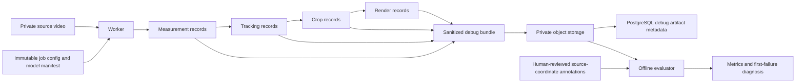

## Goal
Persist one private, versioned debug telemetry bundle per explicitly configured job and evaluate model, tracker, planner, and renderer quality against independently annotated source-coordinate ground truth.

## Task Tree
- Debug I/O and evaluation foundation
  - D1. Define the debug-bundle contract.
    - Outcome: A deterministic, gzip-compressed JSON Lines artifact records reproducible phase input/output summaries without raw frames, credentials, signed URLs, or binary media.
    - Ownership: Worker/model integration.
    - Dependencies: Existing `assets.kind = debug`, `job_artifacts.kind = debug`, and immutable job configuration.
    - Implementation/reuse: Add a schema version and header containing job ID, source metadata, immutable pipeline/model/planner configuration, model-manifest identifiers, and source object version/checksum when available. Emit stage start/end records with monotonic timestamps, duration, progress, outcome, and sanitized structured errors. Emit per-frame source-pixel records for selected detector bounds/confidence, pose root/bounds/landmarks/confidence, target-association result, tracker root/covariance/state, planner input envelope/velocity/lost flag, and planned crop. Emit renderer input/output metadata and crop-path digest. Serialize only data available at public model/tracker/planner boundaries; do not claim detector candidates, ROI coordinates, or rejection reasons until those interfaces expose them. Use `null` for unavailable values rather than synthesizing values.
    - Verification: Schema/serialization tests cover every pipeline stage, absent detector or pose results, lost tracking, terminal errors, stable field ordering, and redaction of credentials, signed URLs, and pixel payloads.
  - D2. Upload and link the debug bundle idempotently.
    - Outcome: An explicitly enabled worker writes exactly one deterministic `private/debug/{project_id}/{job_id}.jsonl.gz` object and one `debug` artifact row, without allowing debug-upload failure to hide a successfully rendered output.
    - Ownership: Worker/storage/backend persistence.
    - Dependencies: D1; generic S3 upload; output finalization transaction.
    - Implementation/reuse: Add a worker-owned debug-capture mode that defaults to off and is separate from local scratch retention. Write the bundle incrementally under job scratch, upload it during `uploading`, head/size/content-type verify it, then create or update the existing unique `(job_id, 'debug')` link. Preserve the one-artifact schema rather than adding per-phase rows. Ensure object and row creation are idempotent on reclaimed jobs. Retain failed-job telemetry when it was flushed before the failure; retain only sanitized terminal summaries when model initialization prevents per-frame processing.
    - Verification: Storage/repository integration tests cover enabled/disabled capture, retried upload, reclaimed job overwrite, output-plus-debug linkage, and cleanup. Database tests preserve the existing single-debug-artifact uniqueness guarantee.
  - D3. Add operator-visible phase timing logs.
    - Outcome: JSON task/stage logs report elapsed milliseconds and bundle identifier alongside the existing trace/job/stage/version/error fields.
    - Ownership: Worker runtime.
    - Dependencies: D1.
    - Implementation/reuse: Time handlers with a monotonic clock in `Worker.process`; log only safe request/response summaries. Do not place detailed per-frame records in stdout/stderr logs.
    - Verification: Logging tests assert duration presence and ensure secret/signed-URL redaction.
  - D4. Produce source-coordinate inspection overlays.
    - Outcome: When a stricter debug-capture mode is enabled, the bundle includes an optional visual overlay that distinguishes detection, pose bounds/root, tracking state, movement envelope, and crop rectangle.
    - Ownership: Worker media rendering.
    - Dependencies: D1 and model/tracker records.
    - Implementation/reuse: Generate the overlay from serialized source-coordinate telemetry, using frame timestamps rather than decoder order assumptions. Package it inside the single debug bundle or make it a deterministic member of an archive only if the existing one-debug-artifact contract requires it. Do not expose it through the normal output-download endpoint.
    - Verification: Frame-accurate media tests confirm overlay positions after rotation normalization and verify no overlay reaches the user-facing output.
  - E1. Define versioned, independently labeled evaluation cases.
    - Outcome: A permitted fixture/evaluation manifest references immutable source media, target selection, source metadata, and human ground truth for stationary, lateral sprint, jump/limb extension, occlusion, and lost-subject scenarios.
    - Ownership: Evaluation tooling.
    - Dependencies: D1 telemetry schema.
    - Implementation/reuse: Keep private video outside Git; version manifests, cryptographic source identifiers, target selection, reviewed frame annotations, and expected metric thresholds. Store each ground-truth frame in source pixels with athlete box, visible landmark/keypoint set, visibility/occlusion state, and optional target identity label. Require annotations to be human-reviewed; model output must never serve as ground truth.
    - Verification: Manifest validation rejects missing source identity, invalid timestamps/coordinates, duplicate frame labels, unsupported VFR metadata, and annotations outside source bounds.
  - E2. Implement offline metric computation and diagnosis.
    - Outcome: A deterministic evaluation command compares debug-bundle records to annotations and emits per-frame, per-sequence, and aggregate JSON/Markdown reports.
    - Ownership: Worker evaluation tooling.
    - Dependencies: D1 and E1.
    - Implementation/reuse: Compute detector/selection precision-recall and IoU against the selected athlete, pose keypoint/root error and availability, tracker availability/recovery and root error, crop containment/limb-crop/edge-risk/athlete-size rates, and normalized pan/zoom velocity, acceleration, and jerk. Verify renderer alignment by comparing telemetry crop transforms with the overlay/output frame timestamps. Segment results by model version, planner version, profile, resolution, and scenario. Report the first failing frame and classify it as measurement, selection, tracking, planning, render mapping, or insufficient/ambiguous annotation.
    - Verification: Synthetic numeric tests cover every metric, sparse annotation interpolation rules, lost-subject handling, rotation-normalized coordinates, deterministic aggregation, and known failure classifications.
  - E3. Establish regression gates and review workflow.
    - Outcome: Model/planner changes are accepted only when they meet fixed technical thresholds and do not regress approved scenarios; qualitative reviewer feedback remains traceable.
    - Ownership: Evaluation tooling and CI.
    - Dependencies: E2 and a baseline run.
    - Implementation/reuse: Save baseline reports keyed by pipeline/model/planner versions. Gate changes on containment, limb crop, tracking recovery, smoothness, and model association/pose metrics with scenario-level floors, plus output technical validation. Generate a reviewer packet with source/overlay/output references and ask reviewers to label the earliest unacceptable frame and reason. Treat subjective preference as a separate human metric, not a replacement for containment/smoothness gates.
    - Verification: CI runs the evaluator against permitted fixtures and fails a deliberately regressed crop/model trace with a diagnostic report.

## Architecture After Plan
The worker captures sanitized, source-coordinate records as data crosses model, tracker, planner, and renderer boundaries. It persists a single private debug bundle only when enabled by trusted worker configuration, while PostgreSQL retains only artifact metadata. An offline evaluator combines the bundle with human-reviewed annotations to locate the first causal divergence and measure regressions by model, planner, profile, and scenario.

## Files to Modify
- `worker/src/boulder_frame_worker/pipeline.py`: Capture phase and per-frame data at existing analysis, planning, render, and upload boundaries.
- `worker/src/boulder_frame_worker/worker.py`: Time stage handlers, flush terminal debug records, and preserve cleanup behavior.
- `worker/src/boulder_frame_worker/config.py`: Add a trusted, default-off debug capture mode separate from `retain_debug_artifacts`.
- `worker/src/boulder_frame_worker/measurement.py`: Expose only the model-boundary details needed by the telemetry contract, if missing after contract review.
- `worker/src/boulder_frame_worker/tracking.py`: Expose tracking decisions needed for evaluation only where they are already determined.
- `worker/src/boulder_frame_worker/repository.py`: Add idempotent debug asset/artifact finalization and deterministic key helpers.
- `worker/src/boulder_frame_worker/logging.py`: Add safe duration and debug-bundle identifier fields.
- `worker/src/boulder_frame_worker/media.py`: Create optional source-coordinate diagnostic overlays from telemetry records.
- `worker/tests/test_pipeline.py`, `worker/tests/test_worker.py`, `worker/tests/test_logging.py`, `worker/tests/test_media.py`, `worker/tests/test_repository.py`: Cover capture, redaction, linkage, timings, overlay alignment, retries, and cleanup.
- `docs/architecture/offline-reframing-mvp.md`: Specify the finalized debug schema, privacy boundary, evaluation data flow, and regression criteria.
- `docs/architecture/service-implementation-plan.md`: Update W7.1 and quality gates to match implementation.
- `docs/specs/worker/runtime-and-pipeline.md`: Document the debug-capture configuration and retention behavior.
- `docs/specs/worker/measurements-and-planner.md`: Document emitted telemetry semantics and source-coordinate rules.
- `docs/specs/backend/persistence.md`: Document the single debug artifact and storage-only telemetry boundary.
- `docs/specs/README.md` and `docs/README.md`: Index the focused evaluation documentation.

## New Files (if any)
- `worker/src/boulder_frame_worker/debug.py`: Versioned JSON Lines schema, redaction, incremental writer, and deterministic digest helpers.
- `worker/src/boulder_frame_worker/evaluation.py`: Manifest validation, metric calculation, aggregation, and first-failure classification.
- `worker/tests/test_debug.py`: Debug-bundle serialization and privacy tests.
- `worker/tests/test_evaluation.py`: Numeric metric and diagnosis tests.
- `worker/tests/evaluation/manifest.json`: Permitted, versioned evaluation metadata and scenario definitions.
- `worker/tests/evaluation/*.json`: Human-reviewed source-coordinate annotations and expected reports for permitted fixtures.
- `docs/specs/worker/debugging-and-evaluation.md`: Authoritative debug bundle schema, evaluator usage, annotations, metrics, and review workflow.

## Risks
- Detailed telemetry can reveal athlete location and pose data. Keep every bundle private, disabled by default, free of credentials/signed URLs/raw frames, and governed by an explicit retention/deletion policy.
- The current `job_artifacts` uniqueness constraint permits one debug artifact. A single compressed JSON Lines bundle is the smallest compatible design; an overlay must be a bundle member rather than a second `debug` row unless the persistence contract is intentionally expanded.
- Current model interfaces expose only target-associated outputs. Candidate-level detector diagnostics and pose ROI details require intentional interface changes and must not be fabricated by the recorder.
- Reliable effectiveness metrics require independently human-reviewed source-coordinate labels. Comparing a crop to the model's own measurements only validates planner consistency, not model correctness.
- Cropping is currently an annotation overlay rather than the specified 1080p reframe. Evaluation should validate source-coordinate crop correctness and rendering alignment now, then add final-output visual-quality metrics once true crop/scale rendering exists.
