## Goal
Replace the pose- and prediction-based worker analysis with detector-box framing that keeps the selected athlete at a stable target screen height, using 50% for the existing `balanced` profile.

## Task Tree

- Detector-driven stable framing
  - D1: Define detector-only observation and association contracts.
    - Outcome: Every source frame has either the user-selected athlete's detector box or an explicit no-detection observation; no pose ROI, landmarks, roots, or predicted state exist.
    - Ownership: implementation worker.
    - Dependencies: none.
    - Implementation/reuse: Reduce `measurement.py` to source geometry, detector types, tap selection, and association evidence. Select the tapped athlete on the selected frame. On every other frame, run full-frame detection and associate against the center of the prior accepted detector box, using the existing containing-reference then nearest-center rule. A selected-frame miss remains `no_selected_athlete`; later misses are non-terminal observations.
    - Verification: Unit tests cover selection at the tap, continued association, later detection gaps, and absence of pose-model interfaces/imports.
  - D2: Replace tracking and movement-envelope planning with a fixed-ratio crop controller.
    - Outcome: A detector box determines the requested crop scale, and a temporal low-pass controller produces stable source-bounded crop rectangles without velocity prediction or future-frame access.
    - Ownership: implementation worker.
    - Dependencies: D1.
    - Implementation/reuse: Replace `tracking.py` and the current planner measurement contract with detector observations. For a detected box of height `h` and target screen-height fraction `f`, request crop height `h / f`, derive crop width from the requested aspect ratio, then clamp to the largest valid source crop. Center the crop on the detector box center. Smooth crop center and height from the preceding actual crop using fixed exponential coefficients. If smoothing would exclude the current detector box, immediately expand/pan only enough to contain it. On a later detector miss, do not extrapolate position: widen the prior crop toward the full valid crop and preserve its center subject to source bounds. The selected-frame miss remains terminal. Preserve existing external profiles but map them only to target-height fractions: `tight=0.60`, `balanced=0.50`, `safe=0.40`, and `full_movement=0.33`.
    - Verification: Planner tests cover exact 50% balanced sizing away from source bounds, requested aspect ratio, containment, source edges, profile ordering, smooth center/scale transitions, abrupt containment override, and widening after missed detections.
  - D3: Wire the detector-only pipeline and runtime.
    - Outcome: `ProcessingPipeline` analyzes frames in one detector-only pass and retains the same restart-safe crop-path, rendering, upload, and durable job-state behavior.
    - Ownership: implementation worker.
    - Dependencies: D1, D2.
    - Implementation/reuse: Remove pose-estimator and tracker injection from pipeline/runtime composition. Load only `OnnxSsdMobileNetV1Detector` and `OpenCVFrameReader`; remove the MediaPipe adapter, artifact verification, runtime resource cleanup, and `mediapipe` dependency. Introduce a new immutable detector-only `MODEL_VERSION`; configured jobs using the old pose model version fail normally as model-version mismatches rather than invoking a compatibility path. Keep VFR normalization, frame alignment checks, crop-path persistence, FFmpeg rendering/validation, retry, lease, storage, and output finalization unchanged.
    - Verification: Runtime composition tests prove no MediaPipe artifact/dependency is required. Pipeline integration tests prove a detector-only frame sequence persists aligned crops, reuses them for rendering, and handles later misses without failure.
  - D4: Simplify debug telemetry and phase review to evidence that still exists.
    - Outcome: Optional diagnostics show detection association, framing/crop behavior, and final render only; no pose or tracking phase claims remain.
    - Ownership: implementation worker and frontend/backend contract updates.
    - Dependencies: D1, D2.
    - Implementation/reuse: Change review phases from `measurement`, `pose`, `tracking`, `planning`, `render` to `detection`, `framing`, `render`. Emit detector box, association outcome/reference, desired/actual crop, target fraction, detection-miss state, and smoothing/containment decisions. Remove pose landmarks, roots, covariance, lead room, envelopes, and tracking serializations. Update review renderer overlays, warning summaries, tests, worker docs, frontend phase labels/types/tests, and the backend evaluation examples/schema expectations as required by the renamed phase IDs.
    - Verification: Debug serialization tests contain no pose/tracking fields; visual review tests render the three valid phases; browser and backend tests accept the revised manifest and show its labels.
  - D5: Update the immutable model and algorithm documentation.
    - Outcome: Repository documentation accurately describes detector-only stable framing and the new model/pipeline versions.
    - Ownership: implementation worker and documentation.
    - Dependencies: D1-D4.
    - Implementation/reuse: Remove the MediaPipe artifact and license entry from the model manifest, change model/version references, and update architecture, worker specifications, documentation indexes, and the stale detector-selection risk in the service plan. Preserve durable source/output, state-machine, and media-validation documentation where behavior is unchanged.
    - Verification: Validate all modified Markdown links, repository search finds no active pose/prediction contract, and `git diff --check` passes.
  - D6: Run focused and repository verification.
    - Outcome: The simplified pipeline is formatted, type checked, and covered by the affected test suites.
    - Ownership: implementation worker.
    - Dependencies: D1-D5.
    - Implementation/reuse: Run worker Ruff, mypy, and pytest; run backend Go tests and frontend tests affected by phase/profile contracts; run documentation-link validation if available and `git diff --check`.
    - Verification: All available commands pass, or each unavailable command is reported with its cause.

## Architecture After Plan

The durable worker stages and render/storage contracts stay unchanged. Analysis becomes one sequential detector pass: the tap chooses the athlete in its frame, later frames select the detector box nearest to the prior accepted box, and each selected box requests a crop based solely on its height relative to the configured profile fraction. A low-pass controller smooths the crop while current-frame containment prevents clipping. Missing detections widen toward the valid full-frame crop without a predicted target position.

```mermaid
flowchart LR
    S[Object-store source] --> V[Validate or normalize to CFR]
    V --> F[Rotation-normalized frame reader]
    F --> D[Full-frame person detector]
    D --> A[Tap or prior-box association]
    A --> C[Fixed target-height crop controller]
    C --> P[Aligned crop-path JSONL]
    P --> R[FFmpeg crop and 1080p render]
    R --> O[Validate, upload, finalize]
```

The profile remains an immutable job field because it is already exposed by the Go API and React application. Its only framing effect is the fixed detector-height fraction, with `balanced` set to 0.50. No model invokes pose inference, and no component calculates velocity, predicts a future target position, applies backward smoothing, or creates a movement envelope.

## Files to Modify

- `worker/src/boulder_frame_worker/measurement.py`: retain detector association and remove pose/ROI contracts.
- `worker/src/boulder_frame_worker/planner.py`: replace envelope/prediction planner with detector-box fixed-ratio smoothing.
- `worker/src/boulder_frame_worker/pipeline.py`: remove pose/tracker workflow and emit detector/framing traces.
- `worker/src/boulder_frame_worker/runtime.py`: compose only the detector and frame reader.
- `worker/src/boulder_frame_worker/models.py`: remove MediaPipe adapter/artifact and publish the detector-only model version.
- `worker/src/boulder_frame_worker/debug.py`: serialize detector/framing evidence only.
- `worker/src/boulder_frame_worker/review.py`: render `detection`, `framing`, and `render` phases only.
- `worker/pyproject.toml`: remove `mediapipe`.
- `worker/models/model-manifest.json`: retain only the licensed pinned detector artifact and new version.
- `worker/tests/test_measurement.py`: replace pose tests with detector-only observation tests.
- `worker/tests/test_planner.py`: replace envelope/prediction tests with fixed-ratio smoothing tests.
- `worker/tests/test_pipeline.py`: update detector-only integration coverage.
- `worker/tests/test_runtime.py`: update composition/model checks.
- `worker/tests/test_models.py`: remove MediaPipe coverage and retain detector validation.
- `worker/tests/test_debug.py`: update detector/framing telemetry assertions.
- `worker/tests/test_review.py`: update review phases and overlays.
- `worker/tests/test_tracking.py`: remove because tracking no longer exists.
- `frontend/src/App.tsx`: retain the profile selector but make its descriptions match fixed subject-size targets.
- `frontend/src/components/PhaseReview.tsx`: show the reduced detector/framing/render phase vocabulary.
- `frontend/src/components/PhaseReview.test.tsx`: update phase fixture IDs and labels.
- Backend evaluation fixture/tests that assert phase IDs: update the manifest examples and assertions for the reduced phase vocabulary.
- `docs/architecture/offline-reframing-mvp.md`: replace pose/tracking/envelope algorithm and diagrams with the detector-box controller.
- `docs/architecture/service-implementation-plan.md`: remove stale pose/prediction assumptions and detector-selection inconsistency.
- `docs/specs/worker/README.md`: revise implemented capabilities and model description.
- `docs/specs/worker/runtime-and-pipeline.md`: revise runtime composition, processing, telemetry, and review phases.
- `docs/specs/worker/measurements-and-planner.md`: rewrite as detector association and fixed-ratio stable crop behavior.
- `docs/specs/worker/models.md`: remove MediaPipe provision/license contract.
- `docs/specs/worker/debug-telemetry-and-evaluation.md`: update telemetry schema, phase review, and metrics.
- `docs/specs/frontend/phase-evaluation.md`: update displayed phase vocabulary.
- `docs/README.md` and `docs/specs/README.md`: revise index summaries if their wording names tracking/planner behavior.

## New Files (if any)

- None. The simplified implementation reuses the existing detector, crop-path, renderer, and durable workflow modules.

## Risks

- Detector association based only on the prior box center can switch identities when athletes overlap or cross. This is an accepted MVP limitation with no appearance re-identification or motion predictor.
- A detector box may not precisely cover extended limbs; fixed-ratio framing intentionally prioritizes predictable athlete scale over pose-based limb containment.
- `target_height_fraction` cannot be achieved near source edges or when the required crop exceeds source dimensions; the controller must use the largest valid crop while retaining the detection where possible.
- The repository currently has uncommitted user changes in `pipeline.py`, `measurement.py`, `debug.py`, `review.py`, their tests, and the targeted worker documentation. These overlap the planned implementation, so they must be resolved or explicitly incorporated before editing begins.
- The target fractions are proposed defaults. `balanced=0.50` follows the requested example; the other profile values should be visually evaluated against permitted fixtures before being treated as product defaults.
