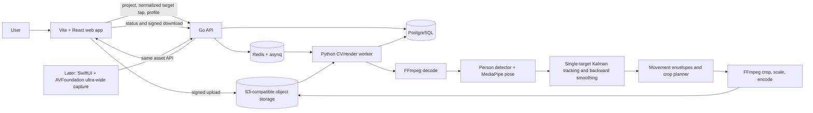

## Goal
Deliver a deployable offline MVP that lets a user upload one wide sports video, select one athlete, and download a smooth 1080p horizontal or vertical reframed video that preserves the athlete's full movement.

## Task Tree
- Offline single-athlete reframing MVP
  - Product and platform boundary
    - T1: Define the MVP contract and acceptance dataset.
      - Outcome: The product supports one continuous, static-camera shot; 4K input; one user-selected athlete; 1080p 16:9 or 9:16 output; Tight, Balanced, Safe, and Full Movement framing profiles; and no real-time output, multi-athlete tracking, equipment/ball detection, or AI upscaling.
      - Ownership: Product/backend worker.
      - Dependencies: None.
      - Implementation/reuse: Make `docs/architecture/offline-reframing-mvp.md` the source product rationale and implementation specification, containing the API behavior, accepted video constraints, profile semantics, and measured success criteria. Build an initial annotated evaluation set from representative user clips before tuning the planner.
      - Verification: Acceptance videos cover standing, sprinting, a jump or extended limb, an occlusion, and a lost-subject case; documented expected containment and fallback behavior matches the implementation.
  - Client experience
    - T2: Implement the web upload, selection, status, and download workflow.
      - Outcome: A browser user can create a project, upload a source video, choose an aspect ratio and framing profile, tap/click the target athlete in the first usable frame, start processing, view job progress/failure, and download the rendered asset.
      - Ownership: Web worker.
      - Dependencies: T1, T5 API contract.
      - Implementation/reuse: Use Vite, React, and TypeScript for the web application. Send selection coordinates normalized to the displayed source-frame dimensions so the backend can map them to decoded pixels. Do not process video in the browser.
      - Verification: Component/API tests cover selection-coordinate normalization and all job states; an end-to-end test completes a short fixture upload through download.
  - Job and asset service
    - T3: Implement durable project, asset, and job orchestration.
      - Outcome: Uploads are stored separately from application processes and each processing run has an inspectable immutable configuration, status, progress, artifacts, error, and retry-safe worker execution.
      - Ownership: Backend worker.
      - Dependencies: T1.
      - Implementation/reuse: Use Go for the API and durable job orchestration, `chi` for HTTP routing, `pgx` for PostgreSQL, and `asynq` with Redis for asynchronous job dispatch. Store projects, processing requests, and artifact metadata in PostgreSQL, and original, intermediate, and output videos in S3-compatible object storage. The Go service owns signed-upload/download URLs and enqueues a Python worker job only after upload completion. Use Docker Compose for local dependencies.
      - Verification: API and worker integration tests demonstrate idempotent enqueueing, status transitions, retryable/transient errors, and cleanup of failed intermediate artifacts.
  - Offline vision and tracking pipeline
    - T4: Produce reliable source-frame measurements for the selected athlete.
      - Outcome: For every analysis frame, the pipeline emits a torso/root estimate, full-pose bounds, detector bounds, confidence, and an identity-continuity state or a lost-track state.
      - Ownership: CV worker.
      - Dependencies: T1, T3.
      - Implementation/reuse: Run this pipeline in the Python worker. Decode normalized frames with FFmpeg. Run an Apache-2.0-compatible person detector exported to ONNX with ONNX Runtime on a downscaled full frame, match the initial detection to the tap, and run MediaPipe Pose Landmarker Full on an expanded original-resolution target ROI. Transform pose coordinates back to source coordinates. Use a single-target Kalman filter, periodic detector correction, and a lightweight appearance signature only for reacquisition. Do not introduce multi-object tracking in this MVP.
      - Verification: Fixture tests cover initial selection association, pose-coordinate remapping, short detection/pose gaps, reacquisition, and correct lost-track output; records include confidence and source-pixel bounds for visual debugging.
  - Framing and rendering pipeline
    - T5: Build the future-aware movement-envelope and crop-path planner.
      - Outcome: The planner creates a valid crop rectangle per output frame that contains the padded athlete envelope when possible, adds directional lead room, protects against uncertainty, remains within the source image, and changes pan/zoom smoothly over the complete shot.
      - Ownership: CV worker.
      - Dependencies: T4.
      - Implementation/reuse: Implement the planner in the Python worker. Derive pan from confidence-weighted hips/shoulders with detector-center fallback. Derive the required envelope from reliable pose landmarks plus detector bounds and profile-specific base padding. Apply forward Kalman filtering and backward smoothing over recorded frames. Start with a deterministic target-crop controller with dead zone, fast zoom-out, slow zoom-in, and hysteresis; make it an isolated planner interface so T8 can replace it with the planned CVXPY/OSQP constrained whole-shot quadratic optimizer without changing storage, API, or rendering contracts. On low confidence, stop zooming in, increase margins, run full-frame detection, and expand toward the widest valid crop.
      - Verification: Unit tests assert aspect-ratio containment, source-frame containment, directional margins, profile ordering, confidence-driven widening, and pan/zoom rate limits. Evaluation videos report subject-retention, cropped-limb, edge-risk, crop-size, and camera-motion metrics.
    - T6: Render and validate production output assets.
      - Outcome: Each successful job produces an H.264/AAC 1080p MP4 at the selected aspect ratio with source audio preserved and the planned camera path applied frame-accurately.
      - Ownership: Media worker.
      - Dependencies: T3, T5.
      - Implementation/reuse: Render in the Python worker using FFmpeg for rotation normalization, decoding, crop/scale/encode, audio mapping, and output validation; use OpenCV only where frame-level pixel transforms are needed. Treat lens-distortion correction as an explicit deferred capability because it requires device/lens calibration or reliable per-asset metadata. Reject unsupported codecs and variable-frame-rate inputs initially rather than silently producing an inaccurate camera path.
      - Verification: Media integration tests validate dimensions, aspect ratio, codec, duration tolerance, audio preservation, crop bounds, and playback of all fixture outputs.
  - Quality, operations, and documentation
    - T7: Make processing observable, reproducible, and documented.
      - Outcome: A developer can run the system locally, inspect a job, reproduce a render from its stored configuration, and understand the documented architecture and constraints.
      - Ownership: Platform worker.
      - Dependencies: T2, T3, T4, T5, T6.
      - Implementation/reuse: Add structured logs and per-stage timings, store model/version and planner configuration with every run, export optional debug overlays, add health checks, and document local setup, deployment prerequisites, privacy/retention, and pipeline behavior in `docs/`. Keep videos private by default and configure retention/deletion policy before external testing.
      - Verification: A clean local environment can process a sample clip using documented commands; CI runs formatting, type checks, unit/integration tests, and `git diff --check`; repository documentation links to the focused architecture document.
  - Explicit later milestones
    - T8: Upgrade crop planning after the MVP is visually validated.
      - Outcome: The target-crop controller is replaced by a constrained whole-shot quadratic optimization implementation that minimizes composition error, pan/zoom velocity, and acceleration while enforcing envelope containment.
      - Ownership: CV worker.
      - Dependencies: T5, a labeled evaluation set that exposes controller limitations.
      - Implementation/reuse: Implement the existing planner interface using CVXPY with OSQP over full shots or overlapping segments. Retain fallback to a validated deterministic planner only for solver failure, not as a parallel behavior.
      - Verification: Benchmark against the MVP controller on the evaluation set and demonstrate equal-or-better containment with lower camera acceleration/jerk.
    - T9: Add native capture only after offline reframing quality is proven.
      - Outcome: An iOS app can record using the ultra-wide camera with stable 4K/60 settings and submit the master asset to the same processing API.
      - Ownership: Mobile worker.
      - Dependencies: T7 and a confirmed iOS-first product decision.
      - Implementation/reuse: Use Swift, SwiftUI, and AVFoundation; use `AVCaptureDevice.DiscoverySession` to select the physical ultra-wide camera where available, persist capture metadata, and upload through the existing asset API. Android is a separate later client using Kotlin and CameraX, not a cross-platform abstraction in the first release.
      - Verification: On supported iPhones, capture metadata confirms ultra-wide selection and generated uploads pass the existing offline pipeline.
    - T10: Add real-time and sport-specific intelligence only after the offline baseline succeeds.
      - Outcome: The system can provide a constrained-latency preview and later understand equipment/ball movement for validated sports.
      - Ownership: CV/mobile workers.
      - Dependencies: T8, T9, sport-specific training/evaluation data, thermal and latency budgets.
      - Implementation/reuse: Use an IMM Kalman predictor with receding-horizon planning for live mode; add equipment/ball models only when their measured containment failures justify the added model and data lifecycle.
      - Verification: Device latency, thermal, battery, and subject-retention targets are defined and met on supported hardware.

## Architecture After Plan (if neccessary)
The first shippable product is a web-controlled offline render service. The browser only gathers project settings and the initial athlete selection. A durable Go API stores metadata and queues a Python background job; the worker decodes the uploaded master video, tracks the selected athlete from source-frame measurements, calculates a future-aware crop path across the recorded shot, and renders a downloadable 1080p result. This separates product iteration from mobile camera hardware and lets the complete video inform every crop decision.

The eventual capture client is iOS-native, because reliable access to the physical 0.5x/ultra-wide lens and its capture metadata is an AVFoundation concern. It remains outside the offline MVP; users can initially upload existing iPhone videos through the web app.

Technology decisions:

| Concern | Chosen technology | Reason |
| --- | --- | --- |
| Initial client | Vite, TypeScript, React | Fastest path to upload, target selection, job status, and output review without imposing a phone-app build before framing is validated. |
| Eventual capture client | Swift, SwiftUI, AVFoundation | Native iOS APIs expose physical ultra-wide camera discovery and capture controls needed for the stated 0.5x workflow. |
| API | Go, `chi`, `pgx` | Keeps the application boundary in the team's primary language with small, idiomatic dependencies and direct PostgreSQL access. |
| CV/render worker | Python 3.12, MediaPipe, ONNX Runtime, OpenCV | Python's mature CV, numerical, and optimization ecosystem minimizes the cost of iterating on pose, tracking, and crop quality. |
| Durable work | `asynq`, Redis, PostgreSQL | The Go API uses `asynq` to dispatch long-running processing work; queue state and relational job metadata outlive web/API processes. |
| Video/media | FFmpeg, OpenCV | FFmpeg provides robust decode/encode/audio handling; OpenCV is limited to frame transforms and measurement utilities. |
| Person detection | ONNX Runtime with an Apache-2.0-compatible person detector | Full-frame detection is needed to initialize/reacquire a small athlete and ONNX Runtime permits CPU development and later GPU execution. The exact model is a benchmark decision before implementation. |
| Pose | MediaPipe Pose Landmarker Full | Matches the documented baseline, provides 33 landmarks, and works efficiently on an original-resolution target ROI. |
| Tracking | Custom single-target Kalman filter | Fits the one-selected-athlete MVP and maintains transparent confidence/uncertainty behavior. |
| Offline crop planning | Deterministic asymmetric controller first; CVXPY + OSQP QP after validation | It proves visual behavior with little solver complexity while preserving a direct upgrade path to the documented global optimizer. |
| Storage | S3-compatible object storage | Original 4K videos and rendered assets should not live on API or worker filesystems. |
| Deployment | Docker Compose locally; containerized Go API and Python worker separately in production | CPU/GPU rendering workloads scale independently from web/API traffic. |
| Quality | pytest, Playwright, fixture videos, annotated evaluation set | Unit checks alone cannot establish visual containment and virtual-camera smoothness. |

Supportive repository reference: `docs/architecture/offline-reframing-mvp.md` is the authoritative product and implementation specification.

## Files to Modify
- `docs/architecture/offline-reframing-mvp.md`: Maintain the authoritative product rationale and implementation specification.
- `README.md`: Add project overview, local quick-start, and links to the product rationale and architecture documentation after scaffolding the repository.
- `docs/README.md`: Add the documentation index and link to the offline MVP architecture document.
- `docs/architecture/offline-reframing-mvp.md`: Record the approved technology choices, API/job model, data retention constraints, pipeline diagram, accepted input/output behavior, and deferred capabilities.
- `frontend/*`: Add the Vite/React upload, selection, processing-status, and download UI.
- `backend/*`: Add the Go API project, PostgreSQL access, `asynq` job dispatch, and asset/job-status/signed URL endpoints.
- `worker/*`: Add the Python worker consumer, vision/tracking/planning modules, rendering integration, and debug artifacts.
- `infra/compose.yaml`: Add local PostgreSQL, Redis, S3-compatible storage, API, web, and worker services.
- `.github/workflows/ci.yml`: Add formatting, type-check, test, and documentation-diff validation after the implementation has a CI-supported platform.

## New Files (if any)
- `README.md`: Repository entry point and local setup.
- `docs/README.md`: Documentation index.
- `docs/architecture/offline-reframing-mvp.md`: Authoritative feature contract and technical architecture.
- `frontend/`: Vite/React application.
- `backend/`: Go API application and PostgreSQL migrations.
- `worker/`: Python processing service, CV pipeline, planner, and renderer.
- `infra/compose.yaml`: Local development service topology.
- `tests/fixtures/`: Small licensed or synthetic videos and expected metadata/metric fixtures.
- `tests/evaluation/`: Evaluation manifests and annotation format; raw private user videos remain outside version control.

## Risks
- No target operating environment, cost ceiling, or privacy/retention requirement has been provided. This plan assumes a cloud-capable backend for the initial service, private assets by default, and a configurable retention policy before external use.
- The source file contains an MVP algorithm but does not establish platform priority. The recommendation is web upload first and iOS-native capture second; choose iOS-first only if controlled ultra-wide capture is required for the earliest user test.
- Athlete size, motion blur, low light, lens distortion, and occlusions may make generic detection/pose insufficient. Benchmark candidate detector models and measure the curated acceptance set before locking the model or GPU sizing.
- FFmpeg timing and variable-frame-rate phone videos can desynchronize analysis and rendering. The first MVP should reject VFR inputs or normalize them with explicit, tested timestamp handling.
- Digital crop quality is bounded by source resolution. Enforce clear source guidance and do not add super-resolution to the MVP.
- The planned `MediaPipe` model and detector license/version must be checked during dependency pinning; the plan intentionally does not commit to a detector until its license, small-subject recall, and hardware performance have been benchmarked.
- Full lens correction needs per-device calibration or dependable metadata. It is not safe to promise correction in the first render pipeline without either.
- The session plan is coordination evidence only. T7 must archive the approved implementation details under `docs/` and index them before the feature is considered complete.
