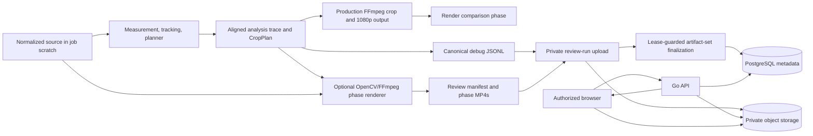

## Goal
Implement opt-in, private, phase-by-phase visual evaluation for terminal Boulder Frame jobs while preserving the cropped 1080p MP4 as the only product output.

## Task Tree

- Deliver private phase review from worker evidence through the authorized frontend.
  - Shared artifact and compatibility rules: Keep `assets.kind = debug`; migrate legacy `job_artifacts.kind = debug` to `debug_telemetry`; add one unique relation per review role (`debug_manifest`, `debug_measurement`, `debug_pose`, `debug_tracking`, `debug_planning`, `debug_render`); preserve v1 JSONL fields and evaluator behavior; do not set `mapping_independently_verified` true without an independent check; visual capture is default-off, requires `debug_capture`, is no-audio H.264, is bounded independently, and is best-effort.
  - **PE-1: Produce stable semantic analysis evidence.**
    - Outcome: One analysis pass produces a scratch-local crop/trace result reused by output rendering, debug telemetry, and review rendering; frame records contain explicit selection outcome, tracker reacquisition, and planner decision data.
    - Ownership: Worker.
    - Dependencies: None.
    - Implementation/reuse: Extend the crop planner result contract from crop rectangles to a `CropPlan` with a per-frame diagnostic trace (envelope, lead room, uncertainty padding, containment risk, zoom action). Extend observations/tracking only where an event cannot be derived unambiguously. Cache the result in job scratch with strict frame/timestamp alignment and have `_render` reuse it rather than rerunning inference. Add v2 fields to `debug.py` additively; the evaluator continues to read v1 fields.
    - Verification: Unit-test selection/reacquisition semantics, planner trace decisions, scratch cache round-trip, exact crop reuse, and v1 debug/evaluation compatibility.
  - **PE-2: Render and describe phase evidence.**
    - Outcome: A bounded review renderer produces synchronized `measurement`, `pose`, `tracking`, `planning`, and `render` MP4s plus a bounded manifest that accurately describes ready, partial, and unavailable phases.
    - Ownership: Worker.
    - Dependencies: PE-1.
    - Implementation/reuse: Add a focused review module that decodes the already normalized source with `OpenCVFrameReader`, draws phase-specific overlays with installed OpenCV/NumPy, and invokes FFmpeg to encode no-audio H.264 MP4s. Keep the production `FFmpegRenderer` crop/scale/validation path unchanged. Compose the render phase as annotated source beside the actual output frame and report output validation separately. Enforce maximum source duration, review dimensions, aggregate bytes, and command timeout; retain telemetry even when one visual phase is omitted.
    - Verification: Fixture media tests decode every review video, assert timing/frame-count alignment and representative overlay pixels, assert limits/timeout cleanup, and prove the final product output remains 1080p H.264/AAC.
  - **PE-3: Finalize one review run durably and compatibly.**
    - Outcome: The worker uploads telemetry, manifest, and available phase videos under one review UUID, links the complete available set under its active lease, and safely cleans up on failed finalization.
    - Ownership: Worker and backend persistence.
    - Dependencies: PE-1, PE-2.
    - Implementation/reuse: Add migration `003_phase_evaluation.sql` to replace the `job_artifacts` kind constraint and migrate existing rows. Replace single-object debug finalization with a lease-guarded, transactional review-set finalizer that creates verified debug assets and role links. Keep object bytes out of PostgreSQL. Generate canonical review-run keys under `private/debug/{project}/{job}/{review}/`; upload/head each object before finalizing; delete newly-uploaded keys when finalization fails. Publish after output finalization while the job is still uploading and best-effort publish partial evidence before durable job failure.
    - Verification: Migration tests or disposable-PostgreSQL coverage verify legacy migration and constraints; repository/pipeline tests cover idempotency, stale lease rejection, terminal rejection, partial runs, failed-job publication, and cleanup.
  - **PE-4: Expose review safely through the API.**
    - Outcome: `GET /api/v1/jobs/{jobID}/evaluation` gives an owner-authorized terminal job either `{ "available": false }` or a validated review projection with only short-lived URLs for ready resources.
    - Ownership: Backend.
    - Dependencies: PE-3.
    - Implementation/reuse: Extend domain/repository queries to obtain recognized artifact metadata internally while preserving `/artifacts` as metadata-only. Add a bounded private-object read operation for the manifest, validate its content type/size/schema against linked artifacts, and project phase summary/status without raw manifest contents or keys. The handler follows existing job/project ownership checks, permits `completed` and `failed`, and returns a conflict for nonterminal jobs. Presign only verified, uploaded, manifest-declared media; omit unavailable resources and redact URLs in logs.
    - Verification: Handler tests cover authorization, malformed IDs, nonterminal jobs, no review, completed/failed partial runs, malformed manifest, unavailable assets, presign/read failure, signed URL fields, and absence of object keys or raw manifest data in responses/logs.
  - **PE-5: Present terminal phase review in the browser.**
    - Outcome: A terminal job with review evidence has a responsive `Review processing` workspace that lets users select a phase, inspect its video and legend, seek warning intervals, retain timestamp across phase switching, and export telemetry.
    - Ownership: Frontend.
    - Dependencies: PE-4.
    - Implementation/reuse: Add typed evaluation API models and `getEvaluation`; keep signed URLs only in React state. Extract a review component from the monolithic job card rather than adding worker logic to the browser. Fetch on explicit review open and again to refresh expired URLs. Use native video playback and phase artifact overlays, with no source-video decode, canvas reconstruction, CV inference, or client metric computation. Add responsive styles matching the existing application visual language.
    - Verification: API-client tests validate route/type/error logging redaction. Add component/browser tests for no review, partial review, phase selection at a nonzero timestamp, interval seeking, unavailable phase display, and URL refresh by reopening.
  - **PE-6: Align operational configuration and authoritative documentation.**
    - Outcome: Runtime configuration, developer defaults, API/persistence contracts, and user-facing behavior describe exactly the implemented feature.
    - Ownership: Worker, backend, frontend, documentation.
    - Dependencies: PE-1 through PE-5.
    - Implementation/reuse: Add validated visual-capture limit settings to worker config and checked-in config files without changing the existing default-off code behavior. Update focused worker/runtime, measurement/planner, backend API/persistence, frontend workflow/review, architecture, and documentation index references to match final names and behavior. Record worker implementation summaries and verification output in this session directory as coordination evidence.
    - Verification: Run worker formatting/type/tests, backend format/tests, frontend lint/type/tests, media integration tests when FFmpeg is available, Markdown internal-link validation, and `git diff --check`.

## Architecture After Plan

The analysis stage becomes the sole producer of frame-level evidence. It writes a scratch-local, aligned
analysis result that drives both the final crop render and optional diagnostics. When visual capture is
enabled, a separate renderer re-decodes the normalized scratch source and creates review media from the
same evidence; it never changes the product output. The worker uploads the review run and lease-finalizes
its artifact set. The Go API reads and validates the manifest privately, then grants the authorized
browser expiring URLs only for available review resources.

## Files to Modify

- `worker/src/boulder_frame_worker/config.py`: add and validate visual-capture settings and limits.
- `worker/conf/config.json`: declare disabled visual-capture defaults and bounded settings.
- `worker/conf/config.dev.json`: declare disabled visual-capture defaults and bounded settings.
- `worker/src/boulder_frame_worker/runtime.py`: compose the review renderer and pass visual settings to the pipeline.
- `worker/src/boulder_frame_worker/measurement.py`: carry explicit selection evidence.
- `worker/src/boulder_frame_worker/tracking.py`: expose reliable reacquisition evidence.
- `worker/src/boulder_frame_worker/planner.py`: return `CropPlan` and semantic per-frame planner diagnostics.
- `worker/src/boulder_frame_worker/debug.py`: serialize additive v2 diagnostic fields and manifest-safe summaries.
- `worker/src/boulder_frame_worker/pipeline.py`: persist/reuse analysis evidence, generate/publish review runs, and preserve best-effort behavior.
- `worker/src/boulder_frame_worker/repository.py`: finalize a verified review artifact set with lease protection and canonical keys.
- `worker/src/boulder_frame_worker/state.py`: update worker repository/finalizer protocols.
- `worker/src/boulder_frame_worker/storage.py`: reuse upload/head/delete operations for all review objects as needed.
- `worker/src/boulder_frame_worker/worker.py`: preserve phase publication timing on success and failure.
- `worker/tests/test_config.py`: cover visual config validation.
- `worker/tests/test_measurement.py`: cover explicit selection evidence.
- `worker/tests/test_tracking.py`: cover reacquisition evidence.
- `worker/tests/test_planner.py`: cover `CropPlan` diagnostic decisions.
- `worker/tests/test_debug.py`: cover additive trace serialization and manifest projection.
- `worker/tests/test_pipeline.py`: cover trace reuse, partial review, and publication behavior.
- `worker/tests/test_repository.py`: cover artifact-set persistence, key validation, cleanup, and lease semantics.
- `worker/tests/test_runtime.py`: cover visual renderer composition/config propagation.
- `worker/tests/test_media.py`: cover review-media timing, decode, and overlay integration.
- `backend/migrations/001_init.sql`: leave immutable baseline unchanged; migration compatibility is added separately.
- `backend/domain/models.go`: add private evaluation response/phase domain types and artifact-kind validation.
- `backend/repository/repository.go`: query review artifact metadata internally for the evaluation endpoint.
- `backend/storage/storage.go`: add bounded private manifest read support.
- `backend/httpapi/handler.go`: register and implement the terminal, owner-authorized evaluation route.
- `backend/httpapi/handler_test.go`: cover evaluation authorization, validation, and safe projection.
- `frontend/src/api.ts`: add evaluation models and request method.
- `frontend/src/api.test.ts`: cover evaluation requests and URL log redaction.
- `frontend/src/App.tsx`: add terminal review entry point and workspace integration.
- `frontend/src/styles.css`: style the review workspace responsively.
- `frontend/package.json`: add only the test utility required to exercise the review component if existing Vitest tooling cannot render it.
- `docs/specs/worker/debug-telemetry-and-evaluation.md`: replace planned wording with implemented telemetry/review behavior.
- `docs/specs/worker/runtime-and-pipeline.md`: document review generation/finalization and runtime limits.
- `docs/specs/worker/measurements-and-planner.md`: document semantic trace data and planner interface.
- `docs/specs/backend/http-api.md`: document exact evaluation response and terminal semantics.
- `docs/specs/backend/persistence.md`: document migrated artifact roles and artifact-set finalization.
- `docs/specs/frontend/phase-evaluation.md`: align the design with the delivered UI/API details.
- `docs/specs/frontend/workflow.md`: document terminal review access and URL refresh behavior.
- `docs/architecture/offline-reframing-mvp.md`: align artifact and service boundaries.
- `docs/architecture/service-implementation-plan.md`: mark delivered implementation details and gates.
- `docs/README.md`: retain the discoverable phase-review index entry.

## New Files (if any)

- `worker/src/boulder_frame_worker/review.py`: phase definitions, overlay drawing, bounded encoding, and manifest construction.
- `worker/tests/test_review.py`: focused review renderer and manifest unit tests.
- `backend/migrations/003_phase_evaluation.sql`: legacy debug migration and expanded artifact kind constraint.
- `frontend/src/components/PhaseReview.tsx`: isolated terminal review workspace.
- `frontend/src/components/PhaseReview.test.tsx`: review interaction coverage if frontend test tooling supports component rendering.

## Risks

- This is an opt-in debug feature but it adds repeated source decoding and up to five encodes; limits and best-effort omission must protect normal output latency and cost.
- Existing jobs may have `debug` artifact rows, so migration is required instead of simply replacing the constraint.
- The API needs a bounded object read for `manifest.json`; presigning alone cannot safely project it.
- Existing source telemetry lacks explicit selection/reacquisition and planner rationale. Those signals must be emitted at their authoritative producer, not guessed during visualization.
- The source trace must be cached between durable stages to prevent model reruns producing review artifacts that differ from the actual rendered crop.
- The existing production renderer has no independent crop-mapping verifier. The render phase can show planned versus actual output but must report mapping verification as false until an independent implementation exists.
- The frontend currently lacks component interaction test infrastructure; introduce the smallest supported test utility only if the installed stack cannot cover the review UI.
