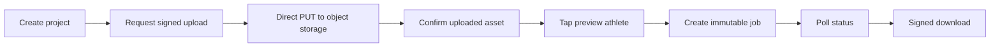

# Frontend MVP Session

## Scope

Implemented `frontend/**` for service-plan tasks F1.1, F2.1, F3.1, and F4.1. No backend, worker, or documentation files were changed.

## Delivered

- Vite + React + TypeScript app shell with responsive desktop/mobile layout.
- Typed API contract models and client for project, signed source upload, upload confirmation, job creation, job polling, and signed download.
- Direct signed `PUT` upload with progress reporting; video bytes never proxy through the browser app API.
- MP4 type and 20 GB client-side validation.
- Preview video with responsive `object-fit: contain` coordinate mapping that accounts for letterboxing and source dimensions.
- Normalized target payload with `frame_time_ms`, `normalized_x`, and `normalized_y` sent once during immutable job creation.
- `16:9` / `9:16` output controls and `tight`, `balanced`, `safe`, `full_movement` profile controls.
- Bounded polling, explicit queued/processing/completed/failed states, safe API errors, retry-by-new-job behavior, and signed result download.
- Unit tests for coordinate mapping and API request/error contracts.

## Verification

- `npm install`: passed, 55 packages audited, 0 vulnerabilities.
- `npm run typecheck`: passed.
- `npm test`: passed, 2 test files and 5 tests.
- `npm run build`: passed, Vite production bundle generated in `dist/`.
- `git diff --check`: not run successfully because the workspace is not a Git repository.
- `git status --short`: not run successfully for the same reason.

## Notes

- API base URL is configured with `VITE_API_BASE_URL`; empty defaults to same-origin `/api/v1`.
- Signed upload/download URLs exist only in runtime state and are not persisted.
