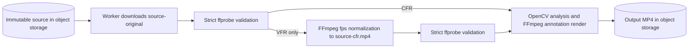

## Goal
Accept supported variable-frame-rate phone videos by producing a job-local constant-frame-rate derivative before analysis and rendering, while preserving the uploaded source object.

## Task Tree
- VFR source normalization
  - VFR-1: Add permissive source inspection and an FFmpeg CFR normalizer.
    - Outcome: Supported MP4/MOV H.264 or HEVC video with AAC audio can be inspected even when its rates differ, and a VFR source is transcoded to job-local H.264/AAC MP4 at its average frame rate.
    - Ownership: Worker media adapter.
    - Dependencies: Existing `FFprobeAdapter`, `SubprocessRunner`, and worker FFmpeg image dependency.
    - Implementation/reuse: Let `FFprobeAdapter.inspect` optionally allow unequal average and real rates, retaining all existing container, codec, duration, audio, and rotation validation. Add a `CFRNormalizer` protocol and `FFmpegCFRNormalizer` that uses FFmpeg's `fps` filter and CFR output mode, maps only the primary video and optional AAC audio, relies on FFmpeg's default display rotation normalization, and reports a user-safe media error on failure. The target rate is the valid input `avg_frame_rate` to retain the source's intended average cadence without adding configuration.
    - Verification: Unit tests cover permissive VFR inspection, the normalizer command, rotation-safe mapping, and subprocess failure classification. A real FFmpeg test creates a VFR input and verifies its derivative passes strict inspection with equal rates.
  - VFR-2: Normalize only when worker validation identifies VFR.
    - Outcome: The pipeline downloads the original to `source-original`, uses it unchanged for strict validation when CFR, and otherwise creates and uses `source-cfr.mp4` for all downstream analysis and rendering.
    - Ownership: Worker pipeline.
    - Dependencies: VFR-1.
    - Implementation/reuse: Catch only `VARIABLE_FRAME_RATE` from strict inspection, re-inspect permissively to obtain the target rate, write the derivative once per job scratch directory, then strictly inspect it. Do not upload, persist, or overwrite either source object. Other validation failures retain their current terminal behavior.
    - Verification: Pipeline tests prove CFR sources skip normalization, VFR sources normalize once and downstream receives the derivative, and a failed normalization does not proceed to processing.
  - VFR-3: Update the worker contract and implementation plan.
    - Outcome: Documentation accurately describes source normalization, scratch-space behavior, timing policy, and retained supported-format restrictions.
    - Ownership: Worker documentation.
    - Dependencies: VFR-1, VFR-2.
    - Implementation/reuse: Update the offline-MVP source contract, media-validation section, W2.1 implementation-plan entry, and applicable documentation index only if a new focused document is needed. No new API, database, or object-storage contract is introduced.
    - Verification: Validate internal Markdown links and ensure implementation names/behavior match the worker code.

## Architecture After Plan
The Go API continues to store and dispatch the immutable uploaded source. The Python worker downloads that source into job scratch, validates it strictly, and only for VFR input creates a temporary CFR derivative. The derivative replaces the source only inside the worker's downstream analysis/render path; it is deleted with the job scratch directory.

## Files to Modify
- `worker/src/boulder_frame_worker/media.py`: add permissive probing support and the CFR normalizer adapter.
- `worker/src/boulder_frame_worker/pipeline.py`: select the downloaded original or its job-local CFR derivative before downstream use.
- `worker/src/boulder_frame_worker/runtime.py`: construct and inject the normalizer using configured FFmpeg.
- `worker/tests/test_media.py`: add unit and FFmpeg integration coverage for normalization.
- `worker/tests/test_pipeline.py`: add pipeline branch coverage for CFR/VFR source selection.
- `worker/tests/test_runtime.py`: adjust composition tests for the new dependency if needed.
- `docs/architecture/offline-reframing-mvp.md`: replace VFR rejection with worker-local normalization behavior.
- `docs/architecture/service-implementation-plan.md`: update W2.1 acceptance and verification contract.
- `docs/specs/worker/runtime-and-pipeline.md`: document the validation/normalization boundary.

## New Files (if any)
- None anticipated.

## Risks
- CFR conversion is CPU-intensive and adds a full source transcode before CV processing; job leases must remain sufficient for the largest supported videos.
- CFR output uses the source average rate, which preserves cadence approximately but may shift a preview timestamp by up to one output frame.
- FFmpeg's rotation behavior must be covered so the normalized video uses the same display coordinate system as the browser selection.
- This broadens VFR handling only for existing supported MP4/MOV, H.264/HEVC video, and AAC audio; it does not make arbitrary containers/codecs supported.
