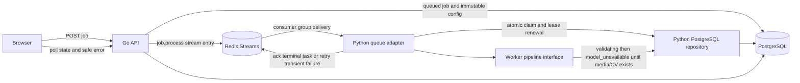

## Goal
Implement stable Python worker queue and PostgreSQL adapters that durably claim the Go API's queued jobs, enforce retry-safe state ownership, and replace indefinite queued jobs with an explicit safe terminal error until the media/CV pipeline is implemented.

## Task Tree

Design decisions that apply to every task:

- Keep the queue payload unchanged: exactly `job_id` and `trace_id`, published as `job.process` to `default` with the job UUID as task ID.
- PostgreSQL is the durable source of truth. Redis acknowledges task delivery only; it must not determine job state.
- The database lease and queue-delivery lease are independent. Every durable write must require the current database lease owner and a non-expired lease.
- Do not implement source download, FFprobe validation, model inference, target association, tracking, crop planning, rendering, output upload, asset/artifact creation, or successful completion in this milestone.
- The approved queue transport is Redis Streams with consumer groups. Do not retain or emulate the Asynq internal protocol.
- Since the actual execution pipeline is not implemented, a claimed production job must transition to `validating` and then fail with the existing user-safe `model_unavailable` error. It must never be marked `completed` without an output asset.

- Durable worker control plane
  - **W1.1 Queue transport compatibility decision**
    - Outcome: Replace Asynq with a language-neutral Redis Streams consumer-group transport shared by Go and Python.
    - Ownership: Worker owner with backend review.
    - Dependencies: None.
    - Implementation/reuse: Use the maintained Go Redis client already present transitively in the backend module and pin the Python `redis` client. Publish `type`, `task_id`, and the exact JSON payload to a named stream; consume with a named group and consumer identity. Use `XACK` for terminal outcomes and pending-entry reclamation for abandoned deliveries. Keep PostgreSQL claim leases authoritative for idempotency.
    - Verification: Go and Python contract tests assert stream field names, exact payload, consumer-group acknowledgement, pending-entry recovery, transient retry, and duplicate delivery behavior against Redis when available.
  - **W1.2 Migration runner and durable job lease schema**
    - Outcome: PostgreSQL can safely arbitrate ownership of an active worker and reject stale state/progress/error writes.
    - Ownership: Backend owner with worker review.
    - Dependencies: W1.1.
    - Implementation/reuse: Change the Go migration runner from loading only `001_init.sql` to applying ordered, idempotent migration files. Add `lease_owner` and `lease_expires_at` to `processing_jobs`, an eligibility index suitable for job-ID claims, and a `stage` check matching the documented state/stage values. Preserve the existing immutable `configuration`, source-asset reference, and API read model. Do not reuse `SetJobFailed` for worker updates because it does not guard state or lease ownership.
    - Verification: A blank database receives every migration once; an already-migrated database is safe to restart; migration tests assert the added lease columns/constraints and preserve API job reads.
  - **W1.3 PostgreSQL worker repository**
    - Outcome: The worker can atomically claim an eligible job, load its immutable configuration and source asset metadata, renew its lease, and persist guarded transitions.
    - Ownership: Worker owner.
    - Dependencies: W1.2.
    - Implementation/reuse: Add a worker-specific repository rather than importing Go HTTP repository code. Evolve `JobRecord` into a claimed execution context containing immutable `JobConfiguration` and source asset metadata. Implement SQL operations for atomic claim of non-terminal jobs with absent/expired leases, guarded transition/progress/error writes, and lease renewal. Set `started_at` only on the first claim; set `completed_at` only for terminal states; clear the lease on terminal writes. Reject cancelled, terminal, foreign-lease, expired-lease, invalid-transition, and decreasing-progress updates without overwriting durable state.
    - Verification: PostgreSQL integration tests cover duplicate delivery, concurrent claims, expired-lease recovery, stale-owner rejection, terminal/cancelled rejection, immutable configuration hydration, monotonic progress, terminal error persistence, and lease cleanup.
  - **W1.4 Queue consumer adapter and retry mapping**
    - Outcome: A worker process receives compatible queue tasks, parses the existing contract, owns task acknowledgement/retry, and delegates durable claiming to the PostgreSQL repository.
    - Ownership: Worker owner.
    - Dependencies: W1.1, W1.3.
    - Implementation/reuse: Add a queue adapter behind a small Python protocol so the pipeline remains independent of transport. Accept only `job.process`; decode JSON then use `JobTask.from_payload`; pass the originating trace ID through structured logs. Treat malformed payloads and user-safe `WorkerError`s as acknowledged terminal outcomes after durable failure where a job can be identified. Treat Redis/PostgreSQL infrastructure failures and transient `WorkerError`s as retryable, retaining the current stage. Run queue heartbeat/lease extension for the full handler lifetime and stop consuming cleanly on shutdown.
    - Verification: Cross-language integration tests publish through `backend/queue` and consume from Python, asserting success acknowledgement, invalid-payload handling, transient retry/redelivery, no duplicate execution during a live lease, and graceful shutdown without task loss.
  - **W1.5 Runtime composition and intentional unavailable-pipeline behavior**
    - Outcome: `boulder-frame-worker --serve` composes configured adapters, publishes accurate capabilities, and no longer sleeps indefinitely.
    - Ownership: Worker owner.
    - Dependencies: W1.3, W1.4.
    - Implementation/reuse: Extend `WorkerConfig` and both config JSON files with required environment-backed database/Redis URLs, bounded concurrency, worker identity, stream/group settings, and lease settings. Pin the Redis and PostgreSQL Python dependencies. Replace the idle CLI loop with adapter startup, signal-aware draining, and resource cleanup. Keep the existing `Worker` stage orchestration injectable and renew database leases during long handlers. Until the media/CV executor exists, compose an explicit unavailable executor that transitions the claimed job into `validating` and persists `model_unavailable` with a user-safe message; do not invoke later stages or create scratch/output artifacts. Report capabilities only after successful adapter readiness.
    - Verification: CLI/config tests reject missing or invalid adapter settings; readiness reports actual capabilities; signal tests prove stop/drain/close behavior; an end-to-end queued job becomes a visible terminal `model_unavailable` failure rather than remaining queued; logs never contain credentials, signed URLs, or media bytes.
- Contract and quality documentation
  - **D1.1 Update authoritative service contracts**
    - Outcome: Documentation matches the deployed worker behavior and clearly separates completed control-plane adapters from pending media/CV/render work.
    - Ownership: Worker owner with backend review.
    - Dependencies: W1.1-W1.5.
    - Implementation/reuse: Update the worker runtime specification and worker index, the backend asynq task-distribution contract, and the service implementation plan. Document the chosen queue library/transport and version, job/database lease predicates, retry and acknowledgement rules, unavailable-pipeline terminal behavior, configuration settings, and operating diagnostics. Retain the current algorithm and output-artifact constraints; do not claim media processing exists.
    - Verification: Internal links validate, the documented task payload/state transitions/configuration names match code, documentation indexes remain accurate, and `git diff --check` passes.

## Architecture After Plan

The Go API continues to persist a queued immutable job and publish a Redis Stream entry containing task metadata and the UUID/trace payload. The Python queue adapter consumes it through a Redis Streams consumer group, while the PostgreSQL adapter atomically claims and leases the durable job. The adapter layer invokes the worker pipeline through an interface. For this scoped milestone, the only production executor persists a safe `model_unavailable` error after the `validating` transition because no source/media/CV/render/output pipeline exists yet. Future algorithm and storage work replaces that executor without changing stream, database claim, lease, or logging contracts.

Decision: Redis Streams is the approved language-neutral queue for this MVP. Existing Asynq-published entries are not protocol-compatible and must be requeued or discarded during local deployment migration; PostgreSQL remains the authority for whether a job is still eligible.

## Files to Modify

- `backend/main.go`: apply all ordered SQL migrations instead of only `001_init.sql`.
- `worker/pyproject.toml`: pin the selected queue/Redis and PostgreSQL runtime dependencies and any test-only integration dependencies.
- `worker/conf/config.json`: declare environment-backed durable adapter and queue runtime settings.
- `worker/conf/config.dev.json`: declare local development equivalents without embedding credentials.
- `worker/src/boulder_frame_worker/config.py`: parse and validate adapter URLs, concurrency, worker identity, and lease/heartbeat settings.
- `worker/src/boulder_frame_worker/cli.py`: compose the configured adapters, expose actual readiness capabilities, and provide signal-aware serving.
- `worker/src/boulder_frame_worker/state.py`: expand the repository contract and claimed record to include durable execution context and lease-guarded operations.
- `worker/src/boulder_frame_worker/worker.py`: depend on the evolved repository/pipeline interface and preserve safe terminal/transient classification.
- `worker/tests/conftest.py`, `worker/tests/test_config.py`, `worker/tests/test_state.py`, `worker/tests/test_worker.py`: repair missing test imports and revise unit tests for the durable repository/pipeline contracts.
- `docs/specs/worker/README.md`: replace the idle-worker status with the completed control-plane boundary and remaining pipeline limitations.
- `docs/specs/worker/runtime-and-pipeline.md`: document configuration, lifecycle, leases, retry behavior, and unavailable-pipeline result.
- `docs/specs/backend/redis-streams-task-distribution.md`: document the Redis Streams contract, acknowledgement, and dual-lease contract.
- `docs/architecture/service-implementation-plan.md`: record W1.1 completion and retain W2-W7 as pending.

## New Files (if any)

- `backend/migrations/002_worker_leases.sql`: adds worker lease fields, stage constraint, and claim-oriented index.
- `worker/src/boulder_frame_worker/repository.py`: PostgreSQL implementation of the worker-facing durable repository.
- `worker/src/boulder_frame_worker/queue_adapter.py`: verified queue consumer implementation and acknowledgement/retry boundary.
- `worker/src/boulder_frame_worker/runtime.py`: adapter composition, pipeline interface, unavailable executor, and graceful lifecycle support.
- `worker/tests/test_repository_integration.py`: PostgreSQL lease/transition integration coverage.
- `worker/tests/test_queue_integration.py`: Go-publisher-to-Python-consumer Redis compatibility coverage.
- `worker/tests/test_runtime.py`: CLI composition, capabilities, unavailable pipeline, and shutdown coverage.
- `.agents/sessions/worker-control-plane-adapters/implementation-summary.md`: implementation-agent evidence and verification results, created during execution.

## Risks

- Existing Redis/Asynq queue entries cannot be consumed by the new Streams worker and require a deployment migration action.
- `backend/main.go` currently executes only `001_init.sql`, so adding a migration without upgrading the runner would silently omit leases in existing databases.
- The worker configuration currently substitutes environment variables but has no secret-redaction or connection validation logic; tests must ensure credentials never appear in logs/errors.
- This milestone intentionally cannot produce output. Deploying it before media/CV/render work will change jobs from indefinitely queued to safe terminal `model_unavailable` failures.
- Queue and database leases require timeouts, heartbeat cadence, and shutdown behavior that are shorter/longer in the right order; verify them under a forced worker stop and duplicate delivery.
- The worktree contains unrelated user changes, including removed infrastructure files. Implementation must not restore, modify, or rely on those files without explicit instruction.
