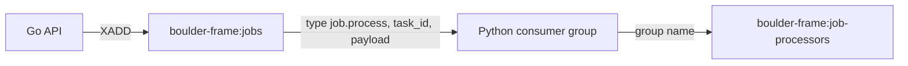

# Redis Streams Go Summary

## Changed Files

- `backend/queue/queue.go`: replaced Asynq publishing with `go-redis/v9` `XADD`; exported stream, consumer-group, task, and field constants; added Redis URL validation, context-aware publishing, structured logging, close handling, and transactional per-job duplicate suppression.
- `backend/queue/queue_test.go`: added Redis-backed contract, exact payload, idempotency, URL validation, job-ID validation, and canceled-context tests.
- `backend/main.go`: wired `NewRedisStreamsPublisher` into API startup.
- `backend/go.mod`: promoted `github.com/redis/go-redis/v9` to a direct dependency and removed Asynq.
- `backend/go.sum`: removed Asynq and no-longer-needed dependency checksums.

## Contract

Each stream entry contains exactly these transport fields:

- `type`: `job.process`
- `task_id`: the job ID
- `payload`: JSON containing exactly `job_id` and `trace_id`

The API does not create or acknowledge the consumer group. The Python worker owns group consumption and terminal `XACK` behavior.

## Evidence

- `gofmt -w main.go queue/queue.go queue/queue_test.go` completed successfully.
- `GOPROXY=off go mod tidy` completed successfully.
- `go test ./...` passed for all backend packages.
- `git diff --check` passed.
- `rg` found no `asynq` or `hibiken` references in `backend/go.*`.
