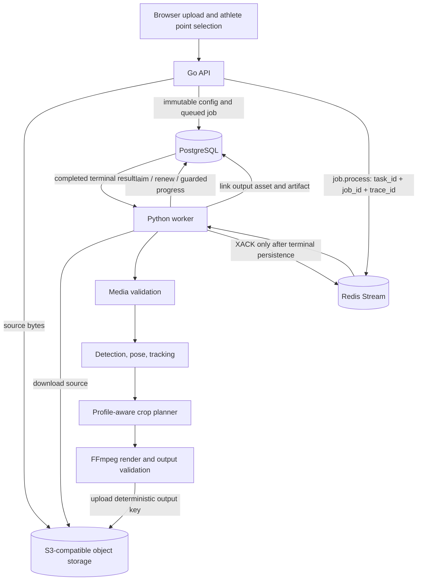

## Goal
Replace the worker's intentional `UnavailablePipeline` with an idempotent offline MVP pipeline that consumes the existing Redis job envelope, loads immutable job data from PostgreSQL, analyzes the selected athlete, renders the requested output, finalizes the output asset, and acknowledges the stream entry only after durable completion.

## Task Tree

- Goal: deliver the real worker processing path within the existing API, PostgreSQL, Redis Streams, and object-storage contracts.
  - W0: Establish model and runtime prerequisites
    - ID: W0.1
      Outcome: One detector and one pose-estimation implementation are selected, license-verified, version-pinned, and recorded in worker configuration and authoritative docs.
      Ownership: Worker/model integration
      Dependencies: None; this is the prerequisite for concrete CV work.
      Implementation/reuse: Evaluate mature existing dependencies before adding packages; preserve the one-target MVP and do not add multi-object identity tracking, ball/equipment detection, or real-time mode. Keep `MODEL_VERSION` immutable in each job configuration.
      Verification: License metadata is checked into the permitted model/dependency manifest; clean worker installation resolves pinned versions; capability check reports detector and pose support.
  - W1: Connect worker object storage and durable output finalization
    - ID: W1.1
      Outcome: The Python worker can verify readiness, download a source asset, upload a deterministic output key, and verify the uploaded object.
      Ownership: Worker infrastructure
      Dependencies: W0.1 only for final runtime image validation; storage contract is otherwise independent.
      Implementation/reuse: Add a narrow S3-compatible adapter using the existing endpoint, presign endpoint, region, bucket, access key, secret key, and path-style settings from Compose. Do not reuse Go code across languages. Classify network/service failures as transient and never expose credentials.
      Verification: Unit tests cover URL/path-style configuration, download/upload/head success, and transient storage failures; readiness fails clearly when storage is unavailable.
    - ID: W1.2
      Outcome: A completed job always has one linked, uploaded, validated output asset and artifact, with safe retries and no duplicate logical outputs.
      Ownership: Worker persistence
      Dependencies: Existing `assets`, `processing_jobs`, and `job_artifacts` schema; W1.1 for object verification.
      Implementation/reuse: Extend the worker repository with a lease-guarded transaction that inserts or reuses a deterministic job-scoped output asset, upserts the `job_artifacts` output relation, and sets `processing_jobs.output_asset_id`. Keep PostgreSQL as the completion authority and use deterministic keys such as `private/output/{project_id}/{job_id}.mp4`.
      Verification: Repository tests prove active-lease authorization, idempotent rerun, artifact uniqueness, and rejection of completion without a validated object. Add a migration only if an existing schema field is insufficient.
  - W2: Implement deterministic media validation and render orchestration
    - ID: W2.1
      Outcome: The validating stage downloads and validates the source video and creates deterministic per-job media metadata in scratch.
      Ownership: Worker media pipeline
      Dependencies: W1.1; existing `media.py`, `state.py`, and hydrated `JobRecord`.
      Implementation/reuse: Reuse the ffprobe parser and strict CFR/container/codec checks. Validate source upload state, target timestamp, dimensions, rotation, and requested output settings. Recreate prerequisites on every retry rather than relying on prior scratch contents.
      Verification: Synthetic permitted fixtures cover MP4/MOV, H.264/HEVC, CFR/VFR rejection, rotation, missing audio, corrupt media, and invalid selection errors.
    - ID: W2.2
      Outcome: The rendering stage converts a planned crop path into a frame-accurate FFmpeg render with the requested 16:9 or 9:16 output.
      Ownership: Worker media pipeline
      Dependencies: W2.1; existing FFmpeg process and output validation primitives.
      Implementation/reuse: Add a crop-path-to-filter-script boundary, normalize rotation once, preserve audio when available, encode H.264/AAC MP4, and validate dimensions, codecs, duration tolerance, and decode-to-null before upload. A fixture-only full-frame plan may be used as an intermediate integration milestone, but it must not be reported as athlete-aware reframing.
      Verification: End-to-end synthetic media tests cover both aspect ratios, audio/no-audio, duration, output codec/dimension checks, FFmpeg failures, and decode validation.
  - W3: Connect the selected-athlete analysis path
    - ID: W3.1
      Outcome: The analyzer maps the immutable browser selection to source pixels and associates it with exactly one detected athlete at the selected frame.
      Ownership: CV integration
      Dependencies: W0.1, W2.1, existing `measurement.py` coordinate and target-association seams.
      Implementation/reuse: Convert normalized preview coordinates through the documented display/rotation transform, select a detection containing the tap or nearest center, expand a bounded ROI, run pose estimation at source resolution, and produce raw frame observations. No athlete ID is added to the public API.
      Verification: Tests cover letterboxing, portrait/landscape display, rotation, edge taps, detection containment/nearest fallback, no detection, and pose ROI coordinate transformation.
    - ID: W3.2
      Outcome: The tracker produces a stable single-target measurement sequence with explicit tracked, reacquiring, and lost states.
      Ownership: CV integration
      Dependencies: W3.1; existing `tracking.py` protocol.
      Implementation/reuse: Change the tracker seam to consume raw frame observations and emit `TrackedMeasurement`; implement a single-target Kalman-style filter, outlier rejection, short-gap recovery, and reacquisition without identity switching. Lost tracking must produce a conservative wide crop rather than an invented close crop.
      Verification: Unit tests cover stationary movement, lateral movement, jumps/limb extension, occlusion, reacquisition, lost track, outliers, and monotonic frame timestamps.
    - ID: W3.3
      Outcome: The planner produces a smooth, profile-aware crop path that contains the athlete's movement envelope.
      Ownership: Framing/planning
      Dependencies: W3.2; existing `planner.py` geometry and profile configuration.
      Implementation/reuse: Feed smoothed measurements into the deterministic planner interface. Add forward filtering/backward smoothing for recorded video, detector fallback bounds, pose confidence/uncertainty padding, directional lead room, containment-risk zoom-out, slow stable zoom-in, pan dead-zone/rate limits, and lost-track widening. Keep the planner replaceable behind its current interface; do not add a global optimizer.
      Verification: Planner tests assert containment, profile differences, pan/zoom velocity and acceleration limits, directional lead, uncertainty widening, lost-track behavior, and reacquisition recovery.
  - W4: Compose the real pipeline and preserve delivery semantics
    - ID: W4.1
      Outcome: `compose_runtime` invokes the real four-stage worker pipeline instead of `UnavailablePipeline`, while preserving lease heartbeats, restart safety, and current state transitions.
      Ownership: Worker runtime
      Dependencies: W1.1, W1.2, W2.1, W2.2, W3.1-W3.3.
      Implementation/reuse: Reuse `Worker.process`, `QueueConsumerAdapter`, `PostgresJobRepository`, and `RedisStreamsTransport`. Stage handlers must load only the job-snapshotted configuration, persist progress monotonically, release leases on transient errors, leave Redis entries pending for recovery, and acknowledge only terminal jobs. Resume each active stage by reconstructing deterministic prerequisites.
      Verification: Runtime tests prove successful completion, terminal failure at every stage, transient retry, duplicate terminal delivery, lease loss, scratch cleanup, and resume from each active state.
  - W5: Verify end-to-end behavior and document the implemented contract
    - ID: W5.1
      Outcome: A disposable integration suite proves the complete upload-to-output path and the failed/unavailable path remains safe.
      Ownership: Integration verification
      Dependencies: W4.1.
      Implementation/reuse: Use disposable PostgreSQL, Redis, and S3-compatible services plus permitted synthetic fixtures. Assert exact Redis envelope validation, PostgreSQL lease ownership, state transitions, deterministic output idempotency, output artifact linkage, signed download availability, retry/reclaim behavior, and terminal user-safe errors.
      Verification: Run worker/backend tests, integration tests, formatting/type checks, media fixture checks, and `git diff --check`.
    - ID: W5.2
      Outcome: Authoritative documentation describes the implemented worker data flow, configuration, storage keys, model versions, state transitions, and operational verification.
      Ownership: Repository documentation
      Dependencies: W4.1 and W5.1 so documentation matches behavior.
      Implementation/reuse: Update the narrow worker runtime/pipeline specification and its index, plus development setup if new model or storage variables are added. Keep the session plan as coordination evidence, not the authoritative contract. Include the final Mermaid data-flow diagram in the focused architecture document.
      Verification: Validate documentation links, API/persistence names against code, and `git diff --check`.

## Architecture After Plan

The browser and Go API contracts remain unchanged. The Redis entry remains a small dispatch envelope; PostgreSQL remains the durable job/configuration and lease authority; object storage remains the source/output byte store. The Python worker hydrates the job, reconstructs deterministic stage prerequisites, performs analysis and planning, renders and validates output, finalizes the artifact under the active lease, and only then acknowledges Redis.

## Files to Modify

- `worker/src/boulder_frame_worker/config.py`: add worker object-storage and pinned model configuration with validation.
- `worker/conf/config.dev.json`: add development substitutions/defaults for storage and model settings.
- `worker/pyproject.toml`: add only the selected, license-approved model and S3-compatible client dependencies.
- `worker/src/boulder_frame_worker/runtime.py`: compose storage, model, analyzer, planner, renderer, finalizer, and `Worker.process` instead of `UnavailablePipeline`.
- `worker/src/boulder_frame_worker/repository.py`: add lease-guarded output asset/artifact finalization and any source metadata persistence required by the pipeline.
- `worker/src/boulder_frame_worker/worker.py`: make stage integration and restart prerequisites explicit where needed; preserve existing lease/error semantics.
- `worker/src/boulder_frame_worker/media.py`: add crop-path filter generation, rotation normalization, duration/audio/decode validation, and render integration.
- `worker/src/boulder_frame_worker/measurement.py`: connect raw observations, selection association, ROI/pose transformation, and confidence/uncertainty data.
- `worker/src/boulder_frame_worker/tracking.py`: implement the single-target tracker and raw observation interface.
- `worker/src/boulder_frame_worker/planner.py`: complete recorded-video smoothing, containment envelope, lead room, rate limits, and lost-track behavior.
- `worker/tests/test_config.py`: cover storage/model configuration and safe validation.
- `worker/tests/test_runtime.py`: replace unavailable-pipeline-only expectations with real composition and terminal/transient behavior.
- `worker/tests/test_repository.py`: cover output asset/artifact finalization and idempotency.
- `worker/tests/test_media.py`: cover real fixture validation/render/output checks.
- `worker/tests/test_measurement.py`: cover selection-to-observation association and coordinate transforms.
- `worker/tests/test_tracking.py`: cover tracker state and recovery behavior.
- `worker/tests/test_planner.py`: cover movement-envelope and crop-path constraints.
- `worker/tests/test_worker.py`: cover stage integration, retries, resume, and scratch cleanup.
- `backend/migrations/`: add a migration only if finalization requires fields not present in the existing asset/job/artifact schema.
- `docs/architecture/service-implementation-plan.md`: record completed implementation milestones and remaining explicit boundaries.
- `docs/specs/worker/runtime-and-pipeline.md`: document the real worker pipeline, storage/finalization contract, and ACK semantics.
- `docs/specs/worker/measurements-and-planner.md`: align observation, tracking, and planner behavior with the implementation.
- `docs/specs/README.md`: keep the worker specification discoverable.
- `docs/dev/development.md`: document any new local environment/model setup required to run the worker.

## New Files (if any)

- `worker/src/boulder_frame_worker/storage.py`: narrow Python S3-compatible download/upload/head adapter and error classification.
- `worker/src/boulder_frame_worker/pipeline.py`: concrete stage orchestration and intermediate analysis/render data contracts, if keeping runtime composition small requires a separate module.
- `worker/src/boulder_frame_worker/inference.py`: selected detector/pose adapter and pinned model loading boundary.
- `worker/tests/fixtures/`: permitted synthetic media and model/evaluation metadata only; private user videos remain excluded.
- `worker/tests/test_storage.py`: storage adapter unit tests.
- `worker/tests/test_pipeline_integration.py`: end-to-end worker pipeline tests against disposable dependencies and fixtures.
- `docs/architecture/worker-processing-mvp.md`: focused architecture document if the existing worker specification cannot contain the finalized data-flow and persistence details without becoming ambiguous.

## Risks

- Model selection is unresolved in the current repository; implementation cannot truthfully enable athlete-aware processing until a detector and pose model are license-verified and pinned.
- The existing media renderer accepts a filter script but does not yet generate a per-frame crop path; rendering integration must not silently produce a static center crop as the finished MVP.
- Object upload and PostgreSQL finalization are separate systems; deterministic keys, idempotent upserts, and post-upload verification are required to avoid orphaned or falsely completed jobs.
- Expired leases restart with a fresh scratch directory; every active stage must reconstruct its inputs or intentionally restart from a safe persisted boundary.
- Rotation and browser letterboxing can produce incorrect athlete association if normalized coordinates are applied directly to raw source pixels.
- A lost track must widen safely and never invent a close crop; this is a product-safety invariant, not an optimization detail.
- Existing working-tree changes in `deploy/bin/local` and `deploy/docker/worker.Dockerfile` are unrelated and must not be reverted.
- The first implementation milestone may prove storage, state, and rendering with synthetic fixtures before model-backed CV is enabled; that milestone must remain explicitly labeled as incomplete athlete reframing.
