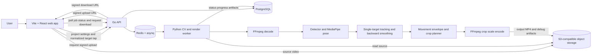

# Offline Reframing MVP

## Purpose

Implement an offline service that turns one wide, static-camera sports recording into a smooth 1080p reframed video. A user uploads a video, selects one athlete, chooses an output aspect ratio and framing profile, waits for processing, and downloads the rendered result.

This document is the authoritative implementation specification, including the product rationale and algorithm decisions behind these choices.

## Product Contract

### Supported workflow

1. Create a project.
2. Upload one source video.
3. Select the athlete by tapping/clicking them in a preview frame.
4. Choose `16:9` or `9:16` and one framing profile.
5. Start processing and observe the job state.
6. Download the finished 1080p MP4 or view a clear terminal failure.

### Supported input

- One continuous shot from a static phone or tripod.
- 4K input is the recommended source resolution.
- One intended athlete.
- Constant-frame-rate video with a supported FFmpeg decode path.
- H.264/AAC MP4 and QuickTime MOV sources are supported. HEVC/H.265 video in MOV is
  accepted when the worker's FFmpeg build can decode it; browser preview support depends on
  the browser codec (Safari on macOS is the recommended preview path for HEVC).

### Output

- 1920x1080 for `16:9`, or 1080x1920 for `9:16`.
- H.264 video and source audio when available.
- A crop path that keeps the selected athlete's available full-body movement in frame and moves smoothly.
- A download URL to the output asset.

### Framing profiles

| Profile | Behavior |
| --- | --- |
| `tight` | Smallest baseline safety margin; zooms in only while movement is stable and confidence is high. |
| `balanced` | Default safety margin and moderate composition lead room. |
| `safe` | Larger base and uncertainty margins; favors retention over subject size. |
| `full_movement` | Widest intended framing; prioritizes limbs and predicted movement envelope. |

Profile differences are planner configuration only. They do not select different models or alter the tracking identity.

### Non-goals

- Real-time reframing or live preview output.
- Multi-athlete selection/tracking.
- Ball or sport-equipment detection.
- AI upscaling or super-resolution.
- Automatic lens-distortion correction.
- Native camera capture in the initial implementation.
- Variable-frame-rate input support until timestamp normalization is explicitly implemented and tested.

## Architecture

The browser is responsible for project settings and the initial athlete selection. It never decodes or processes the full video. A Go service owns authorization, durable metadata, signed asset URLs, and job submission. A Python worker owns video analysis, virtual-camera planning, and rendering, because the required computer-vision and numerical libraries are mature in Python.



## Technology Decisions

| Concern | Choice | Constraint or reason |
| --- | --- | --- |
| Web app | Vite, React, TypeScript | Minimal browser UI for uploads, subject selection, status, and download. |
| API | Go, `chi`, `pgx` | Go is the primary application language; `pgx` provides direct PostgreSQL access. |
| Background dispatch | `asynq`, Redis | Durable asynchronous handoff from the Go API to long-running work. |
| Metadata | PostgreSQL | Stores projects, jobs, configurations, asset references, status, and errors. |
| Video assets | S3-compatible object storage | Original 4K files, rendered MP4s, and optional debug artifacts stay outside service filesystems. |
| CV/render worker | Python 3.12 | Required ecosystem for MediaPipe, ONNX Runtime, OpenCV, numerical processing, and the later optimizer. |
| Detection | Apache-2.0-compatible person detector through ONNX Runtime | Exact model remains a benchmark decision based on license, small-subject recall, and target hardware performance. |
| Pose | MediaPipe Pose Landmarker Full | Returns body landmarks required for a pose-aware movement envelope. |
| Tracking | Custom single-target Kalman filter | A selected-athlete MVP needs transparent tracking and confidence behavior, not a multi-object tracker. |
| Media | FFmpeg, OpenCV | FFmpeg handles decode, encode, audio, and validation; OpenCV is limited to frame-level utilities. |
| First planner | Deterministic target-crop controller | Fast to validate visually and isolated behind a planner interface. |
| Planned optimizer | CVXPY and OSQP | Replaces the controller only after evaluation data justifies a whole-shot constrained quadratic program. |
| Local/online topology | Docker Compose | Runs the complete stack locally and on a self-hosted online development host; online HTTPS is handled by Caddy. |

## Service Boundaries

### Web app

- Creates projects and submits source-asset metadata.
- Requests signed upload and download URLs from the API.
- Renders a preview frame and sends target-tap coordinates normalized to `[0, 1]` in source-frame space: `x = 0` is left, `y = 0` is top.
- Sends output aspect ratio and framing profile.
- Polls the job resource until it becomes terminal.
- Displays progress, terminal errors, and output download.

### Go API

- Authenticates and authorizes project and asset access when authentication is introduced. Initial local development may use a single development user; public deployment must not.
- Validates all requests and supported source constraints.
- Creates signed object-store upload/download URLs.
- Persists immutable processing configuration before enqueueing the job.
- Enqueues one idempotent processing task using a job identifier.
- Exposes project, asset, job status, and output artifact metadata.
- Does not call CV models, decode video, or render media.

### Python worker

- Claims an enqueued job and moves it through valid states.
- Loads the immutable job configuration and source asset from PostgreSQL/object storage.
- Normalizes source rotation and validates dimensions, codec, timing, and decodability.
- Runs athlete measurement, tracking, crop planning, and rendering.
- Periodically persists stage progress and structured errors.
- Writes output/debug artifacts to object storage and makes the completed output available through the API.
- Is stateless between jobs; all durable state belongs in PostgreSQL or object storage.

## API Contract

The external API is REST over JSON. Exact route/version syntax can be selected during scaffolding, but its resource contract must remain as follows.

### Project

```json
{
  "id": "project_uuid",
  "name": "training session",
  "created_at": "2026-08-18T12:00:00Z"
}
```

### Asset

```json
{
  "id": "asset_uuid",
  "project_id": "project_uuid",
  "kind": "source",
  "upload_state": "pending|uploaded|invalid",
  "storage_key": "private/source/project_uuid/asset_uuid.mov",
  "width": 3840,
  "height": 2160,
  "frame_rate": 60,
  "duration_ms": 42000,
  "created_at": "2026-08-18T12:00:00Z"
}
```

The API returns a signed upload URL before the client sends source bytes. The client must confirm upload completion before it can create a processing job.

### Processing request

```json
{
  "source_asset_id": "asset_uuid",
  "target_selection": {
    "frame_time_ms": 0,
    "normalized_x": 0.5,
    "normalized_y": 0.5
  },
  "output": {
    "aspect_ratio": "16:9",
    "profile": "balanced"
  }
}
```

The target selection must use the displayed frame's normalized coordinates after any browser preview layout transform. The worker maps the coordinate to decoded source pixels and associates it with a detected person at the chosen frame.

### Job

```json
{
  "id": "job_uuid",
  "project_id": "project_uuid",
  "source_asset_id": "asset_uuid",
  "state": "queued",
  "stage": "queued",
  "progress": 0,
  "configuration": {
    "target_selection": {
      "frame_time_ms": 0,
      "normalized_x": 0.5,
      "normalized_y": 0.5
    },
    "output": {
      "aspect_ratio": "16:9",
      "profile": "balanced"
    },
    "pipeline_version": "git_sha_or_release",
    "model_version": "pinned_model_identifier"
  },
  "output_asset_id": null,
  "error": null,
  "created_at": "2026-08-18T12:00:00Z",
  "started_at": null,
  "completed_at": null
}
```

`configuration` is immutable after job creation. Retrying uses the same job configuration unless the user explicitly creates a new job.

### Job states

| State | Meaning |
| --- | --- |
| `queued` | The API persisted the job and placed it in the queue. |
| `validating` | The worker is checking source media and selection viability. |
| `analyzing` | Detection, pose, tracking, and crop planning are running. |
| `rendering` | FFmpeg is creating the output video. |
| `uploading` | The worker is storing completed artifacts. |
| `completed` | The output asset is available. |
| `failed` | A terminal error is recorded. |
| `cancelled` | Reserved for an explicit future cancellation feature; no worker cancellation is required in the first implementation. |

The worker may retry transient object storage, queue, or infrastructure failures. Invalid media, no selected athlete at the selected frame, unsupported timing, and unrecoverable rendering errors are terminal failures with a user-safe message and a structured internal error code.

## Persistence Model

The initial PostgreSQL schema has these durable entities:

| Entity | Required fields | Notes |
| --- | --- | --- |
| `projects` | id, name, owner_id, created_at | `owner_id` may use the local development user until authentication exists. |
| `assets` | id, project_id, kind, storage_key, upload_state, media metadata, created_at | `kind` is `source`, `output`, or `debug`. |
| `processing_jobs` | id, project_id, source_asset_id, state, stage, progress, immutable configuration JSON, error code/message, timestamps | Stores pipeline and model versions in the configuration. |
| `job_artifacts` | id, job_id, asset_id, kind, created_at | Links completed output and optional debug artifacts. |

Store only object keys and metadata in PostgreSQL. Do not store video bytes or per-frame measurements in relational rows. Optional visual-debug overlays and compact planner telemetry belong in object storage as job artifacts.

## Processing Specification

### 1. Validate and normalize source

1. Fetch source asset metadata and inspect the asset with FFmpeg/ffprobe.
2. Reject unsupported codec/container, undecodable media, missing video stream, and variable-frame-rate inputs.
3. Normalize display rotation before analysis and retain source audio mapping for output.
4. Establish a constant analysis cadence that maps exactly to output timestamps.

### 2. Identify and measure the athlete

1. Decode the user-selected source frame.
2. Run full-frame person detection on a downscaled frame.
3. Match the detection containing or nearest the normalized tap point.
4. Expand the selected person region by a configurable 30-60%.
5. Crop that ROI from the original-resolution frame and run MediaPipe Pose Landmarker Full.
6. Transform landmarks back to source-frame coordinates.
7. For later frames, use periodic full-frame detection for correction/reacquisition and pose inference within the predicted target ROI.

For every analyzed frame, emit a root estimate, pose bounds, detector bounds, confidence, tracking state, and source-pixel coordinate system. The root estimate is a confidence-weighted combination of hip and shoulder centers, with detector center only as fallback. The crop pan follows the root, not the raw bounding-box center.

### 3. Track and recover

Use a single-target Kalman filter with position, velocity, acceleration, and logarithmic scale. Correct it with detector and pose measurements. Keep an appearance signature only for reacquisition; it is not a multi-object tracker.

When confidence drops:

1. Stop zooming in.
2. Increase envelope uncertainty margins.
3. Continue short-horizon state prediction.
4. Run full-frame detection to reacquire.
5. Expand the crop toward the widest valid composition.

When no reliable athlete can be reacquired, mark the sequence lost and render the widest valid crop rather than inventing a close-up. Source-frame exits are unavoidable containment failures and must be recorded in evaluation telemetry.

### 4. Build movement envelopes

Construct each frame's envelope from reliable pose landmarks, detector bounds, and profile-specific safety padding. The envelope must contain visible head, hands, elbows, knees, feet, torso, and the detector fallback bounds when present.

Add directional lead room based on smoothed velocity and acceleration. Add uncertainty padding based on tracking confidence/covariance. Equipment remains an additional future model; the MVP compensates only through the selected profile's generalized safety margin.

### 5. Smooth recorded-video trajectory

Recorded video exposes future measurements. Apply forward Kalman filtering followed by backward smoothing, interpolate only short validated gaps, and reject robust outliers before calculating envelopes. Do not use a learned movement predictor in this MVP.

### 6. Plan crop path

For source dimensions `W` by `H`, output aspect ratio `r`, crop center `(cx, cy)`, and crop height `h`, crop width is `r * h`. Every crop must remain within source bounds and contain the padded envelope whenever the source itself contains it.

The first planner implementation uses a target crop plus asymmetric temporal controls:

- Derive the minimum valid aspect-ratio crop around the current padded envelope.
- Place the target center at the torso root plus capped directional lead room.
- Apply a pan dead zone and smoothing.
- Zoom out quickly when containment, predicted risk, or confidence requires it.
- Zoom in slowly only after a stable hold period and high confidence.
- Use hysteresis: zoom out when the envelope uses roughly 75-80% of crop extent; zoom in only after it remains below roughly 50-60%.
- Clamp crop position and size to source boundaries every frame.

The planner must be behind an interface that accepts per-frame measurements/configuration and emits crop rectangles. This isolates the later replacement with a whole-shot CVXPY/OSQP constrained quadratic optimizer. Do not add that optimizer until the evaluation set shows a material limitation in the deterministic controller.

### 7. Render and validate

1. Convert the crop path into FFmpeg-compatible crop/scale commands or frame-accurate equivalent transforms.
2. Render 1080p H.264 output at the selected aspect ratio.
3. Preserve source audio when supported.
4. Inspect the output with ffprobe and verify codec, dimensions, duration tolerance, audio mapping, and decodability.
5. Upload the output asset and optional debug overlays before marking the job `completed`.

## Quality Gates

### Automated checks

- Unit tests for normalized target-coordinate mapping.
- Unit tests for source and aspect-ratio crop containment.
- Unit tests for profile ordering, directional margins, low-confidence widening, and maximum pan/zoom-rate behavior.
- Fixture tests for selection association, pose-coordinate transformation, short tracking gaps, reacquisition, and lost-track behavior.
- Media integration tests for dimensions, aspect ratio, codec, duration tolerance, audio preservation, and playable output.
- API/worker integration tests for immutable job configuration, state transitions, idempotent enqueueing, transient retry behavior, and failed-job cleanup.
- Browser end-to-end test for a short MP4 or MOV fixture video from upload through output download.
- CI formatting, type checks, test execution, and `git diff --check`.

### Evaluation set

Build a small, annotated, versioned evaluation manifest before planner tuning. It must include a stationary athlete, sprint/lateral movement, jump or limb extension, temporary occlusion, and lost-subject sequence. Keep private source videos outside version control; version only permitted fixtures, annotations, and evaluation metadata.

Track these measures per job and profile:

- Subject-retention rate.
- Limb-cropped rate.
- Edge-risk rate.
- Average athlete frame size.
- Pan/zoom velocity, acceleration, and jerk.
- Tracking-recovery time.
- Output sharpness/quality checks.
- Human preference against the original wide recording.

## Operational Requirements

- All source and output assets are private by default.
- Signed object-store URLs must be short-lived and limited to one authorized asset operation.
- Configure an explicit retention/deletion policy before accepting external user videos.
- Persist pipeline version, model identifier, and planner configuration with every job so outputs are reproducible.
- Emit structured logs and per-stage timing for validation, analysis, rendering, upload, and failures.
- Keep API and worker containers independently deployable and scalable; GPU workers are optional until benchmarked detection/pose/render workload requires them.
- Do not place long-running media work in the Go API process.

## Delivery Order

1. Scaffold the Vite/React app, Go API, Python worker, Docker Compose development topology, database migrations, and object-store integration.
2. Implement assets, signed uploads, project/job resources, immutable configuration, `asynq` dispatch, and job status polling.
3. Implement source validation and a fixture-only FFmpeg render path end to end.
4. Add initial target selection, detector association, pose ROI transformation, Kalman tracking, and confidence/lost-track states.
5. Add movement envelopes and deterministic crop planning.
6. Add production output validation, debug overlays, automated tests, evaluation metrics, and observability.
7. Evaluate framing quality before considering the global optimizer, native iOS capture, real-time mode, or sport-specific models.

## Deferred Roadmap

| Capability | Prerequisite |
| --- | --- |
| Global crop-path QP | Evaluation evidence that the deterministic planner cannot meet containment/smoothness goals. |
| iOS ultra-wide capture | Offline quality validated; use Swift, SwiftUI, and AVFoundation with physical ultra-wide camera discovery. |
| Android capture | Separate product decision; use Kotlin and CameraX, not a premature cross-platform abstraction. |
| Real-time reframing | Offline planner validated, plus latency, thermal, battery, and device targets; use an IMM Kalman predictor and receding-horizon control. |
| Multi-athlete tracking | Repeated identity-switching failures; evaluate an appearance-based tracker such as Deep OC-SORT. |
| Equipment/ball detection | A chosen sport and labeled data showing generalized padding is insufficient. |
| Lens correction | Device-specific calibration or reliable lens metadata. |
| Super-resolution | Measured output-quality need after source-resolution guidance and crop limits are validated. |
