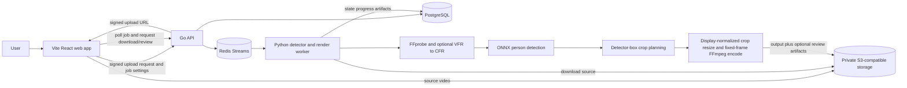

# Offline Reframing MVP

## Purpose

Boulder Frame converts one continuous wide, static-camera sports recording into a smooth 1080p close-up
of one user-selected athlete. Processing is offline only. The user uploads an MP4 or MOV, taps the
athlete in a preview frame, chooses an aspect ratio and profile, waits for completion, and downloads
an H.264/AAC MP4.

## MVP Boundary

- One static-camera shot and one selected athlete.
- 4K input is recommended; output is 1080p `16:9` or `9:16`.
- Supported source video is H.264 or HEVC in MP4/QuickTime MOV with optional AAC. CFR input is used
  directly; supported VFR input is normalized once to a job-local CFR derivative without modifying
  the immutable source object.
- No real-time processing, multi-athlete operation, landmark inference, future-position inference,
  equipment detection, super-resolution, lens correction, or native capture.

## Framing Contract

The W0.2 worker is detector-only. It runs the pinned ONNX SSD-MobilenetV1-12 person detector on the
selected frame and associates the tap with a containing or nearest person box. Every analyzed frame
uses its current person detection. The selected box seeds separate forward and backward association
passes, so no frame is associated before the user selection is resolved. A later candidate must remain
within 1.5 times the last accepted detector-box diagonal of that actual box; rejected candidates
and detector misses widen framing without changing that reference. No former target position is extrapolated.

| Profile | Detected athlete height / crop height |
| --- | --- |
| `tight` | `.60` |
| `balanced` | `.50` |
| `safe` | `.40` |
| `full_movement` | `.33` |

The `deterministic-v3` planner derives a profile-target aspect-ratio crop on the detection center,
clamps it to the source, then applies independent scale and center hysteresis against the previous
final crop. Scale enters adjustment beyond 5% relative target-height error and closes its gate at
2%; center enters beyond 1% of either crop dimension and closes within 0.4% on both axes.
Strictly increasing measurement timestamps drive speed/acceleration-limited log-height zoom and
source-normalized pan, with braking near targets and preserved velocity when a detection retargets
motion. Closing a gate allows a short braking/settling interval, not an instant stop. Idle crops at
rest hold exactly. The first detected frame without a previous crop uses the desired crop directly.
Profile fractions remain centerlines, while small detector jitter leaves settled crops unchanged
when no safety constraint intervenes.

Decision order is desired crop/source clamp, independent scale/center gates, timestamp-based motion
or settling, candidate clamp, then containment. Containment may immediately expand or shift a crop
and overrides deadbands and motion limits. Corrections reset velocity only for affected components.
If source bounds or the requested aspect cannot contain a detection, the planner centers the largest
valid crop as far as bounds permit and records `source_aspect_limited` rather than claiming
containment. These safety results remain separate from gate diagnostics.

A missed detection bypasses/resets both gates, cancels pan and inward zoom velocity, and widens the
previous crop with timestamp-based zoom limits toward the full valid source-aspect height. Outward
zoom velocity is retained; center changes only for necessary clamping, never position extrapolation.
A first-frame miss uses the full crop. Reacquisition compares against the widened previous crop,
not the previous detection. The planner remains behind an interface for future replacement without
changing API or storage contracts. Formulas, limits, and diagnostics are specified in
[Detection and Framing](../specs/worker/measurements-and-planner.md).

## Architecture

The React app handles upload UI, selection, settings, job polling, download, and terminal review.
The Go API owns request validation, PostgreSQL metadata, signed URLs, and Redis dispatch. The Python
worker owns media processing and never runs inside the API process. PostgreSQL stores immutable job
configuration, pipeline/model versions, state/progress, errors, and artifact references; object storage
stores all source, output, telemetry, manifest, and review media bytes.

## Immutable Job Contract

The API accepts normalized source-frame selection coordinates and output settings. It snapshots
pipeline/model versions before queueing. W0.2 model version is exactly
`w0.2-ssd-mobilenetv1-12-onnx-detector-only-1`; a claimed job whose immutable model version differs
from the active verified worker fails terminally with `model_unavailable` before media or inference.
Existing W0.1 jobs are incompatible with W0.2 and fail this check; users must create a new W0.2 job,
not retry the old job.

The default pipeline is `w0.2.3`. Immutable `planner` configuration contains
`controller = deterministic-v3`, `scale_enter_fraction = 0.05`, `scale_exit_fraction = 0.02`,
`center_enter_fraction = 0.01`, `center_exit_fraction = 0.004`, `zoom_max_speed = 0.5`,
`zoom_max_acceleration = 1.0`, `pan_max_speed = 0.25`, and `pan_max_acceleration = 0.5`.
These fixed algorithm constants are not public job inputs. Pipeline version and planner
configuration participate in the job hash,
so an identical submission cannot reuse an older controller's job or cached crop path. Deploy API
and worker together using the [drained cutover procedure](../dev/development.md#start-modules);
retrying an old job does not upgrade its immutable configuration.

Job stages are `queued`, `validating`, `analyzing`, `rendering`, `uploading`, and terminal
`completed`, `failed`, or reserved `cancelled`. Redis provides at-least-once delivery; PostgreSQL
leases and guarded transitions are processing authority. Output finalization is idempotent.

## Rendering And Durability

The worker validates source media, bounds VFR normalization by configured source-size and timeout
limits, preserves valid optional AAC without shortening video, and rotation-normalizes decoded frames
into display coordinates. It applies each planned crop once with OpenCV, resizes it to the fixed 1080p
output surface, and streams fixed-size BGR frames to FFmpeg for H.264/AAC encoding and muxing. Crop
coverage/geometry and decoded-output count mismatches are terminal `invalid_output`; inconsistent
decoded source frames are `invalid_media`, while encoder start/write/finalization failures are
`render_unavailable`. The immutable source object and local VFR derivative are never overwritten or
persisted as a new source.

Optional debug capture is private and best effort. It publishes only `debug_telemetry`,
`debug_manifest`, and available `debug_detection`, `debug_framing`, and `debug_render` roles. Its
failure never changes a validated output result. The API projects a bounded manifest and fresh
short-lived URLs only for terminal authorized jobs.

## Quality Gates

- API/job-state, lease, artifact, and evaluation-projection tests.
- Detector association, profile fractions, independent hysteresis, exact holds, accumulated changes,
  containment precedence, and missed-detection widening/reacquisition tests.
- Output media validation for dimensions, codec, timing, decodability, and audio retention.
- Browser workflow and phase-review contract tests.
- Formatting, type checks, documentation links, and `git diff --check` before release.
