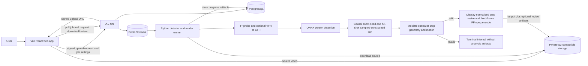

# Offline Reframing MVP

## Purpose

Boulder Frame converts one continuous wide, static-camera sports recording into a smooth 1080p close-up
of one user-selected athlete. Processing is offline only. The user uploads an MP4 or MOV, taps the
athlete in a preview frame, chooses an aspect ratio and profile, waits for completion, and downloads
an H.264/AAC MP4.

## MVP Boundary

- One static-camera shot and one selected athlete.
- 4K input is recommended; output is 1080p `16:9` or `9:16`.
- Supported source video is H.264 or HEVC in MP4/QuickTime MOV with optional AAC. CFR input is used
  directly; supported VFR input is normalized once to a job-local CFR derivative without modifying
  the immutable source object.
- No real-time processing, multi-athlete operation, landmark inference, future-position inference,
  equipment detection, super-resolution, lens correction, or native capture.

## Framing Contract

The W0.2 worker is detector-only. It runs the pinned ONNX SSD-MobilenetV1-12 person detector on the
selected frame and associates the tap with a containing or nearest person box. Each sampled frame
uses its actual person detection. The selected box seeds separate forward and backward association
passes, so no frame is associated before the user selection is resolved. A later candidate must remain
within 1.5 times the last accepted detector-box diagonal of that actual box; rejected candidates
and detector misses widen framing without changing that reference. No former target position is extrapolated.

Detection runs at a configurable sampled rate (default 10 fps; `0` means every frame), always
including the exact selected frame. Planning/rendering remain full-rate. Skipped inference holds
the latest chronological sampled box as guidance, not a hard containment constraint; an actual
sampled miss clears it and widens causal zoom until reacquisition. Held targets may leave the crop.
Future observed boxes constrain camera planning, never fill gaps with predicted athlete positions.

| Profile | Detected athlete height / crop height |
| --- | --- |
| `tight` | `.60` |
| `balanced` | `.50` |
| `safe` | `.40` |
| `full_movement` | `.33` |

The default `lookahead-v1` planner optimizes pan over the full normalized shot. It composes the
`deterministic-v3` causal seed, preserving every crop width/height exactly: profile sizing,
5%/2% scale hysteresis, timestamp-based log-height zoom (speed `0.5`, acceleration `1.0`), miss
widening, and source/aspect-limited dimensions are unchanged. Seed center hysteresis (1%/0.4%)
remains only as an objective reference, not final pan gates. Zoom is not optimized in `w0.2.5`.

Only accepted sampled detector boxes, including the selected frame, impose hard containment
constraints. Source bounds are always hard; source/aspect-impossible boxes are recorded as
uncontained rather than claimed safe. The optimizer may start panning before a large later
sampled displacement or reacquisition. This is full-shot camera optimization, not athlete
trajectory interpolation or extrapolation inside detector gaps.

SciPy `1.15.3` `linprog(method="highs-ds")` solves sparse source-normalized axes independently,
with fixed ordering. Timestamp-based per-axis speed `0.25` and acceleration `0.5` limits include
rest before/after the shot. Four lexicographic passes minimize speed excess, acceleration excess,
duration-weighted L1 distance from seed centers, then total absolute velocity change.
Containment remains authoritative if motion limits conflict; report minimum required excess,
never snap after optimization. Earlier optima are fixed within tolerance `1e-8`.

Every optimum is checked for finite values, legal centers, crop geometry, feasible sampled
containment, and recomputed kinematics. Non-optimal or invalid output fails analyzing terminally
with `internal`, `"Video framing could not be planned."`, without causal fallback or committing
analysis reports, crop paths, or debug analysis traces. The `CropPlanner` interface, rendering,
storage, and public API remain unchanged. Formulas, limits, and diagnostics are specified in
[Detection and Framing](../specs/worker/measurements-and-planner.md).

## Architecture

The React app handles upload UI, selection, settings, job polling, download, and terminal review.
The Go API owns request validation, PostgreSQL metadata, signed URLs, and Redis dispatch. The Python
worker owns media processing and never runs inside the API process. PostgreSQL stores immutable job
configuration, pipeline/model versions, state/progress, errors, and artifact references; object storage
stores all source, output, telemetry, manifest, and review media bytes.

## Immutable Job Contract

The API accepts normalized source-frame selection coordinates and output settings. It snapshots
pipeline/model versions before queueing. W0.2 model version is exactly
`w0.2-ssd-mobilenetv1-12-onnx-detector-only-1`; a claimed job whose immutable model version differs
from the active verified worker fails terminally with `model_unavailable` before media or inference.
Existing W0.1 jobs are incompatible with W0.2 and fail this check; users must create a new W0.2 job,
not retry the old job.

The default pipeline is `w0.2.5`. Immutable `planner` configuration contains
`controller = lookahead-v1`, `seed_controller = deterministic-v3`, `optimizer = scipy-highs-ds`,
`lookahead_scope = full_shot`, `containment_policy = sampled_detections`,
`solver_feasibility_tolerance = 1e-8`, `scale_enter_fraction = 0.05`, `scale_exit_fraction = 0.02`,
`center_enter_fraction = 0.01`, `center_exit_fraction = 0.004`, `zoom_max_speed = 0.5`,
`zoom_max_acceleration = 1.0`, `pan_max_speed = 0.25`, and `pan_max_acceleration = 0.5`,
plus deployment-configurable `detection_sample_fps` (default `10`, `0` disables sampling).
The worker validates the exact key set, types, finite numbers, policies, and constants before
cached crop replay; mismatches are terminal `internal` with user-safe configuration details.
These settings are not public job inputs. Pipeline version and planner configuration participate in the job hash,
so an identical submission cannot reuse an older controller's job or cached crop path. Deploy API
and worker together using the [drained cutover procedure](../dev/development.md#start-modules);
retrying an old job does not upgrade its immutable configuration.

Job stages are `queued`, `validating`, `analyzing`, `rendering`, `uploading`, and terminal
`completed`, `failed`, or reserved `cancelled`. Redis provides at-least-once delivery; PostgreSQL
leases and guarded transitions are processing authority. Output finalization is idempotent.

## Rendering And Durability

The worker validates source media, bounds VFR normalization by configured source-size and timeout
limits, preserves valid optional AAC without shortening video, and rotation-normalizes decoded frames
into display coordinates. It applies each planned crop once with OpenCV, resizes it to the fixed 1080p
output surface, and streams fixed-size BGR frames to FFmpeg for H.264/AAC encoding and muxing. Crop
coverage/geometry and decoded-output count mismatches are terminal `invalid_output`; inconsistent
decoded source frames are `invalid_media`, while encoder start/write/finalization failures are
`render_unavailable`. The immutable source object and local VFR derivative are never overwritten or
persisted as a new source.

Optional debug capture is private and best effort. It publishes only `debug_telemetry`,
`debug_manifest`, and available `debug_detection`, `debug_framing`, and `debug_render` roles. Its
failure never changes a validated output result. The API projects a bounded manifest and fresh
short-lived URLs only for terminal authorized jobs.

## Quality Gates

- API/job-state, lease, artifact, and evaluation-projection tests.
- Causal seed dimensions, scale hysteresis, miss widening/reacquisition, early look-ahead movement,
  sampled-only containment, held-target exclusion, timestamp limits/minimal excess, deterministic
  solves, and safe solver failure tests.
- Output media validation for dimensions, codec, timing, decodability, and audio retention.
- Browser workflow and phase-review contract tests.
- Formatting, type checks, documentation links, and `git diff --check` before release.
