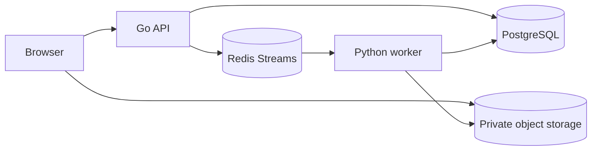

# Service Implementation Plan

This document records the implemented detector-only MVP service contract and its verification gates.
The authoritative product behavior is [Offline Reframing MVP](offline-reframing-mvp.md).

## Implemented Services

| Service | Responsibility | Contract boundary |
| --- | --- | --- |
| Frontend | Upload, normalized athlete tap, aspect/profile selection, job polling, download, terminal review | REST JSON and short-lived signed URLs only |
| Go API | Validation, authorization boundary, immutable job metadata, PostgreSQL, Redis dispatch, artifact/evaluation projection | Does not decode, infer, or render |
| Python worker | Source validation, VFR normalization, ONNX person detection, detector-box framing, FFmpeg rendering, artifact finalization | Claims PostgreSQL lease before durable work |

## Cross-Service Contract

- Job configuration is immutable and includes source asset, target selection, output settings,
  pipeline version, model version, and planner configuration. The current default is `w0.2.2` with
  `deterministic-v2` and four fixed scale/center enter/exit thresholds included in the job hash.
- Profiles are `tight`, `balanced`, `safe`, `full_movement`, with target detected-athlete height
  fractions `.60`, `.50`, `.40`, `.33`; `balanced` is `.50`. Independent scale/center hysteresis
  holds small jitter exactly, while containment and source/aspect safety remain authoritative.
- The selected model is `w0.2-ssd-mobilenetv1-12-onnx-detector-only-1`; configuration contains no
  additional CV state beyond detector framing.
- The worker review phases are ordered `detection`, `framing`, `render`. Phase roles are exactly
  `debug_detection`, `debug_framing`, and `debug_render`; telemetry and manifest remain
  `debug_telemetry` and `debug_manifest`.
- Migration `003_phase_evaluation.sql` retains the non-destructive legacy `debug` to
  `debug_telemetry` conversion. Migration `004_detector_only_review_roles.sql` removes retired
  review links and constrains new artifact roles to the W0.2 set. It leaves retired debug objects
  for configured object-storage lifecycle cleanup rather than deleting potentially shared assets.
- Review media, manifest, and telemetry are optional diagnostics. Required output upload/finalization,
  state handling, VFR normalization, and FFmpeg validation contracts are unchanged.

## Verification Gates

1. Backend: `go test ./...`, including manifest ordering, artifact role validation, migration checks,
   and authorized evaluation projection.
2. Worker: repository role-finalization, detector-framing, model/runtime, telemetry, and media tests.
3. Frontend: typecheck and tests validating the three-phase response schema, media URL requirements,
   phase switching, fixed profile copy, and analyzing label.
4. Documentation: validate internal Markdown links where tooling is available and run `git diff --check`.
