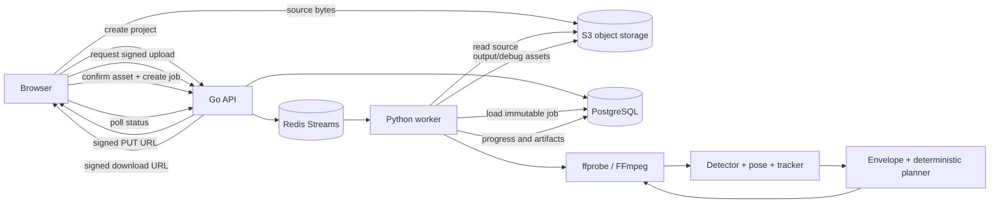

# Service Implementation Plan

## Goal

Implement the offline Boulder Frame MVP as independently testable browser frontend, Go API, and Python processing worker services, with Docker Compose startup for those modules. PostgreSQL, Redis, and S3-compatible object storage remain external application dependencies.

This plan turns [offline-reframing-mvp.md](offline-reframing-mvp.md) into an executable implementation sequence. It does not expand the MVP to real-time processing, native capture, multi-athlete tracking, equipment detection, super-resolution, or variable-frame-rate input.

## Implementation Status

The repository contains a tested frontend/API foundation, worker planning/media primitives, Docker Compose module startup, Redis Streams dispatch/consumption, PostgreSQL worker leases, and a connected four-stage worker pipeline. The worker downloads and validates the source, analyzes/tracks/plans, renders and validates FFmpeg output, uploads and heads a deterministic object key, finalizes the output artifact under its lease, and only then completes/acknowledges. W0.1 pins an Apache-2.0-compatible ONNX SSD-MobilenetV1 detector and MediaPipe Pose Landmarker Full in the [worker model manifest](../specs/worker/models.md). Their files are neither bundled nor downloaded; a selected runtime verifies local provisioned files and loads the OpenCV reader before startup. The local `unset-until-pinned` sentinel normalizes to the safe `unconfigured` runtime, where matching jobs fail terminally with `model_unavailable`; missing configured baseline artifacts instead prevent worker startup. Before a stage handler or media/CV work runs, a claimed job must have immutable `configuration.model_version` equal to the active worker runtime version.

Implemented baseline interfaces include:

- API routes under `/api/v1` for projects, signed source uploads, upload confirmation, jobs, artifacts, and signed downloads.
- PostgreSQL migrations for projects, assets, processing jobs, and job artifacts.
- Migration `002_worker_leases.sql` for lease owner/expiry fields, stage support, and efficient eligible-job claims.
- Immutable job configuration with target selection, output settings, pipeline version, model version, and planner identifier.
- Redis Streams handoff through stream `boulder-frame:jobs` and consumer group `boulder-frame:job-processors`; Redis pending recovery is paired with PostgreSQL lease authority.
- Worker media validation for MP4 or QuickTime MOV, H.264/HEVC video, AAC audio, constant frame rate, rotation metadata, target-coordinate mapping, crop geometry, and deterministic planner behavior.
- Direct-upload support through the shared external S3-compatible store and its CORS configuration.

## Task Tree

- Service implementation plan
  - Cross-service contract and repository foundation
    - **S0.1 Define shared identifiers, enums, and version fields.**
      - Outcome: Frontend, backend, worker, and tests use the same UUID resource identifiers, asset kinds, upload states, job states/stages, aspect ratios, profiles, and pipeline/model version fields.
      - Ownership: Backend owner with worker and frontend review.
      - Dependencies: None.
      - Implementation/reuse: Make PostgreSQL/API JSON names authoritative. Keep job configuration immutable JSON containing source asset ID, normalized target selection, output settings, pipeline version, model version, and planner configuration. Generate OpenAPI or equivalent API types only after the JSON contract is fixed; do not duplicate independently maintained enums.
      - Verification: Contract tests reject unknown enum values and confirm JSON serialization for every documented resource and terminal error shape.
    - **S0.2 Scaffold repository modules and service boundaries.**
      - Outcome: `frontend/`, `backend/`, `worker/`, `deploy/`, and `tests/` each have an explicit build/test entrypoint without one service importing another service's private code.
      - Ownership: Platform owner.
      - Dependencies: S0.1.
      - Implementation/reuse: Use Vite/React/TypeScript, Go with `chi` and `pgx`, and Python 3.12. Pin runtime and dependency versions. Keep shared behavior at HTTP, database, object-storage, and queue contracts rather than adding a shared-language package prematurely.
      - Verification: Backend, worker, and frontend smoke commands run independently; Compose starts the three repository modules without provisioning external dependencies.
    - **S0.3 Establish fixture and evaluation manifests.**
      - Outcome: Tests can refer to permitted synthetic/licensed media without storing private videos in the repository.
      - Ownership: QA/CV owner.
      - Dependencies: None.
      - Implementation/reuse: Add manifest schemas for fixture media, expected ffprobe metadata, target selections, and annotated evaluation sequences covering stationary, lateral/sprint, jump or extended limb, occlusion, and lost-subject cases.
      - Verification: A manifest validator catches missing files, unsupported fixture metadata, and invalid normalized coordinates.
  - Go backend service
      - **B1.1 Implement API process, configuration, and health endpoints.**
      - Outcome: The Go service starts with validated JSON configuration, exposes liveness/readiness endpoints, and shuts down cleanly.
      - Ownership: Backend owner.
      - Dependencies: S0.1, S0.2.
      - Implementation/reuse: Use `chi` routing, `pgx` pooling, structured JSON logs, request IDs, and dependency checks. Keep handlers thin; repositories own PostgreSQL queries and storage/queue clients are injected. Expose `GET /healthz` for liveness and `GET /readyz` for dependency readiness.
      - Verification: Unit tests cover missing/invalid configuration and graceful shutdown; integration tests cover healthy and unavailable dependencies.
    - **B2.1 Implement PostgreSQL migrations and repositories.**
      - Outcome: PostgreSQL stores projects, assets, processing jobs, artifacts, and durable error/progress metadata described by the architecture.
      - Ownership: Backend owner.
      - Dependencies: S0.1, B1.1.
      - Implementation/reuse: Add migrations for `projects`, `assets`, `processing_jobs`, `job_artifacts`, and a development owner identity. Use UUID primary keys, foreign keys, check constraints for enums, unique constraints for storage keys and idempotency, timestamps with UTC semantics, and JSONB for immutable job configuration. Store object keys, never media bytes or per-frame measurements.
      - Verification: Fresh migration, repeat migration, rollback policy if supported, repository CRUD tests, constraint tests, and clean test database teardown.
    - **B3.1 Implement project and asset lifecycle endpoints.**
      - Outcome: The frontend can create a project, request a source upload, confirm upload completion, and retrieve source metadata.
      - Ownership: Backend owner.
      - Dependencies: B2.1, I1.1.
      - Implementation/reuse: Implement `POST /api/v1/projects`, `POST /api/v1/projects/{projectID}/assets/upload`, `POST /api/v1/assets/{assetID}/complete`, and `GET /api/v1/projects/{projectID}`. Generate private object keys server-side. Validate file extension/content intent, expected size limits, ownership, and upload state; media inspection remains a worker responsibility.
      - Verification: API tests cover invalid project/asset IDs, repeated completion, unauthorized ownership, signed upload expiry, and pending-to-uploaded/invalid transitions.
    - **B4.1 Implement processing job creation and immutable configuration.**
      - Outcome: A completed source asset and valid target selection create exactly one durable job configuration and enqueue one idempotent task.
      - Ownership: Backend owner.
      - Dependencies: B2.1, B3.1, W1.1.
      - Implementation/reuse: Implement `POST /api/v1/projects/{projectID}/jobs`. Validate source asset ownership/upload state, `frame_time_ms >= 0`, normalized coordinates in `[0,1]`, `16:9`/`9:16`, and four profiles. Snapshot `PIPELINE_VERSION`, `MODEL_VERSION`, and planner settings into configuration before enqueueing. Append to Redis Stream `boulder-frame:jobs` using the job UUID as `task_id`; make duplicate publication/retry transactionally safe.
      - Verification: Integration tests prove configuration immutability, duplicate-submit behavior, enqueue failure handling, and no job creation from incomplete/invalid assets.
    - **B5.1 Implement job status, artifacts, and signed download endpoints.**
      - Outcome: The frontend can poll a complete job representation and obtain a short-lived download URL only for a completed authorized output.
      - Ownership: Backend owner.
      - Dependencies: B2.1, B4.1, W6.1.
      - Implementation/reuse: Implement `GET /api/v1/jobs/{jobID}`, `GET /api/v1/jobs/{jobID}/artifacts`, and `GET /api/v1/jobs/{jobID}/download`. Return state, stage, progress, immutable configuration, safe error, and timestamps. Never expose internal stack traces, credentials, or unrestricted object-store URLs.
      - Verification: Tests cover every state, terminal error response, missing output, signed URL authorization, and output availability race.
  - Python worker service
    - **W1.1 Implement worker process and task protocol.**
      - Outcome: A Python worker consumes the backend's job task, claims the job idempotently, and records valid state/stage transitions.
      - Ownership: Worker owner.
      - Dependencies: S0.1, B2.1, B4.1.
      - Implementation/reuse: Consume `boulder-frame:jobs` through group `boulder-frame:job-processors`. The entry has `type`, `task_id`, and `payload`; load configuration from PostgreSQL using the payload job UUID. PostgreSQL leases and guarded transitions are the authority for active ownership. Recover pending deliveries, heartbeat active entries/leases, classify transient failures, and acknowledge only terminal stream work. A restarted worker must resume or safely retry without duplicate output artifacts.
      - Verification: Worker integration tests cover duplicate delivery, crash/retry, invalid transition rejection, transient storage failure, and terminal media failure.
    - **W2.1 Implement source validation and timestamp normalization boundary.**
      - Outcome: The worker accepts supported constant-frame-rate H.264/AAC MP4 or QuickTime MOV input, including HEVC video when FFmpeg supports it, and rejects unsupported or variable-frame-rate media with a user-safe error.
      - Ownership: Media/CV worker owner.
      - Dependencies: W1.1, I1.1.
      - Implementation/reuse: Download to a job-scoped temporary directory, inspect with pinned `ffprobe`, validate stream/container/codec/dimensions/duration/frame timing, normalize display rotation, and establish the analysis/output timestamp map. Preserve source audio metadata for rendering.
      - Verification: Fixture tests cover valid input, VFR rejection, missing video, unsupported codec, rotation metadata, corrupt bytes, and cleanup after failure.
    - **W3.1 Implement target-frame detection association and pose measurement.**
      - Outcome: The worker maps the normalized tap to a source frame and selects the intended person, then emits source-coordinate pose and detector measurements.
      - Ownership: CV worker owner.
      - Dependencies: W2.1, pinned detector/model decision.
      - Implementation/reuse: Run an Apache-2.0-compatible ONNX person detector on the downscaled full frame, choose the detection containing or nearest the tap, expand the ROI by the configured range, run MediaPipe Pose Landmarker Full on original-resolution ROI pixels, and transform landmarks back to source coordinates. Keep model versions and licenses pinned before fixture baselines are accepted.
      - Verification: Selection association, ROI expansion, coordinate transformation, no-person, ambiguous-person, and model failure tests pass with visual debug records.
    - **W4.1 Implement single-target tracking, confidence, reacquisition, and smoothing.**
      - Outcome: Each analysis frame has root, pose bounds, detector bounds, confidence/covariance, and tracked/reacquiring/lost state.
      - Ownership: CV worker owner.
      - Dependencies: W3.1.
      - Implementation/reuse: Use the current single-target filter with pose/detector measurements, bounded short-gap prediction, robust outlier rejection, and forward/backward smoothing over recorded measurements. Do not claim identity-preserving re-identification in this milestone; a nearby detection can be selected during fallback or reacquisition.
      - Verification: Tests cover stable tracking, short gaps, occlusion, fallback selection, outliers, low confidence, and unrecoverable loss; no close crop is generated from invented measurements. Identity-preserving reacquisition remains a later model/tracker milestone.
    - **W5.1 Implement movement envelopes and deterministic crop planner.**
      - Outcome: The planner emits source-bounded crop rectangles for every output frame with profile padding, lead room, uncertainty margins, containment controls, and smooth motion.
      - Ownership: CV worker owner.
      - Dependencies: W4.1.
      - Implementation/reuse: Define a planner interface accepting smoothed measurements and immutable profile configuration. Follow the torso/root signal, combine reliable landmarks with detector fallback bounds, add velocity/acceleration lead room, apply dead zone and hysteresis, zoom out quickly for risk/low confidence, zoom in slowly after a stable high-confidence hold, and clamp every crop to the source. Keep the deterministic controller as the only MVP planner; reserve CVXPY/OSQP for a later evidence-based milestone.
      - Verification: Unit tests cover aspect-ratio and source containment, profile ordering, 75-80% zoom-out risk, 50-60% zoom-in hold, directional lead, low-confidence widening, pan/zoom rate limits, and lost-track full-frame fallback.
    - **W6.1 Implement frame-accurate crop annotation, output validation, and artifact upload.**
      - Outcome: Successful jobs produce a playable H.264/AAC MP4 at the display-normalized source dimensions, with the final planned crop rectangle annotated on each original frame and source audio when available.
      - Ownership: Media worker owner.
      - Dependencies: W2.1, W5.1, B2.1.
      - Implementation/reuse: Convert the crop path into frame-accurate FFmpeg annotation commands, rotation-normalize the source, draw the planned rectangle on each original frame, encode with pinned settings, validate output using `ffprobe`, upload output and optional debug artifacts to private object storage, create artifact rows, and mark `completed` only after reads succeed. Preserve idempotency using deterministic artifact keys per job.
      - Verification: Media integration tests validate source-display dimensions, per-frame bbox position, H.264/AAC, duration tolerance, audio mapping, decodability, artifact rows, and rerun behavior.
    - **W7.1 Add worker progress, telemetry, and cleanup.**
      - Outcome: Operators can see stage progress and timings while temporary files and failed artifacts are cleaned safely.
      - Ownership: Worker owner.
      - Dependencies: W2.1, W3.1, W4.1, W5.1, W6.1.
      - Implementation/reuse: Persist coarse progress at stage boundaries and bounded intervals. Emit job ID, stage, duration, pipeline/model versions, structured internal error code, and the originating `trace-id` for task request/response logs. Delete job-scoped scratch data in a finally path and retain only explicitly configured debug artifacts.
      - Verification: Progress monotonicity, timing presence, secret redaction, cleanup on success/failure, and interrupted-job recovery tests pass.
  - Frontend service
    - **F1.1 Implement application shell and typed API client.**
      - Outcome: The frontend uses one typed client for the documented API resources and errors.
      - Ownership: Frontend owner.
      - Dependencies: S0.1, B1.1.
      - Implementation/reuse: Use Vite, React, and TypeScript. Read frontend settings from `frontend/conf/config.json` or `frontend/conf/config.dev.json`, represent loading/empty/error/terminal states explicitly, propagate `X-Trace-ID` across API/direct-upload requests, and keep signed upload/download URLs out of persistent browser state and structured logs.
      - Verification: Type checks, API-client contract tests, API unavailable state, and responsive desktop/mobile smoke tests pass.
    - **F2.1 Implement project creation and signed source upload.**
      - Outcome: A user can create a project, request an upload URL, upload bytes directly to object storage, and confirm the upload through the API.
      - Ownership: Frontend owner.
      - Dependencies: F1.1, B3.1.
      - Implementation/reuse: Use the browser file input and direct signed PUT/POST flow. Show upload progress and prevent job creation until API confirmation returns `uploaded`. Do not proxy 4K video through the Go API.
      - Verification: Browser tests cover cancel/retry, upload failure, confirmation failure, oversized/unsupported files, and successful metadata display.
    - **F3.1 Implement preview-frame selection and normalized coordinate mapping.**
      - Outcome: A displayed preview produces source-frame normalized tap coordinates regardless of letterboxing, scaling, or responsive layout.
      - Ownership: Frontend owner with CV contract review.
      - Dependencies: F2.1, B3.1.
      - Implementation/reuse: Use the first usable preview frame or server-provided metadata path without decoding the full video. Account for the rendered media rectangle, object-fit offsets, source dimensions, and frame time. Send `frame_time_ms`, `normalized_x`, and `normalized_y` exactly once with job creation.
      - Verification: Unit tests cover 16:9/9:16 source display, letterbox offsets, mobile layout, edge taps, and coordinate bounds; Playwright asserts the request payload.
    - **F4.1 Implement output settings, job polling, errors, and download.**
      - Outcome: A user selects aspect/profile, starts one job, sees queued/validating/analyzing/rendering/uploading progress, receives safe failure text, and downloads a completed result.
      - Ownership: Frontend owner.
      - Dependencies: F3.1, B4.1, B5.1.
      - Implementation/reuse: Poll with bounded backoff while non-terminal, stop on completed/failed, expose retry by creating a new job rather than mutating immutable configuration, and navigate to the short-lived signed download URL only after completion.
      - Verification: Browser tests cover all states, polling errors, terminal failure, refresh/reload, duplicate start prevention, and successful download.
  - Cross-service quality gates
    - **Q1.1 Implement API/worker integration tests.**
      - Outcome: The complete upload-to-job-to-artifact lifecycle is verified against its declared dependencies.
      - Ownership: Backend and worker owners.
      - Dependencies: B3.1, B4.1, B5.1, W1.1, W6.1.
      - Implementation/reuse: Use disposable external PostgreSQL, Redis, and object-store test resources. Assert durable state transitions, task idempotency, transient retry, terminal failure, output artifact linkage, and signed download authorization.
      - Verification: Test suite passes from a clean environment and leaves no required state outside its declared test resources.
    - **Q1.2 Implement media and planner fixture tests.**
      - Outcome: CV and media behavior is regression-tested independently from HTTP concerns.
      - Ownership: Worker/CV owner.
      - Dependencies: W2.1, W4.1, W5.1, W6.1, S0.3.
      - Implementation/reuse: Keep numeric measurement fixtures, crop-path expectations, ffprobe expectations, and evaluation annotations versioned; keep private source videos external.
      - Verification: Automated quality gates report containment, limb-crop, edge-risk, athlete size, pan/zoom velocity, acceleration, jerk, recovery time, and output validity.
    - **Q1.3 Implement browser end-to-end test and CI checks.**
      - Outcome: CI proves the documented user workflow and static quality gates.
      - Ownership: Platform and frontend owners.
      - Dependencies: F2.1, F4.1, Q1.1.
      - Implementation/reuse: Add Playwright coverage for fixture upload through download and CI commands for Go formatting/tests, Python formatting/types/tests, frontend type/tests, documentation link checks, and whitespace checks.
      - Verification: CI passes on a clean checkout without private assets or credentials.

## Implementation Sequence

1. Complete S0.1-S0.3, then choose and pin the detector/model versions with license evidence.
2. Complete B1.1, B2.1, and W1.1 so the services can accept a durable queued job.
3. Complete B3.1, B4.1, B5.1, F1.1, F2.1, F3.1, and F4.1 for the API/browser workflow.
4. Complete W2.1 and W6.1 with a fixture-only pass-through/render path before adding CV complexity.
5. Complete W3.1, W4.1, W5.1, and W7.1 for measurement, tracking, planning, rendering, and observability.
6. Complete Q1.1-Q1.3 before shared testing.
7. Evaluate the deterministic planner before considering any deferred optimizer or capture capability.

## Architecture After Plan

The browser owns user interaction and direct object uploads. The Go API owns authorization boundaries, metadata, signed URLs, immutable job configuration, and queue submission. The Python worker owns all media decoding, CV inference, tracking, planning, rendering, artifact upload, and progress updates. PostgreSQL remains the durable source of job truth; Redis is dispatch infrastructure; object storage owns video bytes.

## Files to Modify

- `docs/architecture/offline-reframing-mvp.md`: Keep the product contract and algorithm decisions authoritative; update only when this plan changes an approved behavior.
- `docs/README.md`: Link this service implementation plan and identify copied Asynq material as historical reference.
- `README.md`: Add a concise implementation-status link when scaffolding begins.
- `AGENTS.md`: Keep authoritative-document references aligned with the architecture and specification indexes.
- `.agents/sessions/offline-reframing-mvp/plan.md`: Preserve as historical planning context; do not use it as the only implementation specification.

## New Files

- `docs/architecture/service-implementation-plan.md`: This service-by-service implementation contract and execution sequence.
- `frontend/*`: Vite/React/TypeScript application and browser tests.
- `backend/*`: Go API, migrations, repositories, queue dispatch, and API tests.
- `worker/*`: Python worker, media/CV/planner pipeline, and worker tests.
- `docker-compose.yml` and `deploy/docker/*`: Docker Compose startup and module images; external dependencies are not provisioned here.
- `tests/fixtures/*`: Permitted small media fixtures and expected metadata.
- `tests/evaluation/*`: Evaluation manifests, annotations, and metric expectations.

## Risks

- The exact person-detector model is intentionally unresolved until license, small-subject recall, and CPU/GPU performance are benchmarked; no model should be silently selected as a permanent dependency.
- FFmpeg crop-path implementation may require a frame-level renderer rather than a single filter expression to preserve exact timestamps; validate this before locking the render architecture.
- Signed direct uploads require correct CORS and object-store policy configuration; local and online object-store endpoints must not accidentally expose admin access.
- Queue delivery is at-least-once; PostgreSQL state transitions and deterministic artifact keys must make retries safe.
- A browser preview frame must preserve source-coordinate semantics under letterboxing and responsive layout; this is a high-risk integration boundary requiring explicit tests.
- Model inference and 4K temporary files may exceed baseline online-host memory or disk; keep worker concurrency configurable and CPU mode supported.
- Online HTTPS does not provide authentication. External users must remain blocked until authorization is implemented and reviewed.
- The repository is not currently Git-initialized, so Git-based CI and `git diff --check` cannot be executed until repository initialization occurs.
