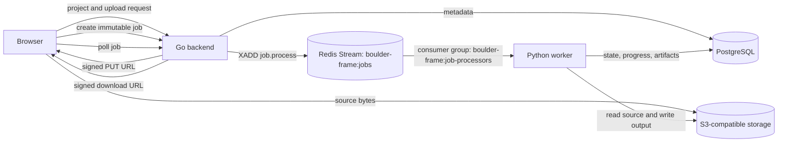

# Component Specifications

These documents describe how the current implementation is structured at component level. They are scoped from the repository root into the corresponding submodule:

```text
docs/specs/
├── backend/     Go API, persistence, signed storage URLs, and Redis Streams dispatch
├── worker/      Python worker runtime, detector framing, media primitives, and review telemetry
├── frontend/    Vite/React workflow and browser/API integration
└── deploy/      Docker Compose startup for repository modules
```

The product boundary and algorithm contract remain authoritative in [../architecture/offline-reframing-mvp.md](../architecture/offline-reframing-mvp.md). The implementation sequence is in [../architecture/service-implementation-plan.md](../architecture/service-implementation-plan.md).

## Component Specifications

- [Backend](backend/README.md): Go process, API resources, PostgreSQL persistence, S3 URLs, and Redis Streams task distribution.
- [Worker](worker/README.md): Python runtime, job state machine, media validation, detector-box framing, and debug telemetry/evaluation contract.
- [Frontend](frontend/README.md): Browser workflow, direct upload, target selection, polling, and download.
- [Compose](deploy/README.md): module container startup and external dependency configuration.

## Cross-Service Flow



## Current Boundary

The Go API, frontend workflow, Redis Streams transport, PostgreSQL-backed worker leases, and the four-stage media/CV pipeline are implemented. The local `MODEL_VERSION=unset-until-pinned` sentinel is normalized by API and worker configuration to `unconfigured`: that safe worker state consumes only matching jobs, which terminally fail with `model_unavailable` instead of producing output. The configured W0.2 detector runtime starts only after its artifact and decoder verify. A running worker terminally rejects a claimed job before pipeline work when immutable `configuration.model_version` differs from its active runtime version. Existing W0.1 jobs therefore fail compatibility and require a new W0.2 job; retrying the old job cannot succeed.
