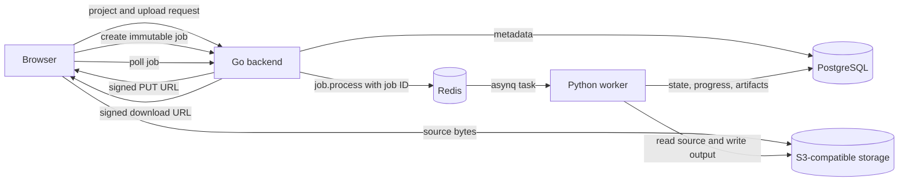

# Component Specifications

These documents describe how the current implementation is structured at component level. They are scoped from the repository root into the corresponding submodule:

```text
docs/specs/
├── backend/     Go API, persistence, signed storage URLs, and asynq dispatch
├── worker/      Python worker runtime, media primitives, tracking, and planner
└── frontend/    Vite/React workflow and browser/API integration
```

The product boundary and algorithm contract remain authoritative in [../architecture/offline-reframing-mvp.md](../architecture/offline-reframing-mvp.md). The implementation sequence is in [../architecture/service-implementation-plan.md](../architecture/service-implementation-plan.md).

## Component Specifications

- [Backend](backend/README.md): Go process, API resources, PostgreSQL persistence, S3 URLs, and Redis/`asynq` task distribution.
- [Worker](worker/README.md): Python runtime, job state machine, media validation, measurement interfaces, and deterministic planner.
- [Frontend](frontend/README.md): Browser workflow, direct upload, target selection, polling, and download.

## Cross-Service Flow



## Current Boundary

The Go API and frontend workflow are implemented. The Python worker currently provides the media, measurement, tracking, and planner foundation but runs in explicit idle mode because queue, database, storage, model, and full render orchestration adapters are not yet implemented. The specifications call out this distinction instead of describing planned adapters as existing behavior.
