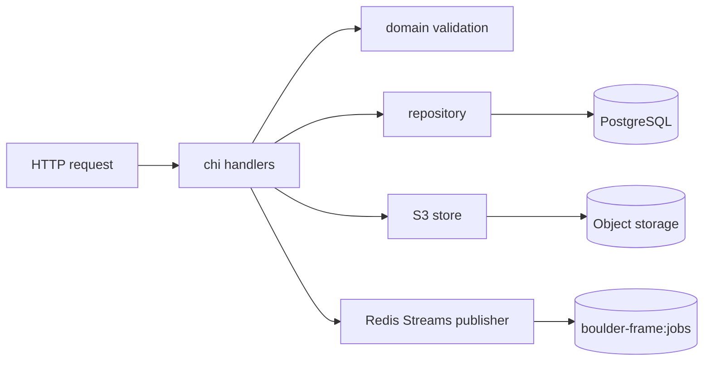

# Backend Specifications

The backend is a Go HTTP process. It owns request validation, PostgreSQL metadata, signed object-storage URLs, and asynchronous processing dispatch. It must not decode video, run CV inference, or render media.

## Documents

- [HTTP API](http-api.md): routes, request validation, response shapes, ownership checks, lifecycle behavior, and immutable `deterministic-v3` planner thresholds/motion limits and hash cutover.
- [Persistence](persistence.md): PostgreSQL entities, constraints, immutable configuration, and repository responsibilities.
- [Redis Streams Task Distribution](redis-streams-task-distribution.md): stream/group configuration, task payload, idempotency, pending recovery, lease authority, and worker handoff.

## Runtime Composition



## Startup

`backend/main.go` loads configuration, opens PostgreSQL, constructs the S3 client and presigner, constructs the Redis Streams publisher, and starts the HTTP server. `GET /healthz` is process liveness. `GET /readyz` currently checks PostgreSQL only; Redis and object-storage readiness remain an operational gap.

The service supports:

```sh
go run .
go run . migrate up
```

The migration command applies `backend/migrations/001_init.sql` through
`backend/migrations/003_phase_evaluation.sql` in order and is idempotent. Before applying migration
`003`, drain and stop older workers because it rejects their legacy `debug` finalization role; see
[Persistence](persistence.md#phase-review-rollout).
