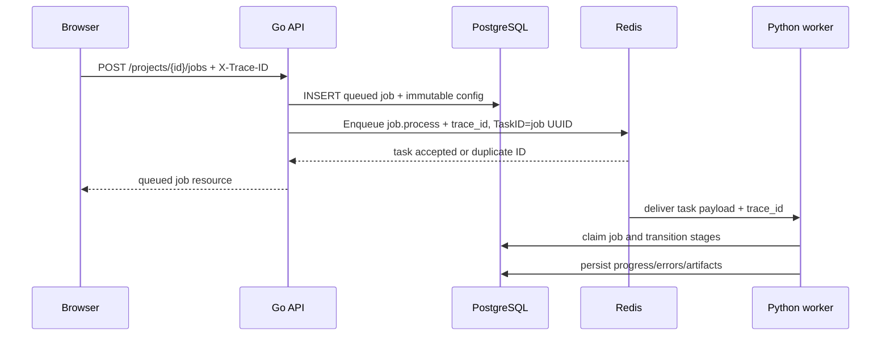

# Asynq Task Distribution

## Responsibility

The Go API owns task publication. The Python worker is the future task consumer. Redis stores queue coordination; PostgreSQL stores the durable job truth. Redis must never be the only record of whether processing exists or completed.



## Task Definition

The backend defines:

```go
const TaskProcessJob = "job.process"
```

The payload is JSON containing the durable job identifier and the originating trace ID:

```json
{"job_id":"job_uuid","trace_id":"trace_uuid"}
```

The worker must load the complete immutable configuration from PostgreSQL using that ID. Do not put source URLs, credentials, large metadata, or mutable settings in the queue payload.

## Queue Options

`queue.NewAsynqPublisher` parses `REDIS_URL` with `asynq.ParseRedisURI` and creates an `asynq.Client`. Jobs are published with:

- Task type: `job.process`
- Task ID: job UUID
- Queue: `default`

The task ID gives at-least-once delivery a stable deduplication key. If a repeated API request gets `asynq.ErrTaskIDConflict`, the publisher returns success because the durable task already exists.

## Publication Sequence

1. Validate project, asset ownership, upload state, target selection, aspect ratio, and profile.
2. Snapshot pipeline/model versions and planner configuration.
3. Hash the serialized configuration.
4. Insert or retrieve the job using `(project_id, configuration_hash)`.
5. Publish the job UUID to Redis unless the retrieved job is already in a non-queued state.
6. Return the job resource.

If publication fails, the API returns `503 queue_unavailable` and leaves the durable job in `queued`. A subsequent identical request can retry publication. This is a deliberate interim recovery mechanism; it is not equivalent to a transactional outbox.

## Consumer Contract

The worker-side contract is:

1. Parse a payload with exactly `job_id` and `trace_id` fields.
2. Load the job and source asset from PostgreSQL.
3. Atomically claim an eligible job using a worker lease.
4. Process stages in order: `validating`, `analyzing`, `rendering`, `uploading`.
5. Persist monotonic progress and terminal state.
6. Treat storage/queue/infrastructure failures as retryable and invalid media/model/render failures as user-safe terminal failures.

The current Python CLI does not yet implement the Redis/asynq consumer. `--serve` intentionally remains idle and reports that the queue/database adapter is unavailable. This document specifies the handoff contract for the next implementation milestone, not a claim that consumption is already active.

## Retry and Idempotency Rules

- Duplicate delivery must not process a terminal job again.
- A lease must prevent two workers from processing the same active job concurrently.
- A worker retry resumes the failed stage, not the next stage.
- Output and debug object keys must be deterministic per job.
- Artifact inserts must be unique per `(job_id, kind)`.
- State transitions must be guarded and monotonic.

## Trace Logging

The frontend sends a UUID in `X-Trace-ID` for every API and direct-upload request. The API validates or creates the ID, returns it in the same response header, and writes it to structured logs as the key `trace-id`. Job publication copies that ID into the queue payload, and the worker writes it to task request/response logs. Request and response bodies are logged in bounded, redacted form; signed URLs, credentials, and binary video contents are omitted.

## Operational Diagnostics

When a job remains queued, inspect:

Check the job row in PostgreSQL, the Redis queue, worker capability output, and the API `PIPELINE_VERSION`/`MODEL_VERSION`. Never log signed URLs or Redis credentials.
