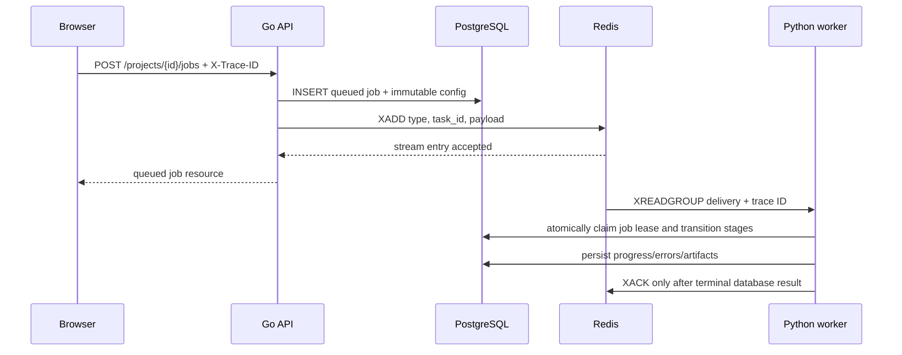

# Redis Streams Task Distribution

The Go API owns Redis Streams publication. The Python worker consumes through a Redis consumer group.
Redis coordinates delivery; PostgreSQL stores durable job truth and is the authority for active worker
ownership. Redis must never be the only record of whether processing exists or completed.



## Task Definition

The backend defines task type:

```go
const TaskProcessJob = "job.process"
```

The payload is JSON containing the durable job identifier and originating trace ID:

```json
{"job_id":"job_uuid","trace_id":"trace_uuid"}
```

The worker loads the complete immutable configuration from PostgreSQL using that ID. Do not put source
URLs, credentials, large metadata, or mutable settings in the queue payload.

## Stream Contract

The publisher uses Redis `XADD` on stream `boulder-frame:jobs`. The worker creates and consumes
consumer group `boulder-frame:job-processors`. Each entry contains exactly:

- `type`: `job.process`
- `task_id`: the job UUID
- `payload`: the JSON task payload above

`task_id` gives the at-least-once handoff a stable idempotency key. The PostgreSQL job configuration
hash remains the request idempotency boundary. The API publisher suppresses duplicate publication for
the same job ID with a Redis task-index key written in the same transaction as the stream entry.

## Publication Sequence

1. Validate project, asset ownership, upload state, target selection, aspect ratio, and profile.
2. Snapshot pipeline/model versions and planner configuration.
3. Hash the serialized configuration.
4. Insert or retrieve the job using `(project_id, configuration_hash)`.
5. Append `type`, `task_id`, and `payload` to `boulder-frame:jobs` unless the retrieved job is already in a non-queued state.
6. Return the job resource.

If publication fails, the API returns `503 queue_unavailable` and leaves the durable job in `queued`.
A subsequent identical request can retry publication. This is a deliberate interim recovery mechanism;
the PostgreSQL job row remains the source of truth if the stream and database temporarily disagree.

## Consumer Contract

1. Read new entries with `XREADGROUP` and recover abandoned pending entries with `XAUTOCLAIM` after the configured idle interval.
2. Parse a payload with exactly `job_id` and `trace_id` fields, and require `task_id == job_id`.
3. Load the job and source asset from PostgreSQL.
4. Atomically claim an eligible PostgreSQL job lease. A pending Stream entry alone never authorizes processing.
5. Heartbeat the active Stream delivery with `XCLAIM` and renew the PostgreSQL lease while processing.
6. Persist monotonic progress and terminal state using lease-guarded writes.
7. Acknowledge with `XACK` only after PostgreSQL records a terminal state. For a transient failure, release the database lease and leave the entry pending for recovery.

The connected worker currently exercises this control plane but intentionally has no detector/pose/render
pipeline. A claimed job transitions `queued -> validating -> failed` with error code
`model_unavailable`, then receives `XACK`. It does not create scratch/output artifacts or report a
completed render.

## Retry and Idempotency Rules

- Duplicate delivery must not process a terminal job again.
- PostgreSQL lease owner and expiry fields, added by migration `002_worker_leases.sql`, must prevent two workers from processing the same active job concurrently. Lease-guarded writes and lease renewal are authoritative over Redis pending ownership.
- A worker retry resumes the failed stage, not the next stage.
- Output and debug object keys must be deterministic per job.
- Artifact inserts must be unique per `(job_id, kind)`.
- State transitions must be guarded and monotonic.
- Pending entries are recovered by `XAUTOCLAIM`; active handlers heartbeat with `XCLAIM` so they are not reclaimed while their database lease is live.

## Trace Logging

The frontend sends a UUID in `X-Trace-ID` for every API and direct-upload request. The API validates or
creates the ID, returns it in the same response header, and writes it to structured logs as the key
`trace-id`. Job publication copies that ID into the queue payload, and the worker writes it to task
request/response logs. Request and response bodies are logged in bounded, redacted form; signed URLs,
credentials, and binary video contents are omitted.

## Operational Diagnostics

When a job remains queued, inspect the job row and lease expiry in PostgreSQL, Stream group pending
entries, worker capability output, and the API `PIPELINE_VERSION`/`MODEL_VERSION`. Never log signed URLs
or Redis credentials.
