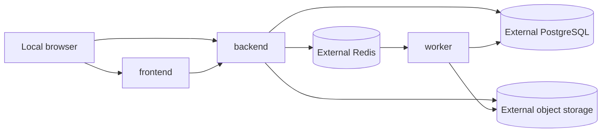

# Compose Runtime

## Services

| Service | Role | Local host exposure |
| --- | --- | --- |
| `frontend` | Vite development server | `0.0.0.0:5173` |
| `backend` | Go API | `0.0.0.0:8080` |
| `worker` | Python worker process | None |

Compose starts these repository modules only. PostgreSQL, Redis, and S3-compatible object storage
must be reachable through the URLs in `.env`; no database or storage container is declared.

The frontend waits for a healthy backend. The worker remains on the private network and is not
published to the host.

Set `WEB_BASE_URL` and `API_BASE_URL` to reachable browser-facing URLs. The frontend embeds
`API_BASE_URL`; the API permits `WEB_BASE_URL` as its CORS origin. The bound ports have no TLS or
authentication and must only be exposed on a trusted network.

## Configuration

`.env.example` documents the values passed into module configuration. Set `DATABASE_URL`,
`REDIS_URL`, `S3_ENDPOINT`, `S3_PRESIGN_ENDPOINT`, and the related credentials to the externally
managed services. Reserved characters in URL passwords must be percent-encoded.

For dependencies published on the Docker host, use `host.docker.internal` instead of `localhost` in
the connection URLs. The backend and worker map that hostname to Docker's host gateway; `localhost`
inside either container resolves to itself.

The worker also needs a stable `WORKER_ID`; optionally set a distinct `STREAM_CONSUMER` when its Redis
consumer identity must differ. The API appends to `boulder-frame:jobs`; workers consume consumer group
`boulder-frame:job-processors`. PostgreSQL leases, not Redis pending ownership, authorize active job
state changes.

The external object store owns bucket creation, credentials, CORS, lifecycle retention, and access
policy. Keep source and output videos private by default.

At startup, the backend and worker log the configuration file path and a safe operational summary,
including pipeline/model versions, storage bucket/region, and runtime settings. They never log
connection URLs or credentials.

## Volumes

- `frontend-node-modules` caches frontend dependencies inside the Compose environment.
- `worker-scratch` stores temporary worker files only.

`docker compose down` stops the modules and preserves these volumes. `down -v` removes local caches
and scratch data; it does not affect the external database, queue, or object store.
