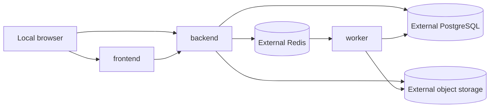

# Compose Runtime

## Services

| Service | Role | Local host exposure |
| --- | --- | --- |
| `frontend` | Vite development server | `0.0.0.0:5173` |
| `backend` | Go API | `0.0.0.0:8080` |
| `worker` | Python worker process | None |

Compose starts these repository modules only. PostgreSQL, Redis, and S3-compatible object storage
must be reachable through the URLs in `.env`; no database or storage container is declared.

The frontend waits for a healthy backend. The worker remains on the private network and is not
published to the host.

Set `WEB_BASE_URL` and `API_BASE_URL` to reachable browser-facing URLs. The frontend embeds
`API_BASE_URL`; the API permits `WEB_BASE_URL` as its CORS origin. The bound ports have no TLS or
authentication and must only be exposed on a trusted network.

## Configuration

`.env.example` documents the values passed into module configuration. Set `DATABASE_URL`,
`REDIS_URL`, `S3_ENDPOINT`, `S3_PRESIGN_ENDPOINT`, and the related credentials to the externally
managed services. Reserved characters in URL passwords must be percent-encoded.

For dependencies published on the Docker host, use `host.docker.internal` instead of `localhost` in
the connection URLs. The backend and worker map that hostname to Docker's host gateway; `localhost`
inside either container resolves to itself.

The worker also needs a stable `WORKER_ID`; optionally set a distinct `STREAM_CONSUMER` when its Redis
consumer identity must differ. The API appends to `boulder-frame:jobs`; workers consume consumer group
`boulder-frame:job-processors`. PostgreSQL leases, not Redis pending ownership, authorize active job
state changes.

The external object store owns bucket creation, credentials, CORS, lifecycle retention, and access
policy. Keep source and output videos private by default.

At startup, the backend and worker log the configuration file path and a safe operational summary,
including pipeline/model versions, storage bucket/region, and runtime settings. They never log
connection URLs or credentials.

## Pipeline Version Cutover

Backend and worker must receive the same `PIPELINE_VERSION` and `MODEL_VERSION`. A new value denotes
immutable processing behavior and changes the backend job-configuration hash. The worker enforces
the model version but not the pipeline version when claiming work. Do not use a rolling deployment
across versions.

For the YOLO26n detector release, provision the verified `yolo26n.onnx`, then explicitly set
`PIPELINE_VERSION=w0.2.6` and `MODEL_VERSION=w0.2-yolo26n-onnx-detector-only-1` in the deployment's
private `.env`; the example file does not migrate it. Stop new submissions, let the old workers finish
all queued and leased jobs, and confirm the Redis consumer group has no pending deliveries. Stop old
workers, deploy backend and worker together with the new shared values, verify both startup summaries,
then reopen submissions. Never replace workers before this drain.

The detector runs CPU-only ONNX Runtime with 2 intra-op threads and 1 inter-op thread. Keep
`WORKER_CONCURRENCY=1` on a 2-vCPU host. Its fixed input is FP32 batch 1, RGB 640x640 letterboxed,
and the approved end-to-end export explicitly uses `nms=False`; no runtime NMS is added. The
AGPL-3.0 model license is accepted; retain the bundled license and satisfy applicable corresponding-source
and network-use obligations. See [model provisioning](../worker/models.md) for pinned export and
verified local-artifact installation. Never accept an export with a different hash.

`DETECTION_SAMPLE_FPS` configures the backend's new-job sampling snapshot. It defaults to `10`;
`0` runs inference on every frame. Finite fractional values from `0` through `1000` are accepted.
The worker consumes `planner.detection_sample_fps` from the job, so changing deployment configuration
never changes a retry. The worker validates the exact `lookahead-v1` map, including seed controller,
optimizer, scope, policy, tolerance, and unchanged hysteresis/motion constants before cached replay.
Old or malformed snapshots fail safely with terminal `internal`; drain old jobs before upgrading.

`lookahead-v1` uses future accepted sampled boxes as camera constraints, not interpolated athlete
positions. Held targets may leave the crop; zoom and miss widening remain causal. Sparse optimizer
failure is terminal analyzing `internal`, with no fallback or committed analysis artifacts.
No new environment controls are introduced.

Pipeline version plus the entire immutable planner map produce a new job hash.
Never rewrite a terminal job's configuration, republish its task UUID, or copy old scratch/crop paths
into a new job; submit the same source and settings again to create a new versioned job instead.

## Volumes

- `frontend-node-modules` caches frontend dependencies inside the Compose environment.
- `worker-scratch` stores temporary worker files only.

`docker compose down` stops the modules and preserves these volumes. `down -v` removes local caches
and scratch data; it does not affect the external database, queue, or object store.
