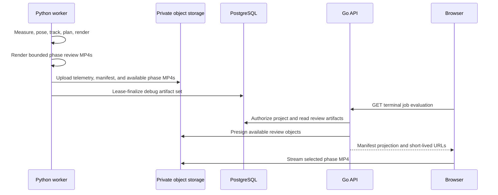

# Phase Evaluation Review

## Goal

Give an authorized project user a visual, phase-by-phase explanation of one offline job after it
reaches `completed` or `failed`. The normal output remains the requested cropped 1080p MP4. Visual
review artifacts are opt-in diagnostics, not a replacement output and not a live processing view.

The review answers a different question in each phase:

| Phase | Reviewer can judge | Required overlay |
| --- | --- | --- |
| `measurement` | Did detection select the intended person? | Selected detector box, confidence, and selection marker. |
| `pose` | Are landmarks, torso root, and pose bounds plausible? | Landmark skeleton, root, pose bounds, and confidence. |
| `tracking` | Did identity and motion remain stable through misses or reacquisition? | Detector/pose input, filtered root trail, state, confidence, covariance, and reacquisition marker. |
| `planning` | Does the movement envelope and crop safely frame the athlete? | Pose/detector fallback bounds, composed envelope, directional lead, final crop, and zoom decision. |
| `render` | Does the final crop correspond to the planned crop and preserve visible movement? | Planned source crop beside the actual output frame, frame/timestamp mapping status, and output validation result. |

The worker creates five low-resolution, H.264, no-audio review MP4s from the display-rotation-normalized
source. They preserve source frame timing so the same timestamp addresses the same frame in every phase.
The `render` video is a two-pane composition; the left pane is the annotated normalized source and the
right pane is the final cropped output. Failed jobs publish every completed phase and a manifest entry
explaining why later phases are unavailable.

## Artifact Contract

Visual capture is controlled by a new default-off `debug_visual_capture` flag. It requires
`debug_capture`; enabling it alone is invalid. The existing `debug_max_frames` and
`debug_max_bytes` limits remain for telemetry. Visual capture has independently bounded maximum
duration, encoded dimensions, total bytes, and FFmpeg/OpenCV timeout. Hitting a visual limit omits
only the affected optional review artifact and records that omission in the manifest; it never changes
the output job result.

Each capture creates the following private resources under one UUID-scoped review run:

```text
private/debug/{project_id}/{job_id}/{review_id}/telemetry.jsonl.gz
private/debug/{project_id}/{job_id}/{review_id}/manifest.json
private/debug/{project_id}/{job_id}/{review_id}/{phase}.mp4
```

`telemetry.jsonl.gz` remains the canonical evaluator input. `manifest.json` is a bounded,
human-oriented projection, not a replacement for telemetry. Schema v1 contains immutable
`pipeline_version` and `model_version` strings, plus `timing.frame_rate`, `timing.duration_ms`, and
`timing.frame_count`; the versions must equal the immutable job configuration. It contains ordered
phase availability, summary counters, warning intervals, and the first unavailable/failure reason.
It contains neither object URLs, source identifiers, source bytes, raw frames, nor credentials.

The pipeline must emit semantic phase trace values rather than reconstruct them in the renderer. In
particular, the planner returns a `CropPlan` containing crops plus, for each frame, the composed
envelope, lead room, uncertainty padding, containment risk, and zoom action. The debug serializer adds
these optional v2 fields without changing the v1 telemetry fields consumed by the offline evaluator.
The selection trace distinguishes `tap_match`, `continued`, `reacquired`, and `unavailable`; it must
not infer selection from the presence of a detector box.

The database links one artifact for each of these immutable kinds:

```text
debug_telemetry
debug_manifest
debug_measurement
debug_pose
debug_tracking
debug_planning
debug_render
```

`assets.kind` remains `debug`; `job_artifacts.kind` identifies the review resource. The worker uploads
and heads all available resources, then finalizes the set under its active lease in one transaction. A
finalization failure deletes the newly uploaded review-run objects where possible. Existing
`job_artifacts.kind = debug` rows migrate to `debug_telemetry`; persisted debug data therefore remains
readable.

Object storage retains review resources under a configurable lifecycle policy. The application never
stores per-frame telemetry, review URLs, or review summaries in PostgreSQL.

## API And Authorization

The backend adds an owner-authorized `GET /api/v1/jobs/{jobID}/evaluation` endpoint. It is available
only after the job is terminal and responds with the manifest projection plus short-lived signed URLs
for available phase MP4s and an optional telemetry export. It must not return object keys or unrestricted
URLs. A request after URL expiry obtains fresh URLs by calling this endpoint again.

```json
{
  "available": true,
  "review_id": "uuid",
  "state": "completed",
  "phases": [
    {
      "id": "pose",
      "label": "Pose",
      "status": "ready",
      "summary": {"pose_available_rate": 0.96, "warning_frames": 18},
      "video_url": "short-lived signed URL"
    },
    {
      "id": "render",
      "label": "Render",
      "status": "ready",
      "summary": {"mapping_verified": true, "output_valid": true},
      "video_url": "short-lived signed URL"
    }
  ],
  "telemetry_download_url": "short-lived signed URL"
}
```

When no review run exists, or every phase MP4 is unavailable, the endpoint returns `{ "available": false }`, not an error. A telemetry-only run may additionally include a short-lived `telemetry_download_url`, but omits review metadata and phases. The existing
`/artifacts` route stays metadata-only and is not a browser media-discovery API. Standard project
ownership checks apply to the new route before any URL is signed. URLs must be omitted from logs and
never embedded in telemetry or manifests.

## Browser Experience

The terminal job card checks review availability only after the user selects `Review processing`; it
does not fetch or presign review media eagerly. It opens the workspace only when `available` is true.
Telemetry-only and all-phase-unavailable responses do not open an empty workspace, while a returned
telemetry export remains available on the terminal card. An available response presents a review workspace:

1. A horizontal phase rail in pipeline order, with `ready`, `partial`, `unavailable`, and `warning`
   states. The selected phase loads only its review MP4.
2. A large native video player and a compact, phase-specific overlay legend. Playback, scrubbing, and
   frame stepping are browser-native; changing phase preserves the current timestamp after metadata
   loads.
3. A timeline of warning/lost/reacquisition/containment intervals. Selecting an interval seeks the
   player to its first frame.
4. A concise metrics panel showing only phase-relevant summary fields and the first warning. It reports
   unavailable evidence plainly rather than showing zeroes as success.
5. An `Export telemetry` link for technical evaluation. It is secondary to visual review.

The browser does not decode the original source, reproduce model overlays, run CV, or derive metrics.
It displays worker-rendered artifacts so visual evidence and the canonical telemetry use the same
source-coordinate records.



## Verification

- Worker tests cover v2 trace semantics, artifact-set idempotency, partial failed-job manifests,
  output-limit cleanup, and matching telemetry/video frame counts.
- Media integration tests decode every phase MP4, validate H.264/timing, and inspect known overlay
  pixels for detector, pose, tracking, planning, and render fixtures.
- API tests require project ownership, terminal jobs, artifact availability, URL expiry metadata, and
  no object keys in responses.
- Browser tests cover no-review, partial-review, phase switching at a nonzero timestamp, timeline seek,
  and an inaccessible expired URL refreshed by reopening the review.
