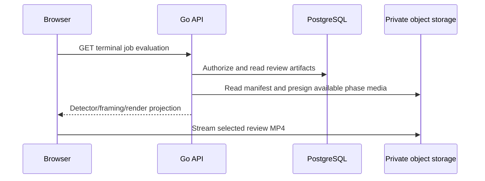

# Phase Evaluation Review

Authorized users can inspect optional private visual diagnostics after a job is `completed` or
`failed`. The cropped 1080p MP4 remains the product output; review artifacts are not live processing
or a replacement output.

## API Contract

`GET /api/v1/jobs/{jobID}/evaluation` returns `{ "available": false }` when no usable visual review
exists. A telemetry-only review may additionally return a telemetry URL but no workspace. A usable
response includes bounded manifest metadata and short-lived URLs only for ready/partial/warning phases:

```json
{
  "available": true,
  "review_id": "uuid",
  "state": "completed",
  "pipeline_version": "w0.2.0",
  "model_version": "w0.2-ssd-mobilenetv1-12-onnx-detector-only-1",
  "timing": {"frame_rate": 60, "duration_ms": 12000, "frame_count": 720},
  "phases": [
    {"id": "detection", "label": "Detection", "status": "ready", "video_url": "short-lived signed URL"},
    {"id": "framing", "label": "Framing", "status": "warning", "video_url": "short-lived signed URL"},
    {"id": "render", "label": "Render", "status": "ready", "video_url": "short-lived signed URL"}
  ]
}
```

The ordered phase IDs and labels are exactly `detection`/`Detection`, `framing`/`Framing`, and
`render`/`Render`. The frontend rejects a response with missing, reordered, unknown, or mismatched
phases; `unavailable` phases must have no media URL and all other statuses must have one. It also
validates bounded summaries, warning intervals inside source duration, version identifiers, and URL
syntax. It does not log signed URLs.

## Browser Behavior

The terminal card requests evaluation only after the user chooses `Review processing`. Reopening
requests fresh signed URLs. The workspace uses an ordered phase rail, a native video player, phase
summary fields, warning timeline, and `Export telemetry` when available. Switching phase retains the
current source timestamp after the new video metadata loads. Selecting a warning seeks to its start.
Unavailable evidence is explicit and never rendered as a successful zero metric.

The browser displays worker-rendered evidence only. It does not decode source video for review, infer
persons, recreate overlays, or calculate detector/framing metrics.



## Verification

- API tests cover terminal-state and ownership checks, strict manifest/artifact reconciliation, URL
  expiry metadata, role-to-phase projection, and no object-key or URL logging.
- Frontend tests cover the three-phase schema, unavailable handling, phase switching at nonzero time,
  warning seeks, and review URL refresh.
