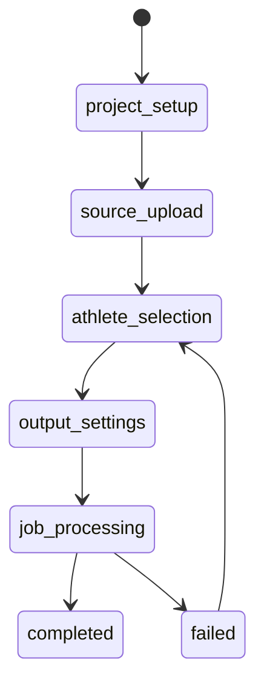

# Frontend Workflow

## UI State Machine



The React state is local runtime state. Signed URLs are not persisted in browser storage.

## Upload

1. Create a project with `POST /api/v1/projects`.
2. Validate local file type and configured maximum size.
3. Request an upload URL from the backend.
4. Upload the MP4 directly with `XMLHttpRequest` so progress is available.
5. Confirm the asset with `POST /api/v1/assets/{id}/complete`.

The current UI accepts MP4 files and defaults to a 2 GiB limit from the `frontend` object in
`frontend/conf/config.dev.json` or `frontend/conf/config.json`. Direct upload requires the local MinIO endpoint at
`http://localhost:9000` and its configured CORS policy.

## Athlete Selection

The browser video element provides intrinsic dimensions and current playback time. `mapPointerToNormalized` accounts for `object-fit: contain` letterboxing before sending:

```json
{
  "frame_time_ms": 1200,
  "normalized_x": 0.48,
  "normalized_y": 0.37
}
```

The marker uses the inverse contain transform so its displayed location matches the submitted source coordinate.

## Job Polling

After `POST /api/v1/projects/{id}/jobs`, the UI polls `GET /api/v1/jobs/{id}` every 1.8 seconds while the state is non-terminal. It displays `queued`, `validating`, `analyzing`, `rendering`, `uploading`, `completed`, `failed`, and `cancelled` states. A failure offers creation of a new job rather than mutating the stored configuration.

When completed, the UI requests `GET /api/v1/jobs/{id}/download` and opens the short-lived signed URL. The frontend does not store the URL beyond the current page state.

## API Client

`frontend/src/api.ts` centralizes JSON requests, typed resource models, safe API errors, signed upload progress, and download URL retrieval. The API origin comes from the `api_base_url` JSON setting.
