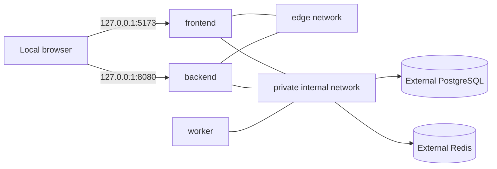

# Compose Runtime

## Services

| Service | Role | Local host exposure |
| --- | --- | --- |
| `frontend` | Vite development server | `127.0.0.1:5173` |
| `backend` | Go API | `127.0.0.1:8080` |
| `worker` | Python worker process | None |
| `caddy` | Online HTTPS routing | Ports 80/443 in online profile |

The frontend and backend use both the `private` network and the local-only `edge` network;
the edge attachment is required for Docker host port forwarding on Colima. The worker uses only
`private`, so it remains unexposed. The networks permit outbound access to the externally managed
PostgreSQL (`76.13.185.64:5432`), Redis (`76.13.185.64:6379`), and S3-compatible store
(`http://srv1883301.hstgr.cloud:9000`). Online Compose adds restart policies, resource limits,
persistent Caddy volumes, and versioned application images.

## Startup Ordering

The frontend waits for a healthy API. The online Caddy service waits for healthy frontend/API containers.
The backend reports remote dependency failures through its readiness endpoint; Compose cannot health-check
the externally managed PostgreSQL or Redis services.

## Object Storage

The backend and worker use the endpoint supplied through `S3_ENDPOINT`; browser signed URLs use
`S3_PRESIGN_ENDPOINT`. Both values point to the external S3-compatible service over HTTP:

- `S3_ENDPOINT=http://srv1883301.hstgr.cloud:9000`
- `S3_PRESIGN_ENDPOINT=http://srv1883301.hstgr.cloud:9000`

The external store owns bucket creation, credential provisioning, lifecycle retention, and CORS. It
must allow signed `PUT`, `GET`, and `HEAD` requests from the local and online frontend origins and
must be reachable from the development host and Compose network. HTTP is only suitable for a trusted
development network; use TLS before exposing the service to untrusted clients.

## Persistence

Named volumes:

- `worker-scratch`
- `caddy-data`
- `caddy-config`

`docker compose down` preserves data. `down -v` is local-only destructive maintenance and must not be run online.
The local frontend source bind mount is paired with the `frontend-node-modules` named volume so
Linux-native optional packages, including Vite's Rolldown binding, are installed inside the image
instead of being reused from the host. Rebuild the frontend image after changing `package.json` or
`package-lock.json`.

## Configuration

`infra/.env.example` is the non-secret infrastructure template. The Compose anchor supplies the
deployment values used to expand placeholders in each module's `conf/config.json`; application
services read those JSON files rather than `.env`. `DATABASE_URL` and `REDIS_URL` point to externally
managed services and must use percent-encoded URL passwords. Online deployments must replace credentials
and use explicit image tags.

## Online Boundary

The current Caddyfile serves `/healthz` and returns `403` for application routes until authentication and authorization are implemented. HTTPS termination is configured, but HTTPS alone is not an access-control mechanism.
