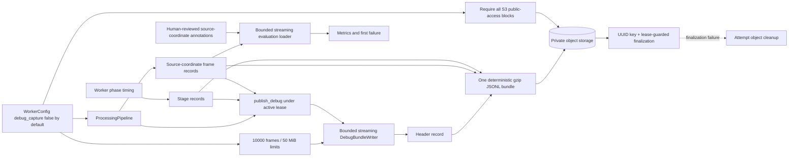

## Scope And Current Boundary

This document specifies the implemented v1 debug capture, bundle writer, evaluation loader/metrics,
and repository finalization contract.

`WorkerConfig.debug_capture` is an independent, default-off boolean (`false`). When enabled, runtime
passes it to `ProcessingPipeline`; the pipeline records source-coordinate analysis frames and the
worker records phase timing/stage records. After the output upload/finalization succeeds, the worker
calls `ProcessingPipeline.publish_debug` while the job remains in `uploading`. `retain_debug_artifacts`
is also default-off, but has a different purpose: it retains the job's local scratch directory rather
than controlling durable capture. Local scratch is not an artifact contract and must not be relied on
for evaluation.

Capture is bounded by positive configuration limits: `debug_max_frames` defaults to `10000` frames and
`debug_max_bytes` defaults to `52428800` bytes (50 MiB). The gzip writer emits records incrementally
and checks the compressed byte limit while writing, reserving its trailer; the evaluator reads gzip
JSONL line by line and applies its frame limit without materializing the bundle. A limit breach removes
the partial bundle and is treated as an optional-publication failure.

When debug capture is enabled, runtime readiness normally requires `head_bucket` plus all four S3
bucket public-access blocks to be `true`: `BlockPublicAcls`, `IgnorePublicAcls`,
`BlockPublicPolicy`, and `RestrictPublicBuckets`. This prevents telemetry collection when its
configured bucket is not explicitly private. A trusted development environment may explicitly set
`debug_require_private_storage: false`; production configurations must leave it enabled.

The repository supports at most one finalized debug artifact relation for a job. Each publication
generates a new UUID and uploads/heads a verified `DebugAsset` with content type `application/gzip`
under this private key:

```text
private/debug/{project_id}/{job_id}/{debug_uuid}.jsonl.gz
```

`finalize_debug` validates the canonical UUID-scoped key, is guarded by the current nonterminal job
lease, and upserts the unique `job_artifacts` relation for the `debug` kind. Successful jobs publish
while still `uploading`; a failed phase can publish its partial telemetry under the active lease before
the terminal failure is persisted. If upload verification or finalization fails after an object key has
been allocated, the pipeline attempts to delete that just-uploaded object. Debug scratch writes and
publication are best-effort: failures warn and cannot change the output job's successful or failed
outcome. Debug bundles are not public output and must be exposed only through an authorized,
short-lived asset access path when one is added.

## Data Workflow



The private bundle deliberately mixes operational records and frame records. The evaluator loads the
header, ignores non-`frame` records such as stage timing and `render_summary`, and evaluates the
strictly increasing source-coordinate frame sequence. It also emits an `insufficient_annotation`
result for every reviewed annotation frame that has no corresponding telemetry frame.

## Bundle Format

The artifact is one gzip-compressed JSON Lines file. The writer emits ASCII canonical JSON with
sorted keys and compact separators; gzip timestamps and names are fixed, so identical records produce
identical bytes. It writes incrementally, rather than constructing an in-memory bundle, and enforces
the configured frame and compressed-byte ceilings. Every writer-generated record has `record_type` and
`schema_version: 1`.

### Header Record

The fixed first record has `record_type: "header"` and identifies the run without media content:

- `job_id`
- `source_metadata`
- `pipeline_version` and `model_version`
- `planner_config` and `model_manifest`
- optional `source_object_version` and `source_checksum`

For evaluation, source metadata must identify the source with `source_id` or `sha256`, include its
display width/height, frame rate, and `variable_frame_rate: false`. The evaluator requires matching
dimensions/timing and either a matching source ID or checksum; it rejects variable-frame-rate sources.

### Frame Records

The bundle contains strictly increasing `frame` records after the header, interleaved with operational
records. Each frame has the top-level source `frame_index` and `timestamp_ms`, plus these required
sections:

| Section | Required evaluation fields | Meaning |
| --- | --- | --- |
| `measurement` | `detection`, `pose`, `selection` | Detector bounds, pose root, and whether the selected detection was chosen. |
| `tracking` | `root`, `state` | Tracked root and tracker state, including `lost`. |
| `planning` | `input`, `crop` | Planner input snapshot and planned source crop. |
| `render` | `crop`, `timestamp_ms`, `mapping_independently_verified` | Planned crop/timestamp and whether an independent renderer-mapping check verified them. |

Rectangle, root, landmark, and crop values are source-display pixel coordinates. Missing observations
are represented by `null`, not invented positions. The debug serializers preserve numeric
measurement/tracking/planning state only; they do not serialize decoded frames.

### Stage Records

The worker records phase timing in the same private bundle. The v1 convention is:

- `stage_start`: `stage`, `progress`, and `monotonic_ms`.
- `stage_end`: `stage`, `progress`, `duration_ms`, `outcome`, and `error_code` on a failed phase.
- `render_summary`: requested 1080p output width and height.

The writer enforces the record envelope and sanitization, not a stage schema. Operational records are
for inspection only. `load_debug_bundle` deliberately streams past every non-`frame` record, including
`stage_start`, `stage_end`, and `render_summary`; they may share the same artifact as evaluation
frames without changing evaluation results. If a durable phase raises, the worker records its failed
`stage_end`, attempts best-effort publication while its lease is active, and only then persists the
job failure.

## Redaction And Content Restrictions

Debug telemetry is metadata-only. Sanitization recursively removes fields whose names indicate
credentials (`token`, `secret`, `password`, `authorization`, keys, signatures, encryption keys, and
similar), URLs/endpoints, and raw media/payload fields (`raw_frame`, `frame`, `image`, `video`,
`bytes`, `buffer`, `data`, and similar). Field-name normalization recognizes snake_case, kebab-case,
and camelCase, so `apiKey`, `sourceURL`, and `rawFrame` receive the same protection. Byte-like values
are replaced with `null`; strings containing HTTP(S), S3, PostgreSQL, or Redis URLs are also replaced
with `null`.

Do not put raw frames, image pixels, video/audio payloads, credentials, signed URLs, object-store
endpoints, database URLs, Redis URLs, or command diagnostics in a debug record. The sanitizer is a
defense in depth measure, not permission to emit those values upstream.

## Evaluation Inputs And Results

Evaluation compares telemetry to a separate JSON annotation file. The annotation must be schema v1,
declare `human_reviewed: true`, identify a reviewer and case, and carry source metadata that matches
the bundle. Its frames have strictly increasing source frame indexes and timestamps. Annotation
bounds, landmarks, and roots are source-display pixel coordinates and must lie inside the source.

Each annotation frame records visibility and may record occlusion, ambiguity, bounds, landmarks, root,
and identity. A visible frame requires bounds. Missing or ambiguous annotations are not treated as a
model result: ambiguous or absent annotations produce `insufficient_annotation`; non-visible frames
do not receive visibility-dependent metrics. A reviewed annotation without a telemetry frame also
produces an `insufficient_annotation` result, so an incomplete telemetry bundle cannot silently omit
evaluation evidence.

The permitted evaluation manifest contains case metadata only, never a media path. Supported scenarios
are `stationary`, `lateral_sprint`, `jump`, `occlusion`, and `lost_subject`; private source videos stay
outside version control.

Per visible, unambiguous annotated frame, the evaluator calculates detector availability and IoU,
selection correctness, pose/tracker availability and root error, tracking recovery time, crop
containment, cropped-landmark count, edge risk, subject scale, and normalized pan/zoom velocity,
acceleration, and jerk. Aggregates report the corresponding availability/rate/mean measures and can
be grouped deterministically by model, planner, pipeline, profile, and source resolution.

The report records the first frame with a failure using this precedence:

1. `measurement`: no detection.
2. `selection`: selection is incorrect or IoU is below 0.5.
3. `tracking`: no non-lost tracker root.
4. `planning`: the crop fails to contain bounds or any annotated landmark.
5. `render_mapping`: an independently verified renderer mapping is marked true and its rendered crop
   or timestamp differs from the planned value.
6. `insufficient_annotation`: no matching annotation or an ambiguous annotation.

## Current Rendering Limitation

The current renderer does not produce the final 1080p reframe. It rotation-normalizes the original
video and overlays the planned source crop rectangle on every source frame, preserving source display
dimensions. The resulting H.264/AAC MP4 is the requested 1080p reframe, used to verify crop mapping; it is
not evidence that a cropped/scaled 1080p output was rendered. The current pipeline records
`mapping_independently_verified: false`; it does not claim the independent renderer-mapping evidence
required to emit a `render_mapping` failure.
