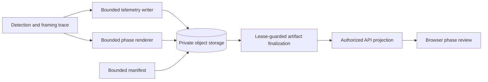

# Debug Telemetry And Evaluation

`debug_capture` is a default-off, bounded private diagnostic path. It does not retain scratch by
itself and cannot change required output processing. `retain_debug_artifacts` only keeps local job
scratch and is not an evaluation contract. `debug_visual_capture` requires `debug_capture` and has
separate review duration, output-size, aggregate-byte, and enforced child-process timeout limits.

Each capture uses one UUID-scoped private review set:

```text
private/debug/{project_id}/{job_id}/{review_id}/telemetry.jsonl.gz
private/debug/{project_id}/{job_id}/{review_id}/manifest.json
private/debug/{project_id}/{job_id}/{review_id}/detection.mp4
private/debug/{project_id}/{job_id}/{review_id}/framing.mp4
private/debug/{project_id}/{job_id}/{review_id}/render.mp4
```

The database roles are `debug_telemetry`, `debug_manifest`, `debug_detection`, `debug_framing`, and
`debug_render`. Only available visual MP4s are finalized. `assets.kind` remains `debug`; the artifact
role names the resource. Review objects are private, are never placed in PostgreSQL as bytes or
summaries, and are exposed only by authorized short-lived API URLs.

## Telemetry Contract

`telemetry.jsonl.gz` is canonical evaluator input. It uses streaming ASCII JSON Lines with bounded
frame and compressed-byte limits. The header contains job/source metadata, immutable pipeline/model
versions, and detector-framing configuration. Frame records are strictly increasing source-frame
records with source-display coordinates and these sections:

| Section | Evidence |
| --- | --- |
| `detection` | Current person detection and tap/association evidence. |
| `framing` | Sampled or held camera-target bounds, target-height crop decision, and final crop. |
| `render` | Final crop, timestamp, and output-validation/mapping evidence. |

Missing or skipped raw detection is `null`, not an invented position. `selection_outcome =
detection_skipped` distinguishes skipped inference from an actual sampled miss. Framing inputs can
retain a previous sampled box; this is a held camera target, not evidence of a fresh detection or
athlete identity. Serialized measurements expose `detection_sampled`: true for actual accepted or
missed samples, false for skips. Skips do not count as detector failures or sampled misses.
Detection summaries report `sampled_frames`, `skipped_frames`, `detected_frames`, and actual
`missed_frames`. Framing summaries use `unavailable_detection_frames` for all frames with no held
camera target, including skipped frames following a sampled miss.

For pipeline `w0.2.7`, headers are built from the validated immutable planner map:
`controller = lookahead-v2`, `seed_controller = deterministic-v3`, `optimizer = scipy-highs-ds`,
`lookahead_scope = full_shot`, `containment_policy = sampled_detections`,
`solver_feasibility_tolerance = 1e-8`, `pan_dead_zone_fraction = 0.05`, the eight unchanged
hysteresis/motion constants, and deployment-snapshotted `detection_sample_fps` (default `10`). See the
[exact map](../backend/http-api.md). Zoom limits use log-height per second/per second²; pan limits
use source dimension per second/per second² independently on each axis.
The deadzone is a per-axis radius of 5% of each seed crop's width/height around its center,
source-normalized for the LP. After speed/acceleration excess, objectives prioritize duration-weighted
deadzone deviation, center travel, velocity change including rest, then exact seed composition.

`LookaheadPlannerFrameTrace` retains common framing fields (`target_height_fraction`,
`desired_crop`, `detection_missed`, `smoothing_applied`, `containment_override`,
`source_aspect_limited`, `action`) and the causal scale fields below, but omits all causal
center-error and center-gate fields. Zoom dimensions, scale hysteresis, and miss widening remain
the exact causal seed output; full-shot optimization changes centers only.

| Field | Meaning |
| --- | --- |
| `observed_height_fraction` | Detector height divided by previous seed crop height; finite or `null`. |
| `scale_relative_error` | Observed height fraction / profile target fraction minus one; finite or `null`. |
| `scale_deadband_applied` | Causal scale gate is idle; residual zoom may still brake. |
| `scale_adjusting` | Causal scale gate is adjusting. |
| `lookahead_center_adjusted` | Final center differs from the causal seed center. |
| `sampled_detection_constraint` | Fresh accepted sampled box supplies this frame's hard constraint. |
| `sampled_detection_contained` | Containment on a fresh accepted sample; otherwise `null`. False is valid only for source/aspect-impossible boxes. |
| `held_target_contained` | Containment of a skipped frame's held box; otherwise `null`. False is permitted by sampling policy. |
| `pan_velocity_x_source_per_second`, `pan_velocity_y_source_per_second` | Recomputed final interval velocity, `null` on the first frame. |
| `pan_acceleration_x_source_per_second2`, `pan_acceleration_y_source_per_second2` | Recomputed change in interval velocity, `null` until two intervals exist. |
| `pan_speed_limit_exceeded`, `pan_acceleration_limit_exceeded` | Validated final motion needs excess beyond configured limits, including rest-boundary acceleration constraints. |
| `smoothing_applied` | Final crop actually changed from the preceding frame. |
| `containment_override` | Always false for look-ahead: containment is an optimizer constraint, not a snap. |

Actions are `initial`, `lookahead_hold`, `lookahead_pan`, `widen_on_miss`, and
`source_aspect_limited`. Future accepted sampled boxes can require early pan, but only actual samples
constrain containment. Held targets may leave the crop; no athlete position is interpolated,
extrapolated, or claimed inside a detector gap. Motion-limit conflicts retain sampled containment
and report minimum required speed then acceleration excess.

Causal `PlannerFrameTrace` remains serializable for explicitly injected `DeterministicCropPlanner`
and historical fixtures. Its `center_error_x_fraction`, `center_error_y_fraction`,
`center_deadband_applied`, `center_adjusting`, and causal hold/smoothing/override actions keep their
original seed meanings; never fabricate those fields for look-ahead output.
All numeric fields pass finite-value sanitization; non-finite diagnostics become `null`.
See [Detection and Framing](measurements-and-planner.md#full-shot-look-ahead-pan).

Invalid/non-optimal solver output fails analyzing terminally with `internal`,
`"Video framing could not be planned."`; no causal fallback or analysis report/crop-path/debug
analysis trace is committed. Backend and worker require the
[drained `w0.2.7` cutover](../../dev/development.md#start-modules), not replay of old configurations.

The sanitizer removes URLs, object keys, credentials, endpoints, command diagnostics, bytes, pixels,
and media payloads. Human-reviewed annotations remain separate. Evaluation reports detector
availability/IoU and selection, crop containment, source/aspect-limited framing, output mapping,
missed-detection widening, subject scale, and pan/zoom continuity. It requires no pose, landmark,
tracker, root, or tracking-recovery schema fields. A reviewed frame without telemetry is insufficient
annotation rather than silent success.

Every fresh or cached product output must pass full decode and exact frame-count validation before
finalization. The mandatory invariant is `source expected frames == crop records == frames written ==
decoded output frames`; failure is terminal even when debug capture is disabled.

With `debug_capture`, the worker additionally emits optional structured diagnostics after rendering.
`render output progress` reports the decoded output-frame count, planned crop count, and at most ten
intervals of exactly repeated decoded frames. `render temporal progress` compares sustained near-static
intervals in the render input with the output. `planned crop temporal progress` measures the same
display-normalized source after the final crop path. Both use 192x108 (or 108x192 portrait) luma-frame
differences at or below 0.05 for at least 15 frames and report only bounded frame intervals. For
normalized jobs, `original source temporal progress` additionally reports the original source's
near-static intervals. These logs contain no frame checksums, pixels, or media data. A subsequent
`render crop mapping` log compares the first crop change, midpoint, and last source frames with the
corresponding output frames. It reports only sampled frame indexes and mean absolute pixel error;
error at or below 24 indicates the sampled crop applied. These diagnostics are evidence only and
cannot replace mandatory product validation.

## Visual Review

The three review phases are ordered and interpreted as follows:

| Phase | Reviewer can judge | Required overlay |
| --- | --- | --- |
| `detection` | Did the detector associate the selected person? | Candidate/selected person boxes, confidence, and tap/reference marker. |
| `framing` | Does sampled-only look-ahead produce a bounded crop? | Fresh/held box provenance and containment, desired/final crop, target fraction, look-ahead action, and motion/source-aspect warnings. |
| `render` | Does the output correspond to the final crop? | Annotated normalized source beside actual output. |

The renderer reuses the same bounded semantic trace, never reruns inference or replans crops. Review
MP4s are low-resolution H.264 without audio and preserve source timing. `render` is letterboxed
two-pane source/output evidence. A failed or bounded-out phase is represented in the manifest as
`unavailable`; successful output remains unaffected.

## Manifest

`manifest.json` schema v1 has immutable `pipeline_version`, `model_version`, source timing, telemetry
status, and exactly ordered `detection`, `framing`, `render` entries. Each phase contains bounded status,
summary, warning intervals, and an unavailable detail when needed. It contains no signed URLs, object
keys, source identifiers, source bytes, or credentials. Its values must match immutable configuration
and validated source metadata before the backend projects them.

Framing summaries may include the bounded sampled constraint/uncontained, held-target-outside,
and pan speed/acceleration excess counts described in the
[processing report](runtime-and-pipeline.md#processing-report). Warning intervals mark unavoidable
motion-limit excess and stale held targets outside the crop separately. The latter warns about
sampling policy, not failed fresh detection containment.


