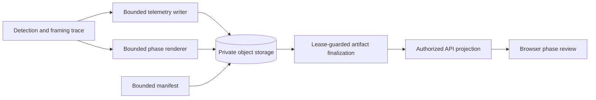

# Debug Telemetry And Evaluation

`debug_capture` is a default-off, bounded private diagnostic path. It does not retain scratch by
itself and cannot change required output processing. `retain_debug_artifacts` only keeps local job
scratch and is not an evaluation contract. `debug_visual_capture` requires `debug_capture` and has
separate review duration, output-size, aggregate-byte, and enforced child-process timeout limits.

Each capture uses one UUID-scoped private review set:

```text
private/debug/{project_id}/{job_id}/{review_id}/telemetry.jsonl.gz
private/debug/{project_id}/{job_id}/{review_id}/manifest.json
private/debug/{project_id}/{job_id}/{review_id}/detection.mp4
private/debug/{project_id}/{job_id}/{review_id}/framing.mp4
private/debug/{project_id}/{job_id}/{review_id}/render.mp4
```

The database roles are `debug_telemetry`, `debug_manifest`, `debug_detection`, `debug_framing`, and
`debug_render`. Only available visual MP4s are finalized. `assets.kind` remains `debug`; the artifact
role names the resource. Review objects are private, are never placed in PostgreSQL as bytes or
summaries, and are exposed only by authorized short-lived API URLs.

## Telemetry Contract

`telemetry.jsonl.gz` is canonical evaluator input. It uses streaming ASCII JSON Lines with bounded
frame and compressed-byte limits. The header contains job/source metadata, immutable pipeline/model
versions, and detector-framing configuration. Frame records are strictly increasing source-frame
records with source-display coordinates and these sections:

| Section | Evidence |
| --- | --- |
| `detection` | Current person detection and tap/association evidence. |
| `framing` | Current detector bounds, target-height crop decision, and final crop. |
| `render` | Final crop, timestamp, and output-validation/mapping evidence. |

Missing detection is `null`, not an invented position. Telemetry records only current detector and
crop-decision values; it records detector association as deterministic evidence, not identity proof.

For controller `deterministic-v3` (pipeline `w0.2.3`), the header's planner configuration includes
the unchanged thresholds `scale_enter_fraction = 0.05`, `scale_exit_fraction = 0.02`,
`center_enter_fraction = 0.01`, and `center_exit_fraction = 0.004`, plus `zoom_max_speed = 0.5`,
`zoom_max_acceleration = 1.0`, `pan_max_speed = 0.25`, and `pan_max_acceleration = 0.5`.
Zoom limits use log-height per second and per second²; pan limits use source dimension per second
and per second² on each axis. Existing framing trace fields explain the independent gates and motion:

| Field | Meaning |
| --- | --- |
| `observed_height_fraction` | Current detector height divided by previous final crop height. |
| `scale_relative_error` | Observed height fraction divided by profile target fraction, minus one. |
| `center_error_x_fraction` | Source-clamped desired-center x displacement divided by previous crop width. |
| `center_error_y_fraction` | Source-clamped desired-center y displacement divided by previous crop height. |
| `scale_deadband_applied` | Scale gate is idle; residual zoom velocity may still be braking. |
| `scale_adjusting` | Scale gate remains in adjustment after this frame's gate decision. |
| `center_deadband_applied` | Center gate is idle; residual pan velocity may still be braking. |
| `center_adjusting` | Center gate remains in adjustment after this frame's gate decision. |
| `smoothing_applied` | Crop motion includes active transitions or braking/settling after a gate closes. |

The four numeric fields are bounded finite numbers or `null`; missing detection or a missing previous
crop reference yields `null`, never invented zero error. The four state/decision fields are booleans.
Misses bypass both gates; all four booleans are false on a miss or the first frame without a previous
crop. Reacquisition uses the widened previous crop as its reference. A gate hold is evidence of the
pre-safety gate decision, not a guarantee that settling, containment, or source clamping left the
final crop unchanged. No new trace fields are required for velocity or animation state.

Actions distinguish `deadband_hold`, `smoothed`, `containment_override`, `source_aspect_limited`,
and `widen_on_miss`. Containment and source/aspect diagnostics remain separate from gate decisions:
required expansion or shifting wins over motion limits and jitter suppression. Misses cancel pan
and inward zoom velocity without extrapolating a subject position. See
[Detection and Framing](measurements-and-planner.md#independent-hysteresis-gates) for threshold
boundaries, timestamp-based braking and retargeting, and causal decision order.

The sanitizer removes URLs, object keys, credentials, endpoints, command diagnostics, bytes, pixels,
and media payloads. Human-reviewed annotations remain separate. Evaluation reports detector
availability/IoU and selection, crop containment, source/aspect-limited framing, output mapping,
missed-detection widening, subject scale, and pan/zoom continuity. It requires no pose, landmark,
tracker, root, or tracking-recovery schema fields. A reviewed frame without telemetry is insufficient
annotation rather than silent success.

Every fresh or cached product output must pass full decode and exact frame-count validation before
finalization. The mandatory invariant is `source expected frames == crop records == frames written ==
decoded output frames`; failure is terminal even when debug capture is disabled.

With `debug_capture`, the worker additionally emits optional structured diagnostics after rendering.
`render output progress` reports the decoded output-frame count, planned crop count, and at most ten
intervals of exactly repeated decoded frames. `render temporal progress` compares sustained near-static
intervals in the render input with the output. `planned crop temporal progress` measures the same
display-normalized source after the final crop path. Both use 192x108 (or 108x192 portrait) luma-frame
differences at or below 0.05 for at least 15 frames and report only bounded frame intervals. For
normalized jobs, `original source temporal progress` additionally reports the original source's
near-static intervals. These logs contain no frame checksums, pixels, or media data. A subsequent
`render crop mapping` log compares the first crop change, midpoint, and last source frames with the
corresponding output frames. It reports only sampled frame indexes and mean absolute pixel error;
error at or below 24 indicates the sampled crop applied. These diagnostics are evidence only and
cannot replace mandatory product validation.

## Visual Review

The three review phases are ordered and interpreted as follows:

| Phase | Reviewer can judge | Required overlay |
| --- | --- | --- |
| `detection` | Did the detector associate the selected person? | Candidate/selected person boxes, confidence, and tap/reference marker. |
| `framing` | Does the current detector box drive a bounded crop? | Detector box, desired crop, final crop, target fraction, miss/widen action, and source/aspect-limit warning. |
| `render` | Does the output correspond to the final crop? | Annotated normalized source beside actual output. |

The renderer reuses the same bounded semantic trace, never reruns inference or replans crops. Review
MP4s are low-resolution H.264 without audio and preserve source timing. `render` is letterboxed
two-pane source/output evidence. A failed or bounded-out phase is represented in the manifest as
`unavailable`; successful output remains unaffected.

## Manifest

`manifest.json` schema v1 has immutable `pipeline_version`, `model_version`, source timing, telemetry
status, and exactly ordered `detection`, `framing`, `render` entries. Each phase contains bounded status,
summary, warning intervals, and an unavailable detail when needed. It contains no signed URLs, object
keys, source identifiers, source bytes, or credentials. Its values must match immutable configuration
and validated source metadata before the backend projects them.


