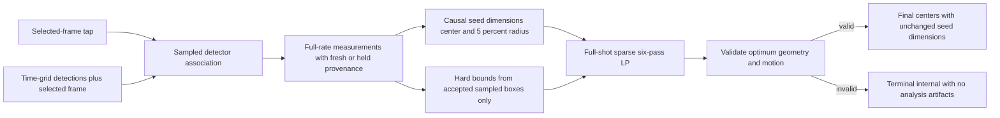

# Detection And Framing

## Coordinate System And Selection

All values use display-rotation-normalized source pixels with the origin at the top left. Browser
selection coordinates are normalized to `[0, 1]` and converted by `source_tap` for the selected
source frame. `Rect` values are source-pixel `x`, `y`, `width`, and `height`.

At the selected frame, `select_target` chooses the detection containing the tap, or the detection
with the nearest center when none contains it. An empty selected-frame result is terminal
`no_selected_athlete`. The selected detector box seeds two independent associations: one scans forward
and one scans backward, preserving chronological output. Each later candidate is selected by containing
the last accepted detector-box center, then nearest center, and must be within 1.5 times the last
accepted box diagonal. This source-dimension-independent gate rejects a distant
competing person without motion prediction or identity proof. A miss or rejected candidate records no
detection and does not update the reference; no target position or identity is extrapolated.

`PersonDetector.detect(frame)` returns person rectangles with confidences. The selected W0.2 adapter
is `OnnxYolo26Detector`; its local artifact, tensor contract, checksum, and AGPL-3.0 license are in
[Model Manifest](models.md).

## Configurable Detection Sampling

Pipeline `w0.2.7` snapshots `planner.detection_sample_fps` from the backend deployment setting
`DETECTION_SAMPLE_FPS` (default `10`). Values are finite numbers from `0` through `1000`;
`0` disables sampling. A rate at or above the source frame rate also detects every frame.
The worker requires this immutable setting; it never reads a live sampling environment variable.

Use a regular time grid based on the processing video's rational CFR timing, starting at frame zero.
Detect the first frame at or after each grid time and always include the exact selected frame,
without shifting the grid or detecting that frame twice. Associate only sampled detections forward
and backward from the selected frame.

Planning and rendering still run at the video's full frame rate. In chronological order, hold the
latest sampled result as camera guidance between samples. A real sampled miss clears that held box
and continues causal zoom widening through skipped frames until a successful sample.
Only accepted sampled boxes, including the selected frame, are hard containment constraints.
Skipped frames are not misses; a stale held box may leave the crop. Future observed boxes constrain
full-shot camera movement but never fill gaps with interpolated or predicted athlete positions.
All source frames are still decoded; this saves detector inference, not decoding or rendering.

## Detector-Box Planner

`FrameMeasurement` contains `detector_bounds`, required integer `timestamp_ms`, detector
`confidence` (default `0`), and `detection_sampled: bool = True`. Timestamps must be non-negative
and strictly increase, including on misses. Accepted samples and actual sampled misses set freshness
true; skipped frames set it false, with held bounds or `None` after a miss.

`LookaheadCropPlanner` is the default behind the unchanged `CropPlanner.plan` interface.
It invokes `DeterministicCropPlanner` as its causal seed and preserves every seed width/height
exactly, replacing only centers. Optimization remains deliberately pan-only: zoom hysteresis,
timestamp-based zoom, miss widening, and source/aspect-limited sizing remain causal.
The seed uses a fixed target height fraction of the detected person box:

| Profile | Detected athlete height / crop height |
| --- | --- |
| `tight` | `.60` |
| `balanced` | `.50` |
| `safe` | `.40` |
| `full_movement` | `.33` |

The `deterministic-v3` seed uses the profile fraction as its centerline, not a per-frame mandate
to resize. It first derives the desired crop height as `detection.height / target_height_fraction`,
centers the aspect-ratio crop on the detector box, and clamps it to source/aspect bounds.
The first frame with a detection and no previous crop uses that desired crop directly.

### Independent Hysteresis Gates

The following gates describe the **causal seed**, not look-ahead pan decisions. Both compare against
the previous final seed crop, including earlier safety overrides or miss widening. Their state is
causal and independent. Center hysteresis provides the look-ahead objective reference only.

```text
observed_height_fraction = detection.height / previous_crop.height
scale_relative_error = observed_height_fraction / target_height_fraction - 1
center_error_x_fraction = (desired_center.x - previous_center.x) / previous_crop.width
center_error_y_fraction = (desired_center.y - previous_center.y) / previous_crop.height
```

The desired center in these formulas is source-clamped. The unchanged hysteresis thresholds are
flat immutable `planner` keys alongside `seed_controller = deterministic-v3`:

| Gate | Enter adjustment from idle | Close adjustment gate |
| --- | --- | --- |
| Scale | `abs(scale_relative_error) > scale_enter_fraction` (`0.05`) | `abs(scale_relative_error) <= scale_exit_fraction` (`0.02`) |
| Center | Either absolute center error `> center_enter_fraction` (`0.01`) | Both absolute center errors `<= center_exit_fraction` (`0.004`) |

Equality at the outer boundary leaves an idle gate closed; equality at the inner boundary closes
an active gate. An idle gate at rest holds its preceding dimensions or center exactly. Closing a gate
while moving instead brakes its existing velocity to zero over a short settling interval, then holds
exactly; it does not stop the crop instantly. For `balanced`, scale entry corresponds to leaving
47.5%–52.5% detected height and gate closure to entering 49%–51%, not a promise about the final
post-settling fraction. Accumulated gradual movement eventually crosses the band because the reference
is the current crop, not an immediately preceding detection.

### Timestamp-Based Motion

Elapsed time is `(timestamp_ms - previous_timestamp_ms) / 1000`. Zoom moves in `log(crop.height)`;
pan moves in `(center.x / source_width, center.y / source_height)`. Pan motion limits therefore use
source dimensions, while the center gate above deliberately retains crop-dimension normalization.

| Immutable planner key | Value | Units |
| --- | --- | --- |
| `zoom_max_speed` | `0.5` | log-height / second |
| `zoom_max_acceleration` | `1.0` | log-height / second² |
| `pan_max_speed` | `0.25` | source dimension / second, per axis |
| `pan_max_acceleration` | `0.5` | source dimension / second², per axis |

In the causal seed, each active component accelerates, cruises within its speed cap, and brakes based on stopping
distance as it approaches the target. Updates integrate those motion phases over actual elapsed
time, rather than applying per-frame exponential coefficients. Retargeting preserves velocity:
new detector boxes do not restart an animation. A target that suddenly moves inside the current
stopping distance can be crossed before reversal; velocity changes still obey acceleration limits
unless a safety override intervenes. Scale and center settle independently after their gates close.

### Safety Precedence And Misses

For detected seed frames, the order is: derive and clamp the desired crop; apply scale and center
hysteresis; advance active motion or idle braking; build and clamp the candidate; then contain the
current detector box. Containment may immediately expand or shift a crop. This safety override takes
precedence over deadband holds, settling, and motion limits. Source/aspect corrections and containment
reset velocity only for the corrected components. If source bounds or the requested aspect make
containment impossible, use the largest valid crop centered on the detection as far as bounds allow
and mark `source_aspect_limited` instead of claiming containment.

A missed detection bypasses both gates and resets their adjustment states to idle. It immediately
cancels pan velocity and any inward zoom velocity; outward zoom velocity is retained while targeting
the full valid source-aspect height with the same timestamp-based zoom limits. The seed's previous center is
held except for source/aspect clamping required as the crop widens. A first-frame miss uses the full
crop immediately. Reacquisition compares the detection with that widened final crop, so a material
error resumes adjustment naturally. The planner never extrapolates an athlete position for a close
crop and performs no additional subject-state or future-motion inference.

### Full-Shot Look-Ahead Pan

The immutable controller is `lookahead-v2`, seed controller `deterministic-v3`, optimizer
`scipy-highs-ds` (pinned `scipy==1.15.3`, `linprog(method="highs-ds")`), scope `full_shot`,
containment policy `sampled_detections`, and feasibility tolerance `1e-8`. These fields plus
`pan_dead_zone_fraction=0.05`, the eight constants above, and `detection_sample_fps` form the exact planner key set; see the
[complete JSON contract](../backend/http-api.md). The worker rejects missing/extra keys, wrong types,
non-finite values, and mismatched constants before cached crop replay with terminal `internal`.

Solve one independently source-normalized axis at a time, using sparse matrices only and fixed
variable/constraint ordering. A seed crop extent `e_i` gives legal source bounds
`e_i/2 <= c_i <= source_extent-e_i/2`. On a fresh accepted sampled box, intersect these with
`box_far_edge-e_i/2 <= c_i <= box_near_edge+e_i/2`. Held boxes never narrow the interval.
If source/aspect geometry makes the fresh box impossible to fit, retain source bounds and record
`source_aspect_limited` and uncontained sampled status; any other empty interval is a planning error.

For normalized center `c_i` and seconds `dt_i`, use the interval velocity
`v_i = (c_i-c_(i-1))/dt_i`. Nonnegative global excess variables `s` and `a` keep sampled
containment authoritative when motion limits conflict:

```text
abs(v_i) <= 0.25 + s
abs(v_1) <= (0.5 + a) * dt_1 / 2
abs(v_i-v_(i-1)) <= (0.5 + a) * (dt_i+dt_(i-1)) / 2
abs(v_last) <= (0.5 + a) * dt_last / 2
```

Start/end constraints model rest immediately before/after the shot. The deadzone is centered on each
seed center, with per-axis radius `r_i = 0.05 * seed_extent_i / source_extent`: 5% of that seed crop's
width on x and height on y, not 5% of source dimensions or a full band width. It is a soft objective
over the entire shot, never selective windows or a relaxation of sampled containment.

Six lexicographic LP passes minimize:

1. Global speed excess `s`.
2. Global acceleration excess `a`.
3. Trapezoidal duration-weighted L1 distance outside the seed deadzone:
   `sum_i w_i * max(abs(c_i-seed_center_i)-r_i, 0)`.
4. Total absolute center travel: `sum_i abs(c_i-c_(i-1))`.
5. Total absolute velocity change, including start/end rest transitions.
6. Duration-weighted exact seed deviation: `sum_i w_i * abs(c_i-seed_center_i)`, only as the
   final composition tie-break.

The timestamp weights are half the adjacent interval at each endpoint and half the sum of adjacent
intervals at each interior frame. Every pass locks all earlier optima plus tolerance `1e-8`; the
deadzone does not force exact seed chasing ahead of travel or velocity stability. Explicit L1
auxiliaries and deterministic `highs-ds` ordering avoid random tie-breaking. Release pass-local
matrices/results before the next axis. Empty input returns the empty seed plan; one frame returns its
legal seed crop without SciPy.

Require every solve to return a finite optimal result. Canonicalize centers outside an interval by
at most tolerance onto its boundary; never repair a materially invalid solution with a snap.
Reconstruct crops using unchanged seed dimensions and validate frame count, timestamps, positive
finite/aspect-correct geometry, source bounds, feasible sampled containment, and recomputed
speed/acceleration against optimized excess plus tolerance. Derive diagnostics from this validated
path, not untrusted solver metadata. `PlannerError` maps to terminal analyzing `internal`,
`"Video framing could not be planned."`; solver diagnostics remain sanitized internal details.
There is no causal fallback and no committed analysis report, crop path, or debug analysis trace
on optimizer failure.

### Diagnostics

`CropPlan.trace` accepts causal `PlannerFrameTrace` or `LookaheadPlannerFrameTrace`.
The look-ahead trace retains `target_height_fraction`, `desired_crop`, `detection_missed`,
`smoothing_applied`, `containment_override`, `source_aspect_limited`, `action`, and causal scale
fields (`observed_height_fraction`, `scale_relative_error`, `scale_deadband_applied`,
`scale_adjusting`). It omits causal center-error/gate fields rather than inventing their meanings.
`containment_override` is always false: hard constraints replace after-the-fact center snaps.
`smoothing_applied` means an actual final crop change from the preceding frame.

Additional fields are `lookahead_center_adjusted`, `sampled_detection_constraint`,
`sampled_detection_contained` (nullable outside fresh accepted samples), `held_target_contained`
(nullable outside skipped frames with a held box), per-axis
`pan_velocity_{x,y}_source_per_second` (null on the first frame), and
`pan_acceleration_{x,y}_source_per_second2` (null until two intervals exist), plus
`pan_speed_limit_exceeded` and `pan_acceleration_limit_exceeded`. Actions are `initial`,
`lookahead_hold`, `lookahead_pan`, `widen_on_miss`, or `source_aspect_limited`.
Reports retain existing metrics and add sampled/held containment and motion-limit counts/excess;
warnings distinguish stale-target sampling policy from genuine sampled containment failure.
See [telemetry](debug-telemetry-and-evaluation.md#telemetry-contract) and
[processing reports](runtime-and-pipeline.md#processing-report).

All settings except the deployment sampling rate are immutable algorithm constants, not frontend
controls. Pipeline `w0.2.7` and the entire planner map participate in the job hash.
Deploy through a [drained cutover](../../dev/development.md#start-modules), not old-job retries.



`CropRect` exposes right/bottom bounds, center, and containment; `full_frame_crop` derives the
widest crop for the requested output aspect ratio and `clamp_crop` keeps all crops inside source
bounds. `LookaheadCropPlanner` retains the same `CropPlanner` rendering and storage contracts;
full-shot camera optimization is not athlete trajectory interpolation.
