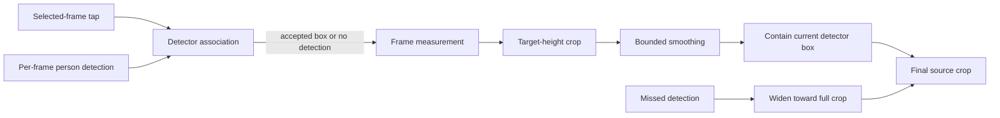

# Detection And Framing

## Coordinate System And Selection

All values use display-rotation-normalized source pixels with the origin at the top left. Browser
selection coordinates are normalized to `[0, 1]` and converted by `source_tap` for the selected
source frame. `Rect` values are source-pixel `x`, `y`, `width`, and `height`.

At the selected frame, `select_target` chooses the detection containing the tap, or the detection
with the nearest center when none contains it. An empty selected-frame result is terminal
`no_selected_athlete`. The selected detector box seeds two independent associations: one scans forward
and one scans backward, preserving chronological output. Each later candidate is selected by containing
the last accepted detector-box center, then nearest center, and must be within 1.5 times the last
accepted box diagonal. This source-dimension-independent gate rejects a distant
competing person without motion prediction or identity proof. A miss or rejected candidate records no
detection and does not update the reference; no target position or identity is extrapolated.

`PersonDetector.detect(frame)` returns person rectangles with confidences. The selected W0.2 adapter
is `OnnxSsdMobileNetV1Detector`; its local artifact, tensor contract, checksum, and license are in
[Model Manifest](models.md).

## Detector-Box Planner

`FrameMeasurement` has only `detector_bounds` and detector confidence. The
`DeterministicCropPlanner` uses a fixed target height fraction of the detected person box:

| Profile | Detected athlete height / crop height |
| --- | --- |
| `tight` | `.60` |
| `balanced` | `.50` |
| `safe` | `.40` |
| `full_movement` | `.33` |

For each detected frame it creates an aspect-ratio crop centered on the person-box center, clamps it
to the source, and applies bounded exponential smoothing to crop center and height. It then expands
or shifts the crop as needed to contain the current detector box. If the requested aspect or source
bounds make containment impossible, it instead uses the largest valid crop centered on the detection
as far as bounds allow. The trace marks this as `source_aspect_limited`; it is not a containment
override. The `CropPlan` records each final crop and a trace containing target fraction, desired crop,
missed-detection flag, smoothing status, containment override, source/aspect limitation, and action.

On a missed detection the planner widens from the previous crop toward the full valid source-aspect
crop. If the first frame is missed it uses that full crop immediately. It never extrapolates an
athlete position for a close crop. This is a causal detector-box controller with no additional
subject-state or future-motion inference.

`CropRect` exposes right/bottom bounds, center, and containment; `full_frame_crop` derives the
widest crop for the requested output aspect ratio and `clamp_crop` keeps all crops inside source
bounds. The planner remains behind its `CropPlanner` interface so a later replacement can retain the
same rendering and storage contracts.
