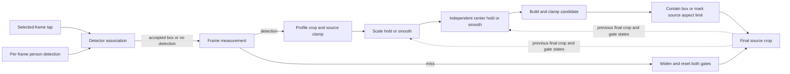

# Detection And Framing

## Coordinate System And Selection

All values use display-rotation-normalized source pixels with the origin at the top left. Browser
selection coordinates are normalized to `[0, 1]` and converted by `source_tap` for the selected
source frame. `Rect` values are source-pixel `x`, `y`, `width`, and `height`.

At the selected frame, `select_target` chooses the detection containing the tap, or the detection
with the nearest center when none contains it. An empty selected-frame result is terminal
`no_selected_athlete`. The selected detector box seeds two independent associations: one scans forward
and one scans backward, preserving chronological output. Each later candidate is selected by containing
the last accepted detector-box center, then nearest center, and must be within 1.5 times the last
accepted box diagonal. This source-dimension-independent gate rejects a distant
competing person without motion prediction or identity proof. A miss or rejected candidate records no
detection and does not update the reference; no target position or identity is extrapolated.

`PersonDetector.detect(frame)` returns person rectangles with confidences. The selected W0.2 adapter
is `OnnxSsdMobileNetV1Detector`; its local artifact, tensor contract, checksum, and license are in
[Model Manifest](models.md).

## Detector-Box Planner

`FrameMeasurement` has only `detector_bounds` and detector confidence. The
`DeterministicCropPlanner` uses a fixed target height fraction of the detected person box:

| Profile | Detected athlete height / crop height |
| --- | --- |
| `tight` | `.60` |
| `balanced` | `.50` |
| `safe` | `.40` |
| `full_movement` | `.33` |

The `deterministic-v2` controller uses the profile fraction as its centerline, not a per-frame mandate
to resize. It first derives the desired crop height as `detection.height / target_height_fraction`,
centers the aspect-ratio crop on the detector box, and clamps it to source/aspect bounds.
The first frame with a detection and no previous crop uses that desired crop directly.

### Independent Hysteresis Gates

Both gates compare against the previous **final crop**, including any earlier safety override or
miss widening, rather than against the previous detector box. Their state is causal and independent:
zoom adjustment does not force a pan, and center jitter does not force a resize.

```text
observed_height_fraction = detection.height / previous_crop.height
scale_relative_error = observed_height_fraction / target_height_fraction - 1
center_error_x_fraction = (desired_center.x - previous_center.x) / previous_crop.width
center_error_y_fraction = (desired_center.y - previous_center.y) / previous_crop.height
```

The desired center in these formulas is source-clamped. Fixed algorithm constants are persisted as
flat immutable `planner` keys alongside `controller = deterministic-v2`:

| Gate | Enter adjustment from idle | Stop adjustment and hold | Adjustment coefficient |
| --- | --- | --- | --- |
| Scale | `abs(scale_relative_error) > scale_enter_fraction` (`0.05`) | `abs(scale_relative_error) <= scale_exit_fraction` (`0.02`) | `height_alpha = 0.25` |
| Center | Either absolute center error `> center_enter_fraction` (`0.01`) | Both absolute center errors `<= center_exit_fraction` (`0.004`) | `center_alpha = 0.35` |

When idle, scale holds the preceding width and height exactly; center holds the preceding center
exactly. While adjusting, each gate retains bounded exponential smoothing until its inner threshold
is reached. Equality at the outer boundary holds; equality at the inner boundary stops adjustment.
For `balanced`, an idle crop holds between 47.5% and 52.5% detected height and an active zoom settles
inside 49% to 51%. Accumulated gradual scale movement eventually crosses the band because the
reference is the current crop, not an immediately preceding detection.

### Safety Precedence And Misses

For detected frames, the order is: derive and clamp the desired crop; apply scale hysteresis; apply
center hysteresis; build and clamp the candidate; then contain the current detector box. Containment
may immediately expand or shift a held crop. This safety override takes precedence over deadband
holds and smoothing. If the source bounds or requested aspect make containment impossible, use the
largest valid crop centered on the detection as far as bounds allow and mark `source_aspect_limited`
instead of claiming containment.

A missed detection bypasses both gates, widens from the previous crop toward the full valid
source-aspect crop, and resets both adjustment states to idle. A first-frame miss uses the full crop
immediately. Reacquisition compares the detection with that widened final crop, so a material error
resumes adjustment naturally. The planner never extrapolates an athlete position for a close crop
and performs no additional subject-state or future-motion inference.

### Diagnostics

Each `CropPlan` contains final crops and frame-aligned traces with the target fraction, desired crop,
miss flag, smoothing status, containment override, source/aspect limitation, and action. The four
numeric errors/fractions above are finite floats or `null` when there is no detection or previous
crop reference. `scale_deadband_applied`, `scale_adjusting`, `center_deadband_applied`, and
`center_adjusting` record each gate's hold/adjust decision independently of the final safety result.
Actions distinguish `deadband_hold`, `smoothed`, `containment_override`, `source_aspect_limited`,
and `widen_on_miss`; a safety action does not erase the gate diagnostics. See the
[telemetry contract](debug-telemetry-and-evaluation.md#telemetry-contract) for serialization.

Thresholds are algorithm constants, not frontend controls or public job inputs. Pipeline `w0.2.2`
and the immutable planner configuration separate this behavior from older cached paths.



`CropRect` exposes right/bottom bounds, center, and containment; `full_frame_crop` derives the
widest crop for the requested output aspect ratio and `clamp_crop` keeps all crops inside source
bounds. The planner remains behind its `CropPlanner` interface so a later replacement can retain the
same rendering and storage contracts.
