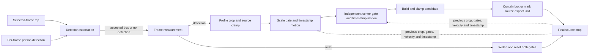

# Detection And Framing

## Coordinate System And Selection

All values use display-rotation-normalized source pixels with the origin at the top left. Browser
selection coordinates are normalized to `[0, 1]` and converted by `source_tap` for the selected
source frame. `Rect` values are source-pixel `x`, `y`, `width`, and `height`.

At the selected frame, `select_target` chooses the detection containing the tap, or the detection
with the nearest center when none contains it. An empty selected-frame result is terminal
`no_selected_athlete`. The selected detector box seeds two independent associations: one scans forward
and one scans backward, preserving chronological output. Each later candidate is selected by containing
the last accepted detector-box center, then nearest center, and must be within 1.5 times the last
accepted box diagonal. This source-dimension-independent gate rejects a distant
competing person without motion prediction or identity proof. A miss or rejected candidate records no
detection and does not update the reference; no target position or identity is extrapolated.

`PersonDetector.detect(frame)` returns person rectangles with confidences. The selected W0.2 adapter
is `OnnxSsdMobileNetV1Detector`; its local artifact, tensor contract, checksum, and license are in
[Model Manifest](models.md).

## Detector-Box Planner

`FrameMeasurement` contains `detector_bounds`, required integer `timestamp_ms`, and detector
`confidence` (default `0`). Timestamps must strictly increase, including on misses.
The `DeterministicCropPlanner` uses a fixed target height fraction of the detected person box:

| Profile | Detected athlete height / crop height |
| --- | --- |
| `tight` | `.60` |
| `balanced` | `.50` |
| `safe` | `.40` |
| `full_movement` | `.33` |

The `deterministic-v3` controller uses the profile fraction as its centerline, not a per-frame mandate
to resize. It first derives the desired crop height as `detection.height / target_height_fraction`,
centers the aspect-ratio crop on the detector box, and clamps it to source/aspect bounds.
The first frame with a detection and no previous crop uses that desired crop directly.

### Independent Hysteresis Gates

Both gates compare against the previous **final crop**, including any earlier safety override or
miss widening, rather than against the previous detector box. Their state is causal and independent:
zoom adjustment does not force a pan, and center jitter does not force a resize.

```text
observed_height_fraction = detection.height / previous_crop.height
scale_relative_error = observed_height_fraction / target_height_fraction - 1
center_error_x_fraction = (desired_center.x - previous_center.x) / previous_crop.width
center_error_y_fraction = (desired_center.y - previous_center.y) / previous_crop.height
```

The desired center in these formulas is source-clamped. The unchanged hysteresis thresholds are
flat immutable `planner` keys alongside `controller = deterministic-v3`:

| Gate | Enter adjustment from idle | Close adjustment gate |
| --- | --- | --- |
| Scale | `abs(scale_relative_error) > scale_enter_fraction` (`0.05`) | `abs(scale_relative_error) <= scale_exit_fraction` (`0.02`) |
| Center | Either absolute center error `> center_enter_fraction` (`0.01`) | Both absolute center errors `<= center_exit_fraction` (`0.004`) |

Equality at the outer boundary leaves an idle gate closed; equality at the inner boundary closes
an active gate. An idle gate at rest holds its preceding dimensions or center exactly. Closing a gate
while moving instead brakes its existing velocity to zero over a short settling interval, then holds
exactly; it does not stop the crop instantly. For `balanced`, scale entry corresponds to leaving
47.5%–52.5% detected height and gate closure to entering 49%–51%, not a promise about the final
post-settling fraction. Accumulated gradual movement eventually crosses the band because the reference
is the current crop, not an immediately preceding detection.

### Timestamp-Based Motion

Elapsed time is `(timestamp_ms - previous_timestamp_ms) / 1000`. Zoom moves in `log(crop.height)`;
pan moves in `(center.x / source_width, center.y / source_height)`. Pan motion limits therefore use
source dimensions, while the center gate above deliberately retains crop-dimension normalization.

| Immutable planner key | Value | Units |
| --- | --- | --- |
| `zoom_max_speed` | `0.5` | log-height / second |
| `zoom_max_acceleration` | `1.0` | log-height / second² |
| `pan_max_speed` | `0.25` | source dimension / second, per axis |
| `pan_max_acceleration` | `0.5` | source dimension / second², per axis |

Each active component accelerates, cruises within its speed cap, and brakes based on stopping
distance as it approaches the target. Updates integrate those motion phases over actual elapsed
time, rather than applying per-frame exponential coefficients. Retargeting preserves velocity:
new detector boxes do not restart an animation. A target that suddenly moves inside the current
stopping distance can be crossed before reversal; velocity changes still obey acceleration limits
unless a safety override intervenes. Scale and center settle independently after their gates close.

### Safety Precedence And Misses

For detected frames, the order is: derive and clamp the desired crop; apply scale and center
hysteresis; advance active motion or idle braking; build and clamp the candidate; then contain the
current detector box. Containment may immediately expand or shift a crop. This safety override takes
precedence over deadband holds, settling, and motion limits. Source/aspect corrections and containment
reset velocity only for the corrected components. If source bounds or the requested aspect make
containment impossible, use the largest valid crop centered on the detection as far as bounds allow
and mark `source_aspect_limited` instead of claiming containment.

A missed detection bypasses both gates and resets their adjustment states to idle. It immediately
cancels pan velocity and any inward zoom velocity; outward zoom velocity is retained while targeting
the full valid source-aspect height with the same timestamp-based zoom limits. The previous center is
held except for source/aspect clamping required as the crop widens. A first-frame miss uses the full
crop immediately. Reacquisition compares the detection with that widened final crop, so a material
error resumes adjustment naturally. The planner never extrapolates an athlete position for a close
crop and performs no additional subject-state or future-motion inference.

### Diagnostics

Each `CropPlan` contains final crops and frame-aligned traces with the target fraction, desired crop,
miss flag, smoothing status, containment override, source/aspect limitation, and action. The four
numeric errors/fractions above are finite floats or `null` when there is no detection or previous
crop reference. `scale_deadband_applied` and `center_deadband_applied` indicate idle gates, not an
instantaneously stationary crop; `scale_adjusting` and `center_adjusting` describe active gates.
`smoothing_applied` includes braking/settling after a gate closes. These decisions remain independent
of the final safety result.
Actions distinguish `deadband_hold`, `smoothed`, `containment_override`, `source_aspect_limited`,
and `widen_on_miss`; a safety action does not erase the gate diagnostics. See the
[telemetry contract](debug-telemetry-and-evaluation.md#telemetry-contract) for serialization.

All eight thresholds and motion limits are algorithm constants, not frontend controls or public job
inputs. Pipeline `w0.2.3` and the immutable planner configuration separate this behavior from older
cached paths.



`CropRect` exposes right/bottom bounds, center, and containment; `full_frame_crop` derives the
widest crop for the requested output aspect ratio and `clamp_crop` keeps all crops inside source
bounds. The planner remains behind its `CropPlanner` interface so a later replacement can retain the
same rendering and storage contracts.
