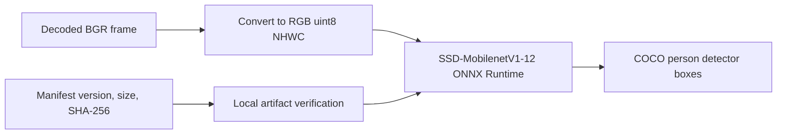

# Detector Model

The detector-only worker has one immutable model version:

`w0.2-ssd-mobilenetv1-12-onnx-detector-only-1`

The machine-readable artifact pin is
[`worker/models/model-manifest.json`](../../../worker/models/model-manifest.json). Model files are
not committed and the worker never downloads them. Before startup, `ModelArtifact.verify` requires
the exact file name, byte size, and SHA-256 from that manifest. A configured runtime with a missing
or mismatched artifact fails startup; it does not fall back to an unchecked model.



## Selected Detector

**ONNX Model Zoo SSD-MobilenetV1-12** is the CPU-capable COCO person detector used for selection
and every analyzed frame.

| Field | Value |
| --- | --- |
| Artifact | `ssd_mobilenet_v1_12.onnx` |
| Upstream source | [ONNX Model Zoo commit `4f43949841cb55a0b98dc8fcd045431ccafd9f96`](https://github.com/onnx/models/tree/4f43949841cb55a0b98dc8fcd045431ccafd9f96/validated/vision/object_detection_segmentation/ssd-mobilenetv1) |
| Exact download | [Pinned media artifact](https://media.githubusercontent.com/media/onnx/models/4f43949841cb55a0b98dc8fcd045431ccafd9f96/validated/vision/object_detection_segmentation/ssd-mobilenetv1/model/ssd_mobilenet_v1_12.onnx) |
| Model format | SSD-MobilenetV1-12, ONNX 1.9.0, opset 12 |
| Size | 29,461,455 bytes |
| SHA-256 | `b8fba5e404077d4048d27fcd1667e85e27e192eb9bf51e696c46a3acd7d21058` |
| Weight license | MIT, stated by the upstream [model README](https://github.com/onnx/models/blob/4f43949841cb55a0b98dc8fcd045431ccafd9f96/validated/vision/object_detection_segmentation/ssd-mobilenetv1/README.md#license) |
| Repository license | [Apache-2.0](https://github.com/onnx/models/blob/4f43949841cb55a0b98dc8fcd045431ccafd9f96/LICENSE) |

The adapter accepts decoded OpenCV BGR pixels, converts them to contiguous RGB `uint8` NHWC, and
uses only COCO class ID `1` (`person`) at score threshold `0.20`. It verifies one input named
`inputs` and these ordered outputs:

| Output | Contract |
| --- | --- |
| `detection_boxes` | normalized `[top, left, bottom, right]` boxes |
| `detection_classes` | COCO numeric class IDs |
| `detection_scores` | score in `[0, 1]` |
| `num_detections` | detection count |

Accepted boxes are clamped and converted to source-display pixels. W0.2 provisions no additional CV
model or runtime beyond this detector.

## Runtime Dependencies

| Dependency | Pin | License evidence | Use |
| --- | --- | --- | --- |
| `onnxruntime` | `1.22.0` | [PyPI metadata](https://pypi.org/project/onnxruntime/1.22.0/) and [source license](https://github.com/microsoft/onnxruntime/blob/v1.22.0/LICENSE) report MIT | CPU ONNX inference |
| `numpy` | `1.26.4` | [BSD-3-Clause-compatible license](https://github.com/numpy/numpy/blob/v1.26.4/LICENSE.txt) | RGB tensor handling |
| `opencv-python-headless` | `4.10.0.84` | [Apache-2.0](https://github.com/opencv/opencv/blob/4.10.0/LICENSE) | CFR BGR decoding and rotation-normalized frames |

Operators provision the detector read-only under `MODEL_DIR` (default `/models`):

```text
MODEL_DIR/
  ssd_mobilenet_v1_12.onnx
```

Set `MODEL_VERSION` to the W0.2 identifier only after verification succeeds. The backend snapshots
that value into immutable job configuration, and the worker processes only matching snapshots. The
local `unset-until-pinned` sentinel normalizes to `unconfigured`: matching jobs fail terminally with
`model_unavailable`. A configured W0.2 worker with a missing/invalid model or unavailable decoder
does not start or consume jobs.

## Evidence Date

URLs, artifact bytes, checksums, and license evidence were verified on 2026-08-20. Any detector
replacement requires a new manifest entry and immutable model version.
