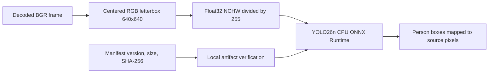

# Detector Model

The detector-only worker has one immutable model version:

`w0.2-yolo26n-onnx-detector-only-1`

The machine-readable artifact pin is
[`worker/models/model-manifest.json`](../../../worker/models/model-manifest.json). Model files are
not committed and the worker never downloads them. Before startup, `ModelArtifact.verify` requires
the exact file name, byte size, and SHA-256 pinned in the manifest and runtime constants. A configured
runtime with a missing or mismatched artifact fails startup; it never uses an unchecked fallback.



## Selected Detector

**Ultralytics YOLO26n** supplies COCO person detections for the selected frame and every sampled
frame. The historical `w0.2.6` release changed only the detector, leaving selection/association,
detection sampling, crop planning, and rendering unchanged. Current pipeline `w0.2.7` retains this
detector and changes only the full-shot pan objective to `lookahead-v2`.

| Field | Value |
| --- | --- |
| Artifact | `yolo26n.onnx` |
| Source checkpoint | Ultralytics assets release `v8.4.0`, `yolo26n.pt`; source URL, byte size, and SHA-256 in the manifest |
| Format | ONNX opset 17; fixed 640x640, batch 1, FP32, CPU |
| Export | Explicit `end2end=True`, `nms=False`, `dynamic=False`, `half=False`, `simplify=False` |
| ONNX integrity | Exact final byte size and SHA-256 in the manifest |
| License | AGPL-3.0; explicitly accepted for this detector cutover; upstream license evidence is linked in the manifest |

`OnnxYolo26Detector` accepts decoded OpenCV BGR pixels, resizes with aspect ratio preserved,
centers the image in a 640x640 canvas filled with 114, converts to contiguous RGB float32 NCHW,
and divides by 255. This is not a stretched resize. Letterbox padding and scale are inverted before
clamping accepted boxes to source-display pixels.

| Tensor | Contract |
| --- | --- |
| Input `images` | float32 `[1, 3, 640, 640]` |
| Output `output0` | float32 `[1, 300, 6]`, each row `[x1, y1, x2, y2, score, class]` in letterbox pixels |

Only COCO class `0` (`person`) at score threshold `0.20` is retained. The end-to-end head supplies
final detections; no additional NMS is exported or applied by the adapter. The worker provisions no
additional CV model or Ultralytics/PyTorch runtime.

## Runtime Dependencies And CPU Limits

| Dependency | Pin | License evidence | Use |
| --- | --- | --- | --- |
| `onnxruntime` | `1.22.0` | [Source license](https://github.com/microsoft/onnxruntime/blob/v1.22.0/LICENSE), MIT | CPU ONNX inference |
| `numpy` | `1.26.4` | [Source license](https://github.com/numpy/numpy/blob/v1.26.4/LICENSE.txt), BSD-3-Clause | RGB tensor handling |
| `opencv-python-headless` | `4.10.0.84` | [Source license](https://github.com/opencv/opencv/blob/4.10.0/LICENSE), Apache-2.0 | CFR BGR decoding, resize, and rotation-normalized frames |

The inference session uses only `CPUExecutionProvider`, with **2 intra-op threads and 1 inter-op
thread** for the 2-vCPU server. Keep `WORKER_CONCURRENCY=1` on that server to avoid competing
inference sessions. These session limits do not introduce new environment controls.

## Reproducible Provisioning

Operators provision the detector read-only under `MODEL_DIR` (default `/models`):

```text
MODEL_DIR/
  yolo26n.onnx
```

Run `./deploy/bin/local prepare-model` before startup. It needs Python 3.11+ for provisioning,
plus `curl` and `uv` when exporting. It downloads and verifies the pinned checkpoint before loading
it, then runs `deploy/bin/export-model.py` in an isolated manifest-pinned Python 3.12 toolchain:
Ultralytics `8.4.143`, PyTorch `2.6.0`, torchvision `0.21.0`, ONNX `1.17.0`, NumPy `1.26.4`, and
opencv-python `4.11.0.86`. Linux uses CPU PyTorch wheels. The export removes all ONNX metadata,
including volatile timestamps and paths, and verifies the final ONNX byte size and SHA-256 before
atomically installing a read-only file in `worker/models` (or `MODEL_DIR_HOST`).

Export bytes can still differ across platforms/toolchains. Such differences fail closed; never
change the approved hash merely to admit a different local export. To provision the exact approved
artifact on another host without installing the export toolchain, transfer it and run:

```sh
./deploy/bin/local prepare-model /path/to/yolo26n.onnx
```

That path also verifies final size and SHA-256 before installation. A matching artifact already in
the destination is verified and reused without network access. Export dependencies are deployment
build tools only: the worker itself never downloads, exports, or loads a checkpoint.

Set `MODEL_VERSION` to the exact YOLO26n identifier only after verification succeeds. The backend
snapshots it into immutable job configuration, and the worker processes only matching snapshots.
The local `unset-until-pinned` sentinel normalizes to `unconfigured`: matching jobs fail terminally
with `model_unavailable`. A configured runtime with a missing/invalid model or unavailable decoder
does not start or consume jobs.

AGPL-3.0 acceptance covers this model choice; deployment and redistribution must comply with its
terms, including applicable corresponding-source disclosure and network-use obligations. Retain
[the bundled license](../../../worker/models/LICENSE) with redistributed artifacts; this file alone
does not ensure compliance. Do not describe these weights or Ultralytics as MIT/Apache-licensed.
Use the manifest's upstream license reference when reviewing distribution obligations.

Backend and worker must use pipeline `w0.2.7` and the same pinned model version. Follow the
[drained cutover](../../dev/development.md#start-modules): finish old jobs on old workers, then
start both services together. Never rewrite or retry old jobs to migrate processing behavior, republish
old task UUIDs, or reuse their scratch/crop paths; submit new versioned jobs instead.
