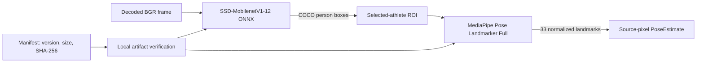

## Status

W0.1 selects a baseline full-frame person detector and a pose implementation for the offline
single-athlete pipeline. The exact approved set is identified by immutable job `model_version`:

`w0.1-ssd-mobilenetv1-12-onnx-mediapipe-pose-full-1`

The machine-readable source of the artifact pins is
[`worker/models/model-manifest.json`](../../../worker/models/model-manifest.json). Model files are
deliberately excluded from version control and are never downloaded by the worker. Before loading,
`ModelArtifact.verify` requires the listed file name, byte size, and SHA-256. A missing or mismatched
file makes runtime composition fail; it must not fall back to a different model or an unchecked file.



## Selected Detector

**ONNX Model Zoo SSD-MobilenetV1-12** is the baseline person detector. It is a mature, CPU-capable
COCO detector in ONNX format and exposes the required person class without adding an unverified
conversion.

| Field | Value |
| --- | --- |
| Artifact | `ssd_mobilenet_v1_12.onnx` |
| Upstream source | [ONNX Model Zoo, commit `4f43949841cb55a0b98dc8fcd045431ccafd9f96`](https://github.com/onnx/models/tree/4f43949841cb55a0b98dc8fcd045431ccafd9f96/validated/vision/object_detection_segmentation/ssd-mobilenetv1) |
| Exact download | [media.githubusercontent.com artifact](https://media.githubusercontent.com/media/onnx/models/4f43949841cb55a0b98dc8fcd045431ccafd9f96/validated/vision/object_detection_segmentation/ssd-mobilenetv1/model/ssd_mobilenet_v1_12.onnx) |
| Model version | SSD-MobilenetV1-12; ONNX 1.9.0; opset 12 |
| Size | 29,461,455 bytes |
| SHA-256 | `b8fba5e404077d4048d27fcd1667e85e27e192eb9bf51e696c46a3acd7d21058` |
| Weight license | MIT, stated by the upstream [model README](https://github.com/onnx/models/blob/4f43949841cb55a0b98dc8fcd045431ccafd9f96/validated/vision/object_detection_segmentation/ssd-mobilenetv1/README.md#license) |
| Repository license | [Apache-2.0](https://github.com/onnx/models/blob/4f43949841cb55a0b98dc8fcd045431ccafd9f96/LICENSE) |

The adapter uses only COCO class ID `1` (`person`) with a score threshold of `0.20`. Its checked
contract is a batch-one `uint8` RGB NHWC tensor named `inputs`, shape
`[1, height, width, 3]`, with variable positive height/width. Outputs, in order, are:

| Output | Contract |
| --- | --- |
| `detection_boxes` | normalized `[top, left, bottom, right]` boxes |
| `detection_classes` | COCO numeric class IDs |
| `detection_scores` | score in `[0, 1]` |
| `num_detections` | detection count |

The adapter receives decoded OpenCV BGR pixels, converts them to contiguous RGB, and converts accepted
normalized boxes back to source pixels.

## Selected Pose Model

**MediaPipe Pose Landmarker Full** is selected for the original-resolution, selected-person ROI. It
packages a pose detector and BlazePose GHUM 3D Full landmark model, returns one pose, and avoids an
additional unverified pose conversion.

| Field | Value |
| --- | --- |
| Artifact | `pose_landmarker_full.task` |
| Exact download | [Google MediaPipe artifact version 1](https://storage.googleapis.com/mediapipe-models/pose_landmarker/pose_landmarker_full/float16/1/pose_landmarker_full.task) |
| Model version | Pose Landmarker Full float16, artifact version 1 |
| Size | 9,398,198 bytes |
| SHA-256 | `5134a3aad27a58b93da0088d431f366da362b44e3ccfbe3462b3827a839011b1` |
| Weight license | [Apache-2.0, BlazePose GHUM 3D Model Card](https://storage.googleapis.com/mediapipe-assets/Model%20Card%20BlazePose%20GHUM%203D.pdf) |
| Runtime source/license | [MediaPipe `v0.10.32` Apache-2.0 license](https://github.com/google-ai-edge/mediapipe/blob/v0.10.32/LICENSE) |
| Published task reference | [Google Pose Landmarker models](https://ai.google.dev/edge/mediapipe/solutions/vision/pose_landmarker#models) |

The adapter creates `PoseLandmarker` in image mode with `num_poses=1`, receives a contiguous RGB HWC ROI,
and returns the first pose's 33 normalized landmarks. A valid empty `pose_landmarks` result returns no
pose observation, allowing the worker tracker to handle reacquisition and loss; it is not a model failure.
Any non-empty result with a landmark count other than 33 remains a model-contract error. The root is the
midpoint of landmark indices 23 and 24 (left/right hip). Bounds are the extrema of all landmarks;
confidence is mean landmark visibility. `TargetFrameAnalyzer` transforms these normalized ROI values into
source pixels. It disables segmentation masks and does not use MediaPipe's own temporal tracking, since
the worker tracker is the authority.

## Runtime Dependencies

| Dependency | Pin | License evidence | Use |
| --- | --- | --- | --- |
| `onnxruntime` | `1.22.0` | [PyPI metadata](https://pypi.org/project/onnxruntime/1.22.0/) reports MIT; [source license](https://github.com/microsoft/onnxruntime/blob/v1.22.0/LICENSE) is MIT | CPU ONNX inference |
| `mediapipe` | `0.10.32` | [PyPI metadata](https://pypi.org/project/mediapipe/0.10.32/) reports Apache-2.0; [source license](https://github.com/google-ai-edge/mediapipe/blob/v0.10.32/LICENSE) is Apache-2.0 | Pose Tasks runtime |
| `matplotlib` | `3.11.1` | [Matplotlib license](https://github.com/matplotlib/matplotlib/blob/v3.11.1/LICENSE) is PSF-compatible | Required by MediaPipe's package initializer; no plotting is used by the worker |
| `numpy` | `1.26.4` | [NumPy license](https://github.com/numpy/numpy/blob/v1.26.4/LICENSE.txt) is BSD-3-Clause compatible | contiguous RGB preprocessing and tensor handling |
| `opencv-python-headless` | `4.10.0.84` | [OpenCV 4.10.0 source license](https://github.com/opencv/opencv/blob/4.10.0/LICENSE) is Apache-2.0 | CFR frame decoding through its FFmpeg video backend and explicit rotation-normalized BGR frames |

Authoritative PyPI SHA-256 evidence captured for the Python 3.12 worker targets:

| Wheel | SHA-256 |
| --- | --- |
| `mediapipe-0.10.32-py3-none-manylinux_2_28_x86_64.whl` | `4b0941fbbbce41862f13cb1850c4878c13dbc62cd5e81e74880051b7a20ce3b6` |
| `mediapipe-0.10.32-py3-none-macosx_11_0_arm64.whl` | `b62178b7585e0bb8789075c43bbb3e352fbc4a8f765797fded509f86a098b29b` |
| `onnxruntime-1.22.0-cp312-cp312-manylinux_2_27_x86_64.manylinux_2_28_x86_64.whl` | `6964a975731afc19dc3418fad8d4e08c48920144ff590149429a5ebe0d15fb3c` |
| `onnxruntime-1.22.0-cp312-cp312-macosx_13_0_universal2.whl` | `f3c0380f53c1e72a41b3f4d6af2ccc01df2c17844072233442c3a7e74851ab97` |
| `numpy-1.26.4-cp312-cp312-manylinux_2_17_x86_64.manylinux2014_x86_64.whl` | `675d61ffbfa78604709862923189bad94014bef562cc35cf61d3a07bba02a7ed` |

The exact wheel URL and the complete dependency metadata are available from each linked PyPI JSON
release record. The project does not commit a platform-specific lockfile, so image builds must use
the pinned version constraints and verify their installer lock/cache separately.

These are all permissive and compatible with the repository's Apache-2.0-compatible requirement. The
Docker image must install exactly the pins from `worker/pyproject.toml`; package transitive dependencies
remain subject to their own wheel notices and must be included in any distributed image notice process.

## Redistribution

The worker is a service and does not return model files to users. If an image, installer, or other artifact
redistributes either model or the runtime wheels, retain the applicable MIT, Apache-2.0, BSD-3-Clause, and
any bundled-wheel notices. Apache-2.0 requires distribution of its license and retention of applicable
copyright, patent, attribution, and NOTICE text; modified Apache source must be marked. MIT and BSD-3-Clause
require their copyright and permission/disclaimer notices. Do not use upstream project or trademark names
to imply endorsement.

Operators provision these exact files read-only under `MODEL_DIR` (default `/models`):

```text
MODEL_DIR/
  ssd_mobilenet_v1_12.onnx
  pose_landmarker_full.task
```

Set `MODEL_VERSION` to the selected identifier only after provisioning succeeds. The backend snapshots
that identifier into immutable job configuration, and a provisioned worker runs only matching snapshots.
The local `.env.example` sentinel `MODEL_VERSION=unset-until-pinned` normalizes to `unconfigured`; this
safe state starts the worker and matching jobs end with terminal `model_unavailable`. In contrast, a
configured W0.1 runtime with absent/mismatched artifacts or an unavailable decoder dependency fails
startup and consumes no jobs. After the selected detector and pose artifacts verify and load, the worker
creates `OpenCVFrameReader`. It disables OpenCV auto-orientation, applies the already-validated
`MediaMetadata` rotation itself, and streams one BGR frame at a time with frame index and timestamp
calculated from immutable CFR metadata. This matches the renderer's rotation transform and does not
retain full-frame pixels after each observation.

## Evidence Date

URLs, artifact bytes, checksums, and the source licenses above were fetched and verified on 2026-08-20.
The model manifest uses the detector repository commit and the pose artifact's explicit numeric version,
not either mutable `main` or `latest` URL.
