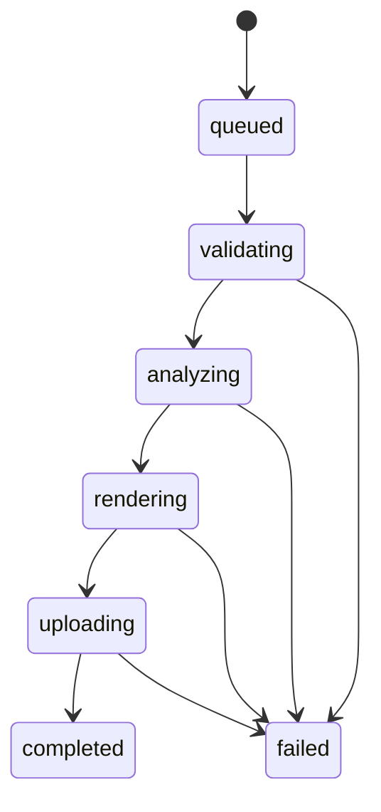
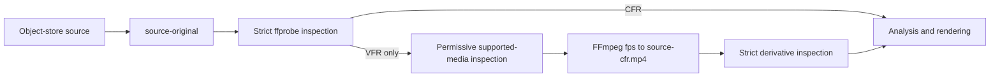
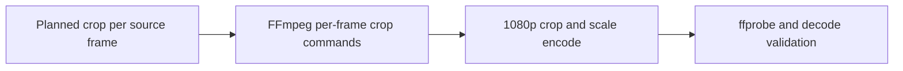

# Worker Runtime And Pipeline

## Configuration

`WorkerConfig.from_file` reads `worker/conf/config.json` or `worker/conf/config.dev.json`:

| Variable | Purpose | Default |
| --- | --- | --- |
| JSON key | Purpose | Default |
| `pipeline_version` | Reproducible pipeline identifier. | `development` |
| `model_version` | Detector/pose model identifier. `unset-until-pinned` normalizes to `unconfigured`. | `unconfigured` |
| `model_dir` | Read-only local directory holding checksum-verified model artifacts. | `/models` |
| `scratch_root` | Job temporary directory root. | `/tmp/boulder-frame-worker` |
| `ffprobe_bin` | ffprobe executable. | `ffprobe` |
| `ffmpeg_bin` | ffmpeg executable. | `ffmpeg` |
| `lease_seconds` | Job lease duration. | `300` |
| `retain_debug_artifacts` | Keep scratch data for debugging. | `false` |
| `debug_capture` | Enable durable private debug-bundle capture. This is distinct from scratch retention. | `false` |
| `debug_require_private_storage` | Require S3 Public Access Blocks before capture; disable only in trusted development. | `true` |
| `debug_max_frames` | Maximum `frame` records in one captured bundle; must be positive. | `10000` |
| `debug_max_bytes` | Maximum compressed bundle size in bytes; must be positive. | `52428800` (50 MiB) |
| `database_url` | PostgreSQL connection for job hydration and authoritative leases. | Required for `--serve`. |
| `redis_url` | Redis connection for Streams consumption. | Required for `--serve`. |
| `s3_endpoint` | S3-compatible endpoint used for worker download/upload/head operations. | Required for `--serve`. |
| `s3_presign_endpoint` | Endpoint reserved for object-store URL compatibility with the API configuration. | Required for `--serve`. |
| `s3_region` | S3 region. | `us-east-1` |
| `s3_bucket` | Private source/output object bucket. | Required for `--serve`. |
| `s3_access_key` | Object-store access key. | Required for `--serve`. |
| `s3_secret_key` | Object-store secret key. | Required for `--serve`. |
| `s3_use_path_style` | Use path-style S3 addressing. | `false` |
| `worker_id` | Stable owner identity stored with the PostgreSQL lease. | Required for `--serve`. |
| `stream_consumer` | Optional Redis consumer identity; otherwise uses `worker_id`. | `worker_id` |
| `stream_block_ms` | Maximum blocking read duration. | Configured runtime value. |
| `stream_reclaim_idle_ms` | Pending-entry idle age before recovery. | Configured runtime value. |
| `heartbeat_seconds` | Interval for lease and active-delivery heartbeats. | Configured runtime value. |
| `concurrency` | Maximum concurrent job handlers for this worker process. | Configured runtime value. |

The runtime config may interpolate `PIPELINE_VERSION`, `MODEL_VERSION`, and `MODEL_DIR` values. The worker does
not load `.env` files. `stream_reclaim_idle_ms` must be at least `lease_seconds * 1000`, and
`heartbeat_seconds` must be shorter than the reclaim idle period so active deliveries are not
recovered while their database lease is valid.

## Job Scratch

Each job receives `{scratch_root}/{job_uuid}`. The context manager creates it exclusively and removes it in `finally` unless debug retention is enabled. Scratch files must never become the durable source of job state.

`retain_debug_artifacts` only retains that local scratch directory; it neither enables nor disables
durable capture. When independently enabled, `debug_capture` is passed to the pipeline, records
source-coordinate analysis frames and worker stage timings, and publishes a bounded private bundle.
Analysis and stage scratch writes are best-effort and do not change media processing. The bundle
schema, redaction rules, limits, and evaluation contract are specified in
[Debug Telemetry and Evaluation](debug-telemetry-and-evaluation.md).

The downloaded immutable source is always named `source-original`. A supported VFR source may also
produce `source-cfr.mp4` in the same scratch directory; that derivative is never uploaded, persisted,
or allowed to replace the object-store source.

## State Machine

`JobState` and `JobStage` are string enums matching the backend values. Progress is monotonic from 0 to 100. A worker lease identifies the active worker and expires for retry/recovery.

## Redis Streams Control Plane

The API appends jobs to stream `boulder-frame:jobs` with exactly `type`, `task_id`, and `payload`
fields. `type` is `job.process`; `task_id` is the job UUID; `payload` is JSON with exactly `job_id`
and `trace_id`. Workers use consumer group `boulder-frame:job-processors`.

`XREADGROUP` consumes new entries. `XAUTOCLAIM` recovers pending entries idle longer than the configured
threshold. During an active handler, `XCLAIM` resets the pending idle timer and PostgreSQL lease
renewal keeps the execution claim live. PostgreSQL lease owner/expiry is the authority for state,
progress, error, and artifact writes; Redis pending ownership never replaces it. On transient failure,
the worker releases its PostgreSQL lease and leaves the entry pending. It calls `XACK` only after the
terminal job state is persisted. Redis connection and timeout failures during polling are treated as
transient transport failures: the worker waits briefly for the client to reconnect and resumes polling
without terminating the process. Startup readiness still fails if Redis cannot be reached.

## Object Storage And Output Finalization

`S3Storage` uses the configured endpoint, region, credentials, bucket, and path-style setting for
private source downloads, output uploads, and object heads. Adapter network/service failures become
transient `storage_unavailable` errors with a user-safe message. Runtime readiness verifies access to
the configured bucket before queue consumption. When both `debug_capture` and
`debug_require_private_storage` are enabled, readiness additionally requires all four bucket
public-access blocks (`BlockPublicAcls`, `IgnorePublicAcls`, `BlockPublicPolicy`, and
`RestrictPublicBuckets`) to be true. Trusted development may explicitly disable that additional check.

After a renderer has uploaded and headed a validated MP4, `PostgresJobRepository.finalize_output`
uses the active `uploading` lease to atomically upsert the deterministic key
`private/output/{project_id}/{job_id}.mp4`, the unique `output` artifact relation, and
`processing_jobs.output_asset_id`. It does not complete the job; the existing guarded state transition
remains completion authority. Retried finalization reuses the same logical output.

`PostgresJobRepository.finalize_debug` similarly supports one verified `application/gzip` debug asset
at `private/debug/{project_id}/{job_id}/{debug_uuid}.jsonl.gz` while a nonterminal job lease is live.
After output finalization, `Worker.process` calls `ProcessingPipeline.publish_debug` before transitioning
to `completed`; a failed durable phase attempts the same publication before its failure is persisted.
Each publication uses a new UUID key. Failed upload verification/finalization attempts delete their
newly uploaded object when possible. Debug build/upload/finalization failures are warnings and do not
change the required output-job result; see [Debug Telemetry and Evaluation](debug-telemetry-and-evaluation.md).

## Media Validation

`FFprobeAdapter` requires:

- MP4 or QuickTime MOV container
- H.264 or HEVC/H.265 video
- Positive dimensions and video-stream duration. The worker derives frame counts and render-duration checks from the video stream's `duration_ts`/`time_base` timing (or its stream duration when timestamps are unavailable), never the container duration, which may include longer AAC audio.
- Valid positive `avg_frame_rate` and `r_frame_rate`
- AAC audio when an audio stream exists

Strict inspection requires equal average and real frame rates. If and only if it returns
`variable_frame_rate`, the pipeline performs the same supported-media validation permissively to
obtain `avg_frame_rate`, then `FFmpegCFRNormalizer` writes `source-cfr.mp4` with FFmpeg's `fps`
filter and CFR output mode at that exact rational rate. The normalizer maps primary video and only
the validated optional AAC stream, transcodes H.264/AAC, uses FFmpeg's default display-rotation
normalization, clears derivative rotation metadata, and the pipeline strictly inspects the derivative
before analysis or rendering. Neither normalization nor rendering uses an audio-shortening output mode:
a valid AAC stream is retained, while the derivative and final output preserve the full normalized
video duration. Before FFmpeg runs,
the pipeline rejects a VFR source whose persisted `size_bytes` exceeds
`normalization_max_source_bytes`; FFmpeg receives `normalization_timeout_seconds`. Defaults are 1 GiB
and 1,800 seconds, respectively, against the API's 2 GiB upload limit, reserving scratch capacity for
the original and derivative. All other strict-inspection errors fail the job unchanged.

When a source contains action-camera metadata or non-decodable `codec_name=none` sidecar tracks,
the worker ignores those tracks and maps only the validated AAC stream by its absolute input-stream
index. Other decodable audio codecs remain unsupported.

Rotation metadata is read from stream tags or side data. `display_dimensions` swaps width and height for 90/270-degree rotation. The renderer applies that normalization before cropping, so output coordinates and pixels use the same display coordinate system.

## Errors

`WorkerError` contains an internal `ErrorCode`, user-safe message, and `transient` flag. Terminal errors include invalid media, unsupported codec/container, invalid target selection, missing athlete, unavailable model, and invalid output. Transient errors are reserved for infrastructure failures.

## Processing Pipeline

`compose_runtime` creates a `ProcessingPipeline` and invokes it through `Worker.process`. The worker
reconstructs source media and stage prerequisites in job scratch on every attempt, then runs these
durable stages:

1. `validating`: downloads the immutable source key as `source-original`, validates it strictly with
   `ffprobe`, and performs the local VFR-to-CFR branch when required.
2. `analyzing`: maps the immutable target selection, emits detector/pose observations through injected
   adapters, tracks them, and generates a deterministic crop path.
3. `rendering`: regenerates the crop path, draws each final crop rectangle on its original display-normalized frame with FFmpeg, and validates the MP4.
4. `uploading`: revalidates or recreates the deterministic output, uploads and heads
   `private/output/{project_id}/{job_id}.mp4`, then performs lease-guarded artifact finalization.

When `debug_capture` is enabled, analysis writes source-coordinate frame records and the worker writes
timing records for each durable phase. The writer/evaluator stream and bound captured frames and
compressed bytes by `debug_max_frames`/`debug_max_bytes`. After output finalization and before the
`completed` transition, the worker builds, uploads, and lease-finalizes a UUID-scoped private debug
bundle while still `uploading`. If a phase fails, it writes the failed stage telemetry and attempts
publication before persisting the failure, while its nonterminal lease remains active. Scratch writes,
bundle publication, and cleanup are all best-effort: errors are logged as warnings without changing
the required output-job result. `Worker.process` sets `completed` after required output finalization
succeeds. Terminal stage errors persist `failed` and allow the entry to be acknowledged. Transient
storage or database errors release the PostgreSQL lease and keep the Redis entry pending for recovery.
Duplicate deliveries of terminal jobs acknowledge without reprocessing; a live foreign lease keeps the
entry pending.

The local `.env.example` sentinel `model_version=unset-until-pinned` normalizes to `unconfigured`.
This safe state starts and consumes matching jobs, whose unavailable adapters terminate with
`model_unavailable`. With `model_version=w0.1-ssd-mobilenetv1-12-onnx-mediapipe-pose-full-1`, runtime
verifies and loads the detector and pose files described in [Model Manifest](models.md), then creates
the default `OpenCVFrameReader`. Missing/invalid artifacts or an unavailable decoder dependency prevent
configured runtime composition and therefore worker startup; unsupported model versions do the same. A
provisioned worker terminally rejects a claimed job before a stage handler executes when immutable
`configuration.model_version` differs from its active runtime value. The reader streams one
display-rotation-normalized BGR frame at a time, using sequential indices and timestamps derived from
immutable CFR metadata. No model weights are downloaded or inferred from configuration.

Worker JSON configuration exposes `normalization_max_source_bytes` and
`normalization_timeout_seconds`; both must be positive integers. Deployment configs set their safe
defaults explicitly so an operator can lower either limit for available scratch capacity or runtime
budget without changing API, persistence, or job configuration contracts.

On service shutdown, runtime explicitly closes closeable model adapters before interpreter teardown.
This releases MediaPipe task dispatchers while their native runtime is still available.

## Rendering Boundary

`FFmpegRenderer` accepts source, destination, a filter script, and a frame rate. The crop script uses FFmpeg `sendcmd` updates so every source frame receives its exact final crop rectangle without expression-size limits. It rotation-normalizes the source, crops and scales to the requested 1080p output dimensions, maps video and the single validated AAC input stream, encodes H.264/AAC, uses `+faststart`, and preserves video when the optional audio stream ends earlier. `validate_output` requires the requested 1080p dimensions and validates codecs. `ProcessingPipeline` generates the crop filter, renders and validates the output, uploads and heads it, and finalizes its artifact under the active lease. On a media command failure, the terminal job keeps a user-safe message and code while its correlated worker log includes a bounded internal `diagnostic` from command stderr.

