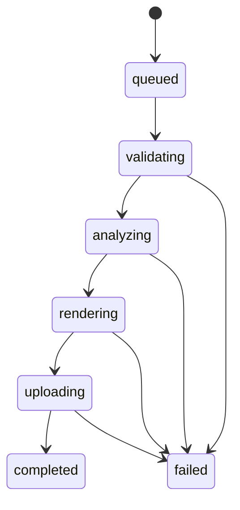

# Worker Runtime And Pipeline

## Configuration

`WorkerConfig.from_file` reads `worker/conf/config.json` or `worker/conf/config.dev.json`:

| Variable | Purpose | Default |
| --- | --- | --- |
| JSON key | Purpose | Default |
| `pipeline_version` | Reproducible pipeline identifier. | `development` |
| `model_version` | Detector/pose model identifier. | `unconfigured` |
| `scratch_root` | Job temporary directory root. | `/tmp/boulder-frame-worker` |
| `ffprobe_bin` | ffprobe executable. | `ffprobe` |
| `ffmpeg_bin` | ffmpeg executable. | `ffmpeg` |
| `lease_seconds` | Job lease duration. | `300` |
| `retain_debug_artifacts` | Keep scratch data for debugging. | `false` |
| `database_url` | PostgreSQL connection for job hydration and authoritative leases. | Required for `--serve`. |
| `redis_url` | Redis connection for Streams consumption. | Required for `--serve`. |
| `worker_id` | Stable owner identity stored with the PostgreSQL lease. | Required for `--serve`. |
| `stream_consumer` | Optional Redis consumer identity; otherwise uses `worker_id`. | `worker_id` |
| `stream_block_ms` | Maximum blocking read duration. | Configured runtime value. |
| `stream_reclaim_idle_ms` | Pending-entry idle age before recovery. | Configured runtime value. |
| `heartbeat_seconds` | Interval for lease and active-delivery heartbeats. | Configured runtime value. |
| `concurrency` | Maximum concurrent job handlers for this worker process. | Configured runtime value. |

The runtime config may interpolate `PIPELINE_VERSION` and `MODEL_VERSION` values. The worker does
not load `.env` files. `stream_reclaim_idle_ms` must be at least `lease_seconds * 1000`, and
`heartbeat_seconds` must be shorter than the reclaim idle period so active deliveries are not
recovered while their database lease is valid.

## Job Scratch

Each job receives `{scratch_root}/{job_uuid}`. The context manager creates it exclusively and removes it in `finally` unless debug retention is enabled. Scratch files must never become the durable source of job state.

## State Machine

`JobState` and `JobStage` are string enums matching the backend values. Progress is monotonic from 0 to 100. A worker lease identifies the active worker and expires for retry/recovery.

## Redis Streams Control Plane

The API appends jobs to stream `boulder-frame:jobs` with exactly `type`, `task_id`, and `payload`
fields. `type` is `job.process`; `task_id` is the job UUID; `payload` is JSON with exactly `job_id`
and `trace_id`. Workers use consumer group `boulder-frame:job-processors`.

`XREADGROUP` consumes new entries. `XAUTOCLAIM` recovers pending entries idle longer than the configured
threshold. During an active handler, `XCLAIM` resets the pending idle timer and PostgreSQL lease
renewal keeps the execution claim live. PostgreSQL lease owner/expiry is the authority for state,
progress, error, and artifact writes; Redis pending ownership never replaces it. On transient failure,
the worker releases its PostgreSQL lease and leaves the entry pending. It calls `XACK` only after the
terminal job state is persisted.

## Media Validation

`FFprobeAdapter` requires:

- MP4 or QuickTime MOV container
- H.264 or HEVC/H.265 video
- Positive dimensions and duration
- Valid positive `avg_frame_rate` and `r_frame_rate`
- Equal average and real frame rates, otherwise `variable_frame_rate`
- AAC audio when an audio stream exists

Rotation metadata is read from stream tags or side data. `display_dimensions` swaps width and height for 90/270-degree rotation. The renderer adapter is responsible for applying normalization; the current foundation does not yet implement the complete rotation-aware render pipeline.

## Errors

`WorkerError` contains an internal `ErrorCode`, user-safe message, and `transient` flag. Terminal errors include invalid media, unsupported codec/container, invalid target selection, missing athlete, unavailable model, and invalid output. Transient errors are reserved for infrastructure failures.

## Intentional Pipeline Limitation

The Redis and PostgreSQL adapters are live, but the detector/pose/render pipeline is intentionally not
implemented. After a worker claims a job, the current runtime records `validating`, then terminal
`failed` with internal error code `model_unavailable`, releases terminal lease state, and acknowledges
the Stream entry. It creates no output or debug artifact. This preserves a truthful terminal API
result while the control plane remains testable.

## Rendering Boundary

`FFmpegRenderer` accepts source, destination, a filter script, and a frame rate. It maps video and optional audio, encodes H.264/AAC, and uses `+faststart`. `validate_output` checks output dimensions and codecs. The full crop-path filter generation and output artifact upload are not yet wired into the worker CLI.
