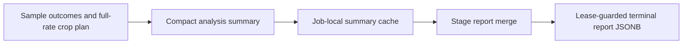

# Runtime And Pipeline

## Runtime

`WorkerConfig` supplies PostgreSQL, Redis Streams, private S3-compatible storage, `WORKER_ID`, FFmpeg,
FFprobe, scratch, lease, VFR-normalization, and debug limits. `MODEL_VERSION=unset-until-pinned`
normalizes to `unconfigured`; the only configured runtime model is
`w0.2-yolo26n-onnx-detector-only-1` with one verified
`yolo26n.onnx` artifact in `MODEL_DIR`.

Configured model verification or decoder composition failure prevents startup. A claimed job with a
different immutable `configuration.model_version` fails with `model_unavailable` before a stage
handler runs. `debug_capture` is default-off. `debug_visual_capture` requires it and uses independent
duration, dimensions, aggregate-byte, and child-process deadline limits.

`compose_runtime` and `ProcessingPipeline` default to `LookaheadCropPlanner`; explicit planner-factory
injection remains supported. SciPy is pinned to `1.15.3` for sparse deterministic `highs-ds` solves.

## Durable Pipeline

```mermaid
flowchart LR
  Q[Redis delivery] --> L[PostgreSQL lease claim with fresh attempt UUID]
  L --> A[Isolated attempt scratch]
  A --> S[source-original]
  S --> I[Strict ffprobe]
  I -->|CFR| D[ONNX person detection]
  I -->|Supported VFR only| N[Bounded local CFR normalization]
  N --> D
  D --> F[Causal zoom seed plus full-shot sampled-constrained pan]
  F --> C[Validate optimum geometry and motion]
  C -->|valid| R[Per-frame crop resize and fixed-frame FFmpeg encode]
  C -->|invalid| E[Terminal internal without analysis artifacts]
  R --> O[Lease-finalize output]
  O --> V[Optional telemetry and review]
  V --> T[Persist terminal state and JSON report then XACK]
```

Stages are `validating`, `analyzing`, `rendering`, and `uploading`, surrounded by queued/terminal job
states. The worker acknowledges Redis only after a terminal PostgreSQL state is durable. Pending stream
deliveries can be reclaimed; an active PostgreSQL lease prevents duplicate processing.

Each claim uses a fresh UUID as `lease_owner`; `WORKER_ID` remains the process identity, not the
ownership token. Renewal, release, state updates, and artifact finalization use the claimed attempt's
token, so an expired attempt cannot renew or release a replacement attempt's lease.
Scratch lives at `{scratch_root}/{job_id}-{attempt_id}`. A retry reconstructs prerequisites in its
own directory and cleanup removes only that attempt's directory, unless retention is enabled.
Directories left by a crashed process are neither reused nor deleted by another attempt; remove
orphaned scratch only after ensuring the owning process is stopped.

`validating` downloads the immutable object as `source-original`, strictly inspects supported media,
and normalizes only supported VFR input to job-local `source-cfr.mp4` under configured source-size and
timeout bounds. The immutable object and derivative policy are unchanged: the derivative is never
uploaded or persisted. Valid optional AAC is retained without truncating video, and display rotation
is normalized consistently for analysis and rendering.

`analyzing` maps the immutable tap, detects persons, selects the target on that frame, then associates
forward and backward from its detector box. Later candidates must pass the detector-box-relative spatial
gate; a miss or rejected candidate does not update the reference.
Detection runs only on the immutable `planner.detection_sample_fps` time grid plus the exact selected
frame. All source frames remain decoded and frame-aligned. Between samples, full-rate framing uses
the last chronological sampled result; a real sampled miss clears the held box until reacquisition.
Skipped frames are not detection failures. `FrameMeasurement.detection_sampled` is true on accepted
samples and actual sampled misses, false on skipped frames (held bounds or `None` after a miss).
Before any cached crop replay, one immutable planner parser checks the exact key set, types,
finite numbers, controller/seed/optimizer/scope/policy strings, and all constants against the
[planner contract](../backend/http-api.md). Missing, extra, or incompatible settings fail
terminally with `internal` and a user-safe planner-configuration message.

`framing` preserves `deterministic-v3` seed width/height exactly, including causal zoom hysteresis,
timestamp-based zoom limits, and miss widening. `lookahead-v1` replaces centers with full-shot,
sparse per-axis optimization. Only accepted fresh sampled boxes impose containment constraints;
held targets may leave the crop. Future observed boxes allow early camera movement but never
interpolate/extrapolate an athlete position. Source/aspect bounds remain hard, impossible sampled
containment is explicit, and unavoidable speed then acceleration excess is minimized and reported.
Every solver optimum and reconstructed crop/kinematic path is validated; there is no post-plan
snap or causal fallback. `PlannerError` becomes terminal analyzing `internal`,
`"Video framing could not be planned."`, retaining only sanitized internal solver diagnostics.
Do not commit `analysis-report.json`, `crop-path.jsonl`, or debug analysis trace on this failure.
See [Detection and Framing](measurements-and-planner.md#full-shot-look-ahead-pan).
`rendering` reads display-normalized BGR frames,
applies every planned crop once with OpenCV, resizes each crop to the fixed 1080p output surface, and
streams the fixed-size frames to FFmpeg for H.264/AAC encoding and muxing. Source, crop, written, and
fully decoded output frame counts must be exactly equal; the renderer never repairs a short output by
duplicating frames or applying an output frame-rate filter. A local rendered output is reusable only
after the same strict media and exact decoded-frame-count validation, and only when its atomic sidecar
matches the persisted crop-path digest, output aspect ratio, and `fixed-output-v1` renderer version.
`uploading` heads and lease-finalizes the deterministic output object before completion.

The `w0.2.6` pipeline, YOLO26n model version, and entire immutable planner map hash create distinct jobs for the
same input and settings under the new detector. Old jobs must drain on old workers before the
[version cutover](../../dev/development.md#start-modules), because claim-time compatibility checks
cover model version, not pipeline version. Never carry old job scratch or crop paths into a new job.

## Processing Report

The worker stores a small `processing_jobs.report` JSONB object in the same lease-guarded update
that records completion or terminal failure. It is independent of debug capture. The API returns
the stored JSON unchanged; neither the database nor the API imposes a report schema or version.
Apply migration `005_job_report.sql` before deploying the report-aware API or worker.

The current producer includes:

- `attempt_id`: the UUID of the attempt that persisted the terminal result.
- `elapsed_ms`: monotonic wall-clock time from the successful claim to preparation of the terminal
  update, including optional review publication but excluding queue time, prior attempts, the final
  database write, and scratch cleanup.
- `stage_durations_ms`: durations of the stage handlers executed in this attempt, including a failed
  handler. On resume, prerequisite reconstruction is counted within the resumed handler.
- `frames_processed`: the frame count of the validated output, available after rendering succeeds.
  It is not the number of detector invocations or the sum of repeated decode/render passes.
  Resuming directly at uploading still supplies this count after reconstructing and verifying output.
- `detection`: `frames`, `sampled_frames`, `skipped_frames`, `detected_frames`, `missed_frames`,
  and `outcome_counts` keyed by every detector selection outcome (including zero counts).
  Detected means an accepted selected-athlete box, not any person candidate. Misses count sampled
  frames only and distinguish `no_detections` from `no_accepted_candidate`; skips are not misses.
- `framing`: `unavailable_target_frames` counts full-rate frames without a held target, including
  skips after a sampled miss. `detection_gap_count` counts contiguous unavailable-target runs;
  `longest_detection_gap_ms` measures from the first missing frame to reacquisition or the exclusive
  CFR frame-grid end. `max_center_step_source_px` is the largest Euclidean center displacement
  between adjacent final crops; `max_center_step_timestamp_ms` identifies its destination frame
  (first on ties, `null` if stationary). `max_height_step_fraction` is the largest absolute
  adjacent crop-height ratio minus one. Steps include safety overrides, not just smooth motion.
  Planner traces additionally supply `action_counts`, `containment_override_frames`, and
  `source_aspect_limited_frames`; these are absent for planners without traces.
  Look-ahead framing also includes `planner_controller`, `optimizer`, `lookahead_scope`,
  `containment_policy`, `sampled_detection_constraint_frames`,
  `sampled_detection_uncontained_frames` (only source/aspect-impossible boxes are valid),
  `held_target_outside_crop_frames`, `max_pan_axis_speed_source_fraction_per_second`,
  `max_pan_axis_acceleration_source_fraction_per_second2`, `pan_speed_limit_exceeded_frames`,
  `pan_acceleration_limit_exceeded_frames`, `pan_speed_limit_excess_source_fraction_per_second`,
  and `pan_acceleration_limit_excess_source_fraction_per_second2`. Kinematic metrics are recomputed
  from the validated path, including start/end rest transitions for acceleration limits.

Analysis summaries are computed without debug capture and atomically cached in job-local
`analysis-report.json` before committing the crop path. Analysis, rendering, and upload handlers
return the cached summary through the existing terminal-report merge, including resumed jobs.
Legacy crop caches without a summary omit these metrics rather than inventing zero counts.
Failures before analysis finishes do not supply a partial detection summary. Completed jobs are not
backfilled; the look-ahead report additions accompany the immutable `w0.2.5` cutover.

Old jobs and active jobs normally have `report: null`. A transient failure does not publish a terminal
report; the next attempt starts fresh rather than aggregating earlier work. A failure before a valid
output exists omits `frames_processed`. Duplicate terminal deliveries leave the stored report intact.
Only small summary values belong here; per-frame data remains in optional telemetry artifacts.

## Review Finalization

While a nonterminal lease remains active, `publish_debug` may upload a UUID-scoped review set below
`private/debug/{project_id}/{job_id}/{review_id}/`. Required publication resources are telemetry and
manifest; available phase MP4s are only `detection.mp4`, `framing.mp4`, and `render.mp4`, finalizing
as roles `debug_detection`, `debug_framing`, and `debug_render`. `finalize_review` atomically replaces
these roles and removes stale current-review roles. Debug failures clean up newly uploaded objects
where possible and never alter the required output result.

Look-ahead review summaries retain bounded sampled/held containment and motion-limit counts.
Warning intervals distinguish unavoidable motion-limit excess from held-target-outside-crop:
the latter is sampling-policy evidence, not a fresh detector containment failure. Debug headers use
the validated immutable planner map, never a hardcoded seed controller.
