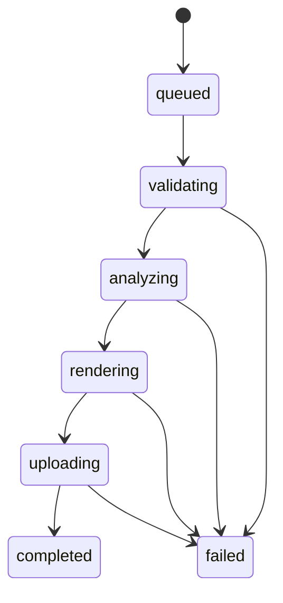

# Worker Runtime And Pipeline

## Configuration

`WorkerConfig.from_file` reads `worker/conf/config.json` or `worker/conf/config.dev.json`:

| Variable | Purpose | Default |
| --- | --- | --- |
| JSON key | Purpose | Default |
| `pipeline_version` | Reproducible pipeline identifier. | `development` |
| `model_version` | Detector/pose model identifier. `unset-until-pinned` normalizes to `unconfigured`. | `unconfigured` |
| `model_dir` | Read-only local directory holding checksum-verified model artifacts. | `/models` |
| `scratch_root` | Job temporary directory root. | `/tmp/boulder-frame-worker` |
| `ffprobe_bin` | ffprobe executable. | `ffprobe` |
| `ffmpeg_bin` | ffmpeg executable. | `ffmpeg` |
| `lease_seconds` | Job lease duration. | `300` |
| `retain_debug_artifacts` | Keep scratch data for debugging. | `false` |
| `database_url` | PostgreSQL connection for job hydration and authoritative leases. | Required for `--serve`. |
| `redis_url` | Redis connection for Streams consumption. | Required for `--serve`. |
| `s3_endpoint` | S3-compatible endpoint used for worker download/upload/head operations. | Required for `--serve`. |
| `s3_presign_endpoint` | Endpoint reserved for object-store URL compatibility with the API configuration. | Required for `--serve`. |
| `s3_region` | S3 region. | `us-east-1` |
| `s3_bucket` | Private source/output object bucket. | Required for `--serve`. |
| `s3_access_key` | Object-store access key. | Required for `--serve`. |
| `s3_secret_key` | Object-store secret key. | Required for `--serve`. |
| `s3_use_path_style` | Use path-style S3 addressing. | `false` |
| `worker_id` | Stable owner identity stored with the PostgreSQL lease. | Required for `--serve`. |
| `stream_consumer` | Optional Redis consumer identity; otherwise uses `worker_id`. | `worker_id` |
| `stream_block_ms` | Maximum blocking read duration. | Configured runtime value. |
| `stream_reclaim_idle_ms` | Pending-entry idle age before recovery. | Configured runtime value. |
| `heartbeat_seconds` | Interval for lease and active-delivery heartbeats. | Configured runtime value. |
| `concurrency` | Maximum concurrent job handlers for this worker process. | Configured runtime value. |

The runtime config may interpolate `PIPELINE_VERSION`, `MODEL_VERSION`, and `MODEL_DIR` values. The worker does
not load `.env` files. `stream_reclaim_idle_ms` must be at least `lease_seconds * 1000`, and
`heartbeat_seconds` must be shorter than the reclaim idle period so active deliveries are not
recovered while their database lease is valid.

## Job Scratch

Each job receives `{scratch_root}/{job_uuid}`. The context manager creates it exclusively and removes it in `finally` unless debug retention is enabled. Scratch files must never become the durable source of job state.

## State Machine

`JobState` and `JobStage` are string enums matching the backend values. Progress is monotonic from 0 to 100. A worker lease identifies the active worker and expires for retry/recovery.

## Redis Streams Control Plane

The API appends jobs to stream `boulder-frame:jobs` with exactly `type`, `task_id`, and `payload`
fields. `type` is `job.process`; `task_id` is the job UUID; `payload` is JSON with exactly `job_id`
and `trace_id`. Workers use consumer group `boulder-frame:job-processors`.

`XREADGROUP` consumes new entries. `XAUTOCLAIM` recovers pending entries idle longer than the configured
threshold. During an active handler, `XCLAIM` resets the pending idle timer and PostgreSQL lease
renewal keeps the execution claim live. PostgreSQL lease owner/expiry is the authority for state,
progress, error, and artifact writes; Redis pending ownership never replaces it. On transient failure,
the worker releases its PostgreSQL lease and leaves the entry pending. It calls `XACK` only after the
terminal job state is persisted.

## Object Storage And Output Finalization

`S3Storage` uses the configured endpoint, region, credentials, bucket, and path-style setting for
private source downloads, output uploads, and object heads. Adapter network/service failures become
transient `storage_unavailable` errors with a user-safe message. Runtime readiness verifies access to
the configured bucket before queue consumption.

After a renderer has uploaded and headed a validated MP4, `PostgresJobRepository.finalize_output`
uses the active `uploading` lease to atomically upsert the deterministic key
`private/output/{project_id}/{job_id}.mp4`, the unique `output` artifact relation, and
`processing_jobs.output_asset_id`. It does not complete the job; the existing guarded state transition
remains completion authority. Retried finalization reuses the same logical output.

## Media Validation

`FFprobeAdapter` requires:

- MP4 or QuickTime MOV container
- H.264 or HEVC/H.265 video
- Positive dimensions and video-stream duration. The worker derives frame counts and render-duration checks from the video stream's `duration_ts`/`time_base` timing (or its stream duration when timestamps are unavailable), never the container duration, which may include longer AAC audio.
- Valid positive `avg_frame_rate` and `r_frame_rate`
- Equal average and real frame rates, otherwise `variable_frame_rate`
- AAC audio when an audio stream exists

Rotation metadata is read from stream tags or side data. `display_dimensions` swaps width and height for 90/270-degree rotation. The renderer adapter is responsible for applying normalization; the current foundation does not yet implement the complete rotation-aware render pipeline.

## Errors

`WorkerError` contains an internal `ErrorCode`, user-safe message, and `transient` flag. Terminal errors include invalid media, unsupported codec/container, invalid target selection, missing athlete, unavailable model, and invalid output. Transient errors are reserved for infrastructure failures.

## Processing Pipeline

`compose_runtime` creates a `ProcessingPipeline` and invokes it through `Worker.process`. The worker
reconstructs source media and stage prerequisites in job scratch on every attempt, then runs these
durable stages:

1. `validating`: downloads the immutable source key and validates it with `ffprobe`.
2. `analyzing`: maps the immutable target selection, emits detector/pose observations through injected
   adapters, tracks them, and generates a deterministic crop path.
3. `rendering`: regenerates the crop path, renders it with FFmpeg, and validates the MP4.
4. `uploading`: revalidates or recreates the deterministic output, uploads and heads
   `private/output/{project_id}/{job_id}.mp4`, then performs lease-guarded artifact finalization.

`Worker.process` sets `completed` only after finalization succeeds. Terminal stage errors persist
`failed` and allow the entry to be acknowledged. Transient storage or database errors release the
PostgreSQL lease and keep the Redis entry pending for recovery. Duplicate deliveries of terminal jobs
acknowledge without reprocessing; a live foreign lease keeps the entry pending.

The local `.env.example` sentinel `model_version=unset-until-pinned` normalizes to `unconfigured`.
This safe state starts and consumes matching jobs, whose unavailable adapters terminate with
`model_unavailable`. With `model_version=w0.1-ssd-mobilenetv1-12-onnx-mediapipe-pose-full-1`, runtime
verifies and loads the detector and pose files described in [Model Manifest](models.md), then creates
the default `OpenCVFrameReader`. Missing/invalid artifacts or an unavailable decoder dependency prevent
configured runtime composition and therefore worker startup; unsupported model versions do the same. A
provisioned worker terminally rejects a claimed job before a stage handler executes when immutable
`configuration.model_version` differs from its active runtime value. The reader streams one
display-rotation-normalized BGR frame at a time, using sequential indices and timestamps derived from
immutable CFR metadata. No model weights are downloaded or inferred from configuration.

## Rendering Boundary

`FFmpegRenderer` accepts source, destination, a filter script, and a frame rate. It maps video and optional audio, encodes H.264/AAC, and uses `+faststart`. `validate_output` checks output dimensions and codecs. `ProcessingPipeline` generates the crop-path filter, renders and validates the output, uploads and heads it, and finalizes its artifact under the active lease.
