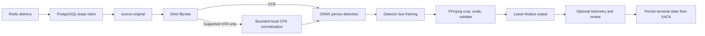

# Runtime And Pipeline

## Runtime

`WorkerConfig` supplies PostgreSQL, Redis Streams, private S3-compatible storage, `WORKER_ID`, FFmpeg,
FFprobe, scratch, lease, VFR-normalization, and debug limits. `MODEL_VERSION=unset-until-pinned`
normalizes to `unconfigured`; the only configured runtime model is
`w0.2-ssd-mobilenetv1-12-onnx-detector-only-1` with one verified
`ssd_mobilenet_v1_12.onnx` artifact in `MODEL_DIR`.

Configured model verification or decoder composition failure prevents startup. A claimed job with a
different immutable `configuration.model_version` fails with `model_unavailable` before a stage
handler runs. `debug_capture` is default-off. `debug_visual_capture` requires it and uses independent
duration, dimensions, aggregate-byte, and child-process deadline limits.

## Durable Pipeline

Stages are `validating`, `analyzing`, `rendering`, and `uploading`, surrounded by queued/terminal job
states. The worker acknowledges Redis only after a terminal PostgreSQL state is durable. Pending stream
deliveries can be reclaimed; an active PostgreSQL lease prevents duplicate processing.

`validating` downloads the immutable object as `source-original`, strictly inspects supported media,
and normalizes only supported VFR input to job-local `source-cfr.mp4` under configured source-size and
timeout bounds. The immutable object and derivative policy are unchanged: the derivative is never
uploaded or persisted. Valid optional AAC is retained without truncating video, and display rotation
is normalized consistently for analysis and rendering.

`analyzing` maps the immutable tap, detects persons, selects the target on that frame, then associates
forward and backward from its detector box. Later candidates must pass the detector-box-relative spatial
gate; a miss or rejected candidate does not update the reference. `framing` derives the profile-target
crop, smooths it, contains the current box when possible, reports `source_aspect_limited` when it is not,
and widens on misses without position extrapolation. `rendering` applies the exact
crop path without output-side frame duplication or dropping, then validates 1080p H.264/AAC output.
A local rendered output is reusable only when its
atomic sidecar matches the complete persisted crop-path digest and output aspect ratio. `uploading` heads
and lease-finalizes the deterministic output object before completion.

## Review Finalization

While a nonterminal lease remains active, `publish_debug` may upload a UUID-scoped review set below
`private/debug/{project_id}/{job_id}/{review_id}/`. Required publication resources are telemetry and
manifest; available phase MP4s are only `detection.mp4`, `framing.mp4`, and `render.mp4`, finalizing
as roles `debug_detection`, `debug_framing`, and `debug_render`. `finalize_review` atomically replaces
these roles and removes stale current-review roles. Debug failures clean up newly uploaded objects
where possible and never alter the required output result.
