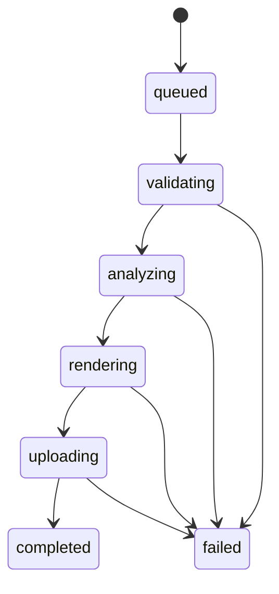

# Worker Runtime And Pipeline

## Configuration

`WorkerConfig.from_file` reads `worker/conf/config.json` or `worker/conf/config.dev.json`:

| Variable | Purpose | Default |
| --- | --- | --- |
| JSON key | Purpose | Default |
| `pipeline_version` | Reproducible pipeline identifier. | `development` |
| `model_version` | Detector/pose model identifier. | `unconfigured` |
| `scratch_root` | Job temporary directory root. | `/tmp/boulder-frame-worker` |
| `ffprobe_bin` | ffprobe executable. | `ffprobe` |
| `ffmpeg_bin` | ffmpeg executable. | `ffmpeg` |
| `lease_seconds` | Job lease duration. | `300` |
| `retain_debug_artifacts` | Keep scratch data for debugging. | `false` |

The deployment config may interpolate `PIPELINE_VERSION` and `MODEL_VERSION` values supplied by
Compose. The worker does not load `.env` files.

## Job Scratch

Each job receives `{scratch_root}/{job_uuid}`. The context manager creates it exclusively and removes it in `finally` unless debug retention is enabled. Scratch files must never become the durable source of job state.

## State Machine

`JobState` and `JobStage` are string enums matching the backend values. Progress is monotonic from 0 to 100. A worker lease identifies the active worker and expires for retry/recovery.

## Media Validation

`FFprobeAdapter` requires:

- MP4 or QuickTime MOV container
- H.264 or HEVC/H.265 video
- Positive dimensions and duration
- Valid positive `avg_frame_rate` and `r_frame_rate`
- Equal average and real frame rates, otherwise `variable_frame_rate`
- AAC audio when an audio stream exists

Rotation metadata is read from stream tags or side data. `display_dimensions` swaps width and height for 90/270-degree rotation. The renderer adapter is responsible for applying normalization; the current foundation does not yet implement the complete rotation-aware render pipeline.

## Errors

`WorkerError` contains an internal `ErrorCode`, user-safe message, and `transient` flag. Terminal errors include invalid media, unsupported codec/container, invalid target selection, missing athlete, unavailable model, and invalid output. Transient errors are reserved for infrastructure failures.

## Rendering Boundary

`FFmpegRenderer` accepts source, destination, a filter script, and a frame rate. It maps video and optional audio, encodes H.264/AAC, and uses `+faststart`. `validate_output` checks output dimensions and codecs. The full crop-path filter generation and output artifact upload are not yet wired into the worker CLI.
