# Runtime And Pipeline

## Runtime

`WorkerConfig` supplies PostgreSQL, Redis Streams, private S3-compatible storage, `WORKER_ID`, FFmpeg,
FFprobe, scratch, lease, VFR-normalization, and debug limits. `MODEL_VERSION=unset-until-pinned`
normalizes to `unconfigured`; the only configured runtime model is
`w0.2-ssd-mobilenetv1-12-onnx-detector-only-1` with one verified
`ssd_mobilenet_v1_12.onnx` artifact in `MODEL_DIR`.

Configured model verification or decoder composition failure prevents startup. A claimed job with a
different immutable `configuration.model_version` fails with `model_unavailable` before a stage
handler runs. `debug_capture` is default-off. `debug_visual_capture` requires it and uses independent
duration, dimensions, aggregate-byte, and child-process deadline limits.

## Durable Pipeline

```mermaid
flowchart LR
  Q[Redis delivery] --> L[PostgreSQL lease claim with fresh attempt UUID]
  L --> A[Isolated attempt scratch]
  A --> S[source-original]
  S --> I[Strict ffprobe]
  I -->|CFR| D[ONNX person detection]
  I -->|Supported VFR only| N[Bounded local CFR normalization]
  N --> D
  D --> F[Detector-box framing]
  F --> R[Per-frame crop resize and fixed-frame FFmpeg encode]
  R --> O[Lease-finalize output]
  O --> V[Optional telemetry and review]
  V --> T[Persist terminal state and JSON report then XACK]
```

Stages are `validating`, `analyzing`, `rendering`, and `uploading`, surrounded by queued/terminal job
states. The worker acknowledges Redis only after a terminal PostgreSQL state is durable. Pending stream
deliveries can be reclaimed; an active PostgreSQL lease prevents duplicate processing.

Each claim uses a fresh UUID as `lease_owner`; `WORKER_ID` remains the process identity, not the
ownership token. Renewal, release, state updates, and artifact finalization use the claimed attempt's
token, so an expired attempt cannot renew or release a replacement attempt's lease.
Scratch lives at `{scratch_root}/{job_id}-{attempt_id}`. A retry reconstructs prerequisites in its
own directory and cleanup removes only that attempt's directory, unless retention is enabled.
Directories left by a crashed process are neither reused nor deleted by another attempt; remove
orphaned scratch only after ensuring the owning process is stopped.

`validating` downloads the immutable object as `source-original`, strictly inspects supported media,
and normalizes only supported VFR input to job-local `source-cfr.mp4` under configured source-size and
timeout bounds. The immutable object and derivative policy are unchanged: the derivative is never
uploaded or persisted. Valid optional AAC is retained without truncating video, and display rotation
is normalized consistently for analysis and rendering.

`analyzing` maps the immutable tap, detects persons, selects the target on that frame, then associates
forward and backward from its detector box. Later candidates must pass the detector-box-relative spatial
gate; a miss or rejected candidate does not update the reference.
Detection runs only on the immutable `planner.detection_sample_fps` time grid plus the exact selected
frame. All source frames remain decoded and frame-aligned. Between samples, full-rate framing uses
the last chronological sampled result; a real sampled miss clears the held box until reacquisition.
Skipped frames are not detection failures. Missing or invalid sampling configuration is rejected,
including before a cached crop path is reused.
`framing` derives the profile-target crop, independently gates scale and center through `deterministic-v3` hysteresis, and advances
speed/acceleration-limited log-height zoom and source-normalized pan using increasing frame
timestamps. Retargeting preserves velocity; closed gates brake briefly before exact holds.
Containment/source-aspect corrections override motion limits, containing the current box when
possible and reporting `source_aspect_limited` otherwise. Misses bypass/reset the gates, cancel pan
and inward zoom velocity, and widen without position extrapolation. See
[Detection and Framing](measurements-and-planner.md) for thresholds, motion limits, and safety precedence.
`rendering` reads display-normalized BGR frames,
applies every planned crop once with OpenCV, resizes each crop to the fixed 1080p output surface, and
streams the fixed-size frames to FFmpeg for H.264/AAC encoding and muxing. Source, crop, written, and
fully decoded output frame counts must be exactly equal; the renderer never repairs a short output by
duplicating frames or applying an output frame-rate filter. A local rendered output is reusable only
after the same strict media and exact decoded-frame-count validation, and only when its atomic sidecar
matches the persisted crop-path digest, output aspect ratio, and `fixed-output-v1` renderer version.
`uploading` heads and lease-finalizes the deterministic output object before completion.

The `w0.2.4` pipeline and immutable planner controller/threshold/motion-limit/sampling-rate hash create distinct jobs for the
same input and settings under the new controller. Old jobs must drain on old workers before the
[version cutover](../../dev/development.md#start-modules), because claim-time compatibility checks
cover model version, not pipeline version. Never carry old job scratch or crop paths into a new job.

## Processing Report

The worker stores a small `processing_jobs.report` JSONB object in the same lease-guarded update
that records completion or terminal failure. It is independent of debug capture. The API returns
the stored JSON unchanged; neither the database nor the API imposes a report schema or version.
Apply migration `005_job_report.sql` before deploying the report-aware API or worker.

The current producer includes:

- `attempt_id`: the UUID of the attempt that persisted the terminal result.
- `elapsed_ms`: monotonic wall-clock time from the successful claim to preparation of the terminal
  update, including optional review publication but excluding queue time, prior attempts, the final
  database write, and scratch cleanup.
- `stage_durations_ms`: durations of the stage handlers executed in this attempt, including a failed
  handler. On resume, prerequisite reconstruction is counted within the resumed handler.
- `frames_processed`: the frame count of the validated output, available after rendering succeeds.
  It is not the number of detector invocations or the sum of repeated decode/render passes.
  Resuming directly at uploading still supplies this count after reconstructing and verifying output.

Old jobs and active jobs normally have `report: null`. A transient failure does not publish a terminal
report; the next attempt starts fresh rather than aggregating earlier work. A failure before a valid
output exists omits `frames_processed`. Duplicate terminal deliveries leave the stored report intact.
Only small summary values belong here; per-frame data remains in optional telemetry artifacts.

## Review Finalization

While a nonterminal lease remains active, `publish_debug` may upload a UUID-scoped review set below
`private/debug/{project_id}/{job_id}/{review_id}/`. Required publication resources are telemetry and
manifest; available phase MP4s are only `detection.mp4`, `framing.mp4`, and `render.mp4`, finalizing
as roles `debug_detection`, `debug_framing`, and `debug_render`. `finalize_review` atomically replaces
these roles and removes stale current-review roles. Debug failures clean up newly uploaded objects
where possible and never alter the required output result.
